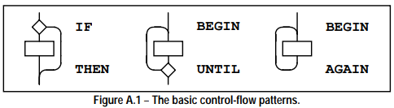
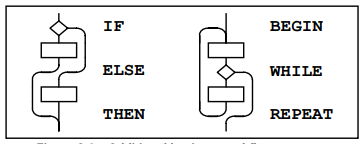
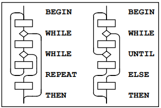

# Rationale (informative annex)

## A.1 Introduction 

### A.1.1 Purpose 

### A.1.2 Scope 

この規格は、これまでのForth言語の工業規格よりも広範囲に及んでいます。 これが必要になった理由は、以下の通りです。

- 以前の標準間の矛盾を解決したい。 
- 意味上の曖昧さやその他の不備を解消する必要性；。
- 共通のプラクティスを標準化し、可能であればコンプライアンス・コストを最小化する方法で相違を解決すること。
- ハードウェアに関連するものも含め、一般的なシステム技術を標準化すること。

これらの目的をすべて満たすための努力の結果、必要なワード数が少なくなるように調整された規格が完成しました。このため、リソースに制約のある組込みシステムにもANS Forthを提供することができます。必要なワードセット以外のワードは、いくつかのオプションのワードセットとその拡張に整理され、標準に準拠しながらカスタマイズされたシステムの実装を可能にしています。

X3J14技術委員会のメンバは、相対的な優劣を判断する際、以下の目標(アルファベット順)を指針としました。

<description>
||一貫性(Consistency)||標準規格は、機能的重複を最小限に抑えた、機能的に完全なワードの集合を提供します。

||準拠のコスト<br>(Cost of compliance)||この目標には、一般的な慣習、提案された変更によって既存のコードがどの程度壊れるか、既存のアプリケーションやシステムを規格に準拠させるために必要な労力などの問題が含まれます。

||効率性(Efficiency)||実行速度、メモリのコンパクトさ。

||移植性(Portability)||システムに依存しないワードであること。

||可読性(Readability) ||Forthの定義名はその動作の概要を明確に描くべきです。その動作は、迅速な理解をサポートするように、ぱっと見て分かるように単純であるべきです。Forthは簡単に教えることができ、コードは容易に保守できるものでなければなりません。

||利便性(Utility)|| 必要不可欠な機能と使用頻度が十分にあると判断される機能を包含していること。

</description>

### A.1.3 Document organization 

#### A.1.3.1 Word sets 

当初、X3J14技術委員会は、「本当の」Forthとは何かという点で、相反する考え方に直面していました。それだけでなく、Forthコミュニティ内のさまざまなグループのニーズの相反にも直面していました。ある極端な例では、"素の" Forthを求める人々がいました。もう一方の極端な例では、"太った" Forthを求める人々がいました。多くはその中間でした。全員が、自分たちの立場の正しさと、両極端の少なくともどちらかが間違っていることを確信していました。委員会の構成は、このようなあらゆる利害を反映したものでした。

私たちがとったアプローチは、必要なシステム機能の最大の下限を確立するコア・ワードセットを定義し、特別な目的のためにオプションのワードセットのポートフォリオを提供するというものです。このシンプルなアプローチは、拡張可能な言語としてのForthの基本的な性質と類似しており、それによって一種のメタ拡張性を実現しています。

この重要でハイレベルな妥協点によって、個々のワードセットの実際の構成にかかわらず、長期にわたって堅固で使い物になるフレームワークが確立されます。Localsワードセットがあるべきだとか、`COMPILE`というワードがコア拡張というワードセットに属するべきだとか、そういうことに同意する人もしない人もいるかもしれません。しかし、少なくともそのようなものを論理的かつ整然と含めることができるメカニズムがあります。

このワードセットのオプション化のスキームには、いくつかの重要な意味があります。

第一に、ANS Forthシステムは、他のどの言語単独よりも幅広いハードウェアに実装することができます。必要なのはCoreワードセットだけなので、非常に制約の厳しいハードウェアでもANS Forthの実装に対応できます。

第二に、アプリケーションの移植性に加え、プログラマの移植性がより高くなることが期待されます。オプションのワードセットは、それまで幅広く実装されていたが、統一された定義名や方法論、同じレベルの完全性を持たなかったさまざまな関数(浮動小数点数など)を標準化するものです。このようなワードがオプショナル・ワードセットで標準化されたことで、プログラマ間の口頭によるコミュニケーションや、雑誌やジャーナルの記事によるコミュニケーションの水準が飛躍的に向上することでしょう。また、コードやアプリケーションの共有の質とレベルも飛躍的に向上するはずです。

第3に、ANS Forthシステムは、ユーザが選択的に、さらには動的に、1つ以上のオプションのワードセットまたはその一部を含めたり除外したりできるように設計されているかもしれません。また、Coreワードセットを必要とし、それ以上を必要としないユーザ向けに、低価格の製品を提供することもできます。このようにして、理論上は無制限の柔軟性がユーザに提供されます。

しかし、これらの利点には代償があります。特にアプリケーションの移植性が重要な場合、どのような機能が必要かを判断し、それに応じて製品を選択する責任はユーザにあります。私たちは、ほとんどの実装者がすべてのワードセットを提供しようとするとは考えていません。実装者それぞれが、自分たちが意図する市場にとって最も価値のあるものを選択することを期待しています。

基本的な要件は、実装者が特定のオプションのワードセットを持つと主張する場合、そのワードセットが要求する部分全体が利用可能でなければならないということです。実装者がオプションのワードセットの一部だけを提供したい場合、特に選択または除外されたワードが明確に項目化されていれば、例えば「このシステムは[これこれの名前の]ワードセットの一部を提供します」と言うことは許容されます。

各オプションワードセットは、おそらく特定の利用者にアピールするでしょう。例えば、複雑な数学的解析を行う科学者は、単純な組み込みコントローラを開発するプログラマよりも、浮動小数点数ワードセットに高い価値を置くかもしれません。コア拡張の場合と同じように、実装者は、ユーザが評価するだろうと予想するワードセットを提供することを期待します。

オプションのワードセットは、ソース形式で提供されるか、またはユーザが選択的にロードできるようにファクタリングされます。

オプションのワードセットの拡張機能には、そのワードセットがサポートするアクティビティの主要なものを実行するために、明らかに関連性があるが、不可欠ではないとみなされるワードも含まれます。コア拡張の場合と同様に、実装者は、すべてのワードが存在するとユーザに誤解を与えるようなラベリングを付けない限り、拡張ワードセットから項目化されたサブセットを選択的に追加することができます。

## A.2 Terms and notation 

### A.2.1 Definitions of terms 

<miniterm>

||曖昧な条件(ambiguous condition)||
曖昧な状態に対する標準システムの対応は、実装者の裁量に任されています。
標準システムは曖昧な状態の発生を明示的に検出したり報告したりする必要はありません。

||クロスコンパイラ(cross compiler)||
クロスコンパイラは、組み込みシステムで実行されるプログラムを準備するために使用されることがあり、また、同じランタイム環境または異なるランタイム環境用の Forth カーネルを生成するために使用されることもあります。

||データフィールド(data field)||
以前の標準では、データフィールドは「パラメータフィールド」と呼ばれていました。
サブルーチンスレッドのForthシステムでは、すべてがオブジェクトコードです。従来のコードフィールドやデータフィールドはありません。`CREATE`で定義されたワード、または`CREATE`を呼び出すワードだけがデータフィールドを持ちます。`CREATE` によって定義されたデータフィールドのみが移植可能な操作が可能です。

||ワードセット(word set)||
本標準規格では、一部の関数は、特定の応用分野で有用である一方、すべての Forth システムで必要であることを正当化するには十分な汎用性がないことを認識しています。さらに、関連する関数に従って Forth ワードをグループ化すると便利です。これらの問題は、ワードセットの概念を使用して取り扱います。

「コア(Core)」ワードセットには、Forthシステムで必要不可欠なワードが含まれています。これは唯一の「必須」ワードセットです。本標準規格が定義する他のワードセットは、機能レベルを整えて標準システムとして提供できるようにするためのオプションの追加です。

</miniterm>

### A.2.2 Notation 

#### A.2.2.2 Stack notation 

スタック効果の図で *sys*、*orig*、*dest* データ型を使用することにより、2つの情報を伝えます。第一に、多くの実装がこれらの目的のために不特定の方法でデータスタックを使用するため、制御フロースタックまたはデータスタック上で、この下の項目が利用できないことを読者に警告します。第2に、*orig*と*dest*が使用される場合、明示的なペアリング規則は、その結果がスタックの使用と等価になるように、すべてのシステムがそのモデルを実装し、実際に多くの実装がこの目的のためにデータスタックを使用するという前提で文書化されています。しかし、本標準では、モデルの暗黙の動作が維持される限り、この目的のためにデータスタック(または他のスタック)を実際に使用することを実装に要求するものはありません。

## A.3 Usage requirements 

Forthのシステムは、C言語のような従来の言語のコンパイラに比べて、非常に簡単に開発できます。ベンダーがサポートする Forth システムに加えて、パブリックドメインの実装と実装ガイドが 20 年近くにわたって広く利用可能でした。また、多数の個人が独自の Forth システムを開発してきました。その結果、さまざまな実装アプローチが開発され、それぞれが特定のプラットフォームやターゲット市場向けに最適化されてきました。

X3J14技術委員会は、基礎となるForthシステムとその上で開発されるアプリケーションプログラムとの間の標準インターフェースを定義するという目標に合致するように、実装者をできる限り制約しないことによって、この多様性に対応するように努めてきました。

同様に、このセクションではForthシステムの実装方法について説明するのではなく、本標準規格への準拠を適切に主張できるシステムの最低要件について、いくつかのガイダンスを提供します。

### A.3.1 Data-types 

ほとんどのコンピュータは任意のビットパターンを扱います。あるセルがアドレスを含むか符号なし整数を含むかを検査で判断する方法はありません。データが持つ唯一の意味は、アプリケーションによって割り当てられた意味です。

データを操作するとき、結果の意味は入力値に割り当てられた意味に依存します。入力値の組み合わせには無意味な結果を生み出す組み合わせもあります。例えば、文字 "A"のASCII表現とTRUEフラグの算術和にどのような意味があるでしょうか。たぶん、「意味なし」でしょう。場合によっては、その演算がチェックサムを生成する最初のステップになるかもしれません。文脈が意味を決定するのです。

プログラムがさまざまなビットパターンの組み合わせに割り当てる意味を規定することは、しばしばデータ型付けと呼ばれます。多くのコンピュータ言語では、明示的なデータ型付けが行われ、コンパイラが正しくない定義の演算を防ぐようになっています。

Forthが明示的にデータ型の制限を課すことはほとんどありません。しかし、データ型は暗黙のうちに存在するものであり、特にプログラムの移植性を目標とする場合には、その規律が求められます。Forthでは、データが正確に型付けされているかどうかを判断するのは、(コンパイラではなく)プログラマに任されています。

このセクションでは、Forth におけるデファクトのデータ型付けに関するガイダンスを示します。

#### A.3.1.2 Character types 

文字データ型の正しい識別と適切な操作は、スタックの深さによる Forth のデータ型強制の範囲を超えています。文字は、意味のあるデータ部分がスタックエントリ1つの幅全体を占めるとは限りません。符号付き文字と符号なし文字の区別は、Forth の正式な仕様にはまったくありませんが、実際のところ、数学的な演算を行う場合には、文字を短い正の整数として扱う傾向があります。

##### a) Standard Character Set

<itemize>

1) 文字データ型(`C@`、`C!`、`FILL`など)の記憶単位は、0から255までの符号なし数値を格納できなければなりません。

2) 実装は、文字格納をその範囲に制限する必要はないが、環境依存のない標準プログラム(Standard Program)は、"char"位置にその範囲外の数値を格納する能力を仮定することはできません。

3) 許容される数値表現は、2の補数、1の補数、符号+絶対値(signed-magnitude)です。 これらの数システムはすべて正の数の表現を許容していることに注意してください。

4) "char" は小さな正の数を格納でき、文字データ型は符号なし整数データ型の下位範囲なので、`C!`はセルの最下位ビットn個を格納しなければなりません(8 &le; n &le; ビット/セル)。 許容される数値表現とその既知のエンコーディングの列挙が与えられたとすると、`TRUE xx C! xx C@`は、ある数のビットがセットされたスタック項目として、IFが非0として受理する値を残さなければなりません。

5) 入力(`KEY`、`ACCEPT`など)と出力(`EMIT`、`TYPE`など)のために、数字と人間が読める記号の間のエンコーディングはISO646/IRV(ASCII)です。これは、32から126(スペースから`~`)までの範囲に収まります。 EBCDICはアウトです(ほとんどの "EBCDIC" コンピュータシステムはASCIIもサポートしています)。その範囲外の値の扱いは、実装次第です。明らかな実装上の選択肢は、0から31の範囲で、少なくともその範囲の「表示可能な」文字(TAB、RETURN、LINEFEED、FORMFEED)についてはASCII制御文字を使用することです。 しかし、これらの文字の扱いはオペレーティングシステムによって異なるため、これは見た目ほど明確ではありません。例えば、あるシステムでは4文字の境界でTABし、あるシステムでは8文字の境界でTABし、あるシステムではあらかじめ設定されたタブストップでTABします。また、キャリジリターン文字の後にラインフィードを自動で行うシステムもあれば、ラインフィードのあとにキャリジリターンするものもあります。どちらも行わないシステムもあります。

128から255までのコードは、多くのヨーロッパ言語に見られるダイアクリティカルマーク付きの文字のような国際的な文字として使用するために、公式または非公式に標準化されるかもしれません。そのようなエンコーディングの一つが8ビットのISO Latin-1文字セットです。これらの文字のどのエンコーディングセットが優先されるかは、最終的にはコンピュータ市場全体で決定されることになります。オペレーティングシステム上で動作するForthの実装(最近の標準的なプラットフォーム上で動作する実装の大部分)では、おそらくほとんどのForth実装者は、システムで使用されているものであれば、どのようなものであれそれを選択するでしょう。

6) 標準プログラムは、32から126までの範囲内の任意の文字を`KEY`により受信し、`EMIT`により出力する能力の存在に依存することができます。プログラムがその範囲外の特定の文字を受信または表示できなければならない場合は、その文字を受信または表示する能力に対する環境依存を宣言することができます。

7) 標準プログラムでは、定義名に制御文字を使用することはできません。しかし、標準システムはこの禁止の強制が求められていません。したがって、現在`BLOCK`ソースからのワード名に制御文字を許可している既存のシステムは、引き続きそれを許可することができ、それらのシステム上で実行されるプログラムは引き続き動作します。テキストファイルのソースでは、スペースを区切り文字とする解析動作(例えば、 `BL` `WORD`)は制御文字をスペースと同じように扱います。このため、テキストファイルソースからの定義名では制御文字を使用できないことになります。テキストインタプリタは制御文字を区切り文字として扱うからです。この「制御文字のたたみ込み」はスペースが区切り文字である場合にのみ適用されることに注意してください。従って、`CHAR ) WORD` は制御文字を含む文字列を収集するかもしれません。

</itemize>

##### b) Storage and retrieval 

文字は `C!` によってデータスタックからメモリに転送され、`C@` によってメモリからデータスタックに転送されます。 `C!`の動作により、文字の実装依存の幅と等価の下位ビットがスタックエントリのポップされたデータから指定のアドレスに転送されます。このとき、デスティネーションアドレスにあるセルの上位ビット部分は影響をうけません。しかし、`C@`の動作は、それがプッシュしたデータスタックエントリの、文字の実装依存の幅を超えるすべての上位のビットをクリアします(上位のビットに実装で定義された表示情報が含まれる場合があります)。プログラマは、文字データ型を意図したワードで任意のスタックエントリワードに対して、文字データ型を意図する操作を適用すると、データの切り捨てが生じる可能性があることに留意すべきです。

##### c) Manipulation on the stack 

`C@`と`C!`に加えて、以下のワードによって、文字をデータスタックへ移動させ、データスタックから文字を移動させ、文字をデータスタック上に移動させます。

    >R ?DUP DROP DUP OVER PICK R> R@ ROLL ROT SWAP 

##### d) Additional operations  

    + - * / /MOD MOD 

以下の数学演算子は文字データに対して有効です。以下の比較演算子およびビット演算子は文字に対して有効ですが、実装で定義された方法で文字の最上位ビットにキャッシュされた表示情報をマスクするか、その他の方法で処理しなければならない場合があることに留意してください。

    AND OR > < U> U< = <> 0= 0<> MAX MIN  LSHIFT RSHIFT  

#### A.3.1.3 Single-cell types 

型付けを無視して見た単一セルのスタックエントリは、Forth の基本的なデータ型です。他のすべてのデータ型は、実際には1つ以上の単一セルスタックエントリで表されます。

##### a) Storage and retrieval 

`!`によって、単一セルデータがスタックからメモリへ転送されます。`@`によって、単一セルデータがメモリからスタックへ転送されます。全ビットが双方向に転送され、いかなる方法であれ型チェックは一切行われません。また、標準システムにより、`!`や`@`が使用するメモリアドレスが適切に整列されているか、転送されるデータが収容できる大きさかどうかのチェックも行われません。

##### b) Manipulation on the stack  

ここでは、単一セルのデータをデータスタックへ、またはデータスタックから、あるいはデータスタック上に移動させる最も重要なワードを紹介します。

    ! @ >R ?DUP DROP DUP OVER PICK R> R@ ROLL ROT SWAP 

##### c) Comparison operators

以下の比較演算子は1個以上の単一セルに対して常時有効です。

    = <> 0= 0<> 

##### A.3.1.3.1 Flags 

`FALSE`フラグはすべてのビットがセットされていない単一セルのデータであり、`TRUE`フラグはすべてのビットがセットされている単一セルのデータです。フラグをテストするForthワードは、NULL以外のビットパターンを真として受け入れますが、整った形式のフラグ(well-formed flag)という概念もあります。フラグとして使用するつもりの演算が、 `TRUE` でも `FALSE` でもないビットマスクを生成する可能性がある場合、推奨される規律は、Forthワード `0<>` を用いて演算結果を整った形式に変換することです。これにより、そのフラグに対するそれ以後の論理演算の結果が予測可能となります。

単一セル項目を移動、フェッチ、格納するワードに加えて、以下のワードはデータスタックに存在する1つ以上のフラグデータに対する操作に有効です。

    AND OR XOR INVERT  

##### A.3.1.3.2 Integers 

単一セルデータは、標準プログラムにより符号付き整数として扱われます。このようなデータの移動と保存は、他の単一セルデータと同様に実行されます。単一セルデータに普遍的に適用可能な、これまで説明してきた演算子に加えて、以下の数学演算子および比較演算子が単一セルの符号付き整数に対して有効です。

    * */ */MOD /MOD MOD + +! - / 1+ 1- ABS MAX MIN NEGATE 
    0< 0> < > 

同じビット数であれば、符号なし整数は通常、符号付き整数で表現可能な絶対値の数の2倍の数の数値を表現します。

標準プログラムでは単一セルのデータを符号なし整数として扱うことができます。このようなデータの移動と保存は他の単一セルデータと同様に実行されます。さらに、以下の数学演算子や比較演算子は単一セルの符号なし整数に対して有効です。

    UM* UM/MOD + +! - 1+ 1- * U< U>  

##### A.3.1.3.3 Addresses 

アドレスは単一セルの符号なし数値として一意に表現されます。スタックへの移動、スタックからの移動、スタック上への移動の際にそのように扱うことができます。逆に、各符号なし数は一意なアドレス(必ずしもアクセス可能なメモリのアドレスではない)を表します。アドレスと符号なし数値の間のこの1対1の関係は、アドレス演算と符号なし数値の対応する演算の間に等価性を強制します。

アドレス演算用にいくつかの演算子が用意されています。

    CHAR+ CHARS CELL+ CELLS  

そして、浮動小数点数ワードセットが存在する場合は、

    FLOAT+ FLOATS SFLOAT+ SFLOATS DFLOAT+ DFLOATS  

標準プログラムでは、Forthアドレスとそれがマッピングされる物理アドレスの間に特定の対応を想定することはできません。

##### A.3.1.3.4 Counted strings 

ANS Forth のトレンドは、スタック上の文字列に対して"c-addr u"表現を一貫して使用することです。これに代わるスタック表現として「カウントされた文字列のアドレス」を使用することは推奨されません。伝統的なForthのワードである `WORD` と `FIND` は、歴史的な理由から引き続き「カウントされた文字列のアドレス」表現を使用しています。既存のプログラムの移植の補助として追加された新しいワード `C"` も、カウントされた文字列表現を使用します。

カウント文字列は、文字列をメモリに格納する方法として有用であることに変わりはありません。この使用は推奨されません。このような文字列への参照がスタック上に現れる場合は、 "*c-addr u*"表現を使用することが望ましいです。

##### A.3.1.3.5 Execution tokens 

実行トークンと定義の関連は静的です。一度作成されれば、検索順序の変更などによって変わることはありません。しかし、それは一意ではないかもしれません。例として、次のフレーズ

    `' 1+` と
    `' CHAR+` 

は同じ値を返すかもしれません

#### A.3.1.4 Cell-pair types 

##### a) Storage and retrieval

セルの2つ組をフェッチ・ストアするために演算子2個が提供されます。

    2@ 2!

##### b) Manipulation on the stack  

加えて、セルの2つ組をスタックから・スタックに動かすために、以下に示す演算子を使用することができます。

    2>R 2DROP 2DUP 2OVER 2R> 2SWAP 2ROT 

##### c) Comparison  

以下の比較演算子は一般的にセルの2つ組に対しても有効です。

    D= D0=  

##### A.3.1.4.1 Double-Cell Integers 

倍セル整数を符号付きとして扱う場合、以下の比較演算子と算術演算子が有効です。

    D+ D- D< D0< DABS DMAX DMIN DNEGATE M*/ M+  

倍セル整数を符号なしとして扱う場合、以下の比較演算子と算術演算子が有効です。

    D+ D- UM/MOD DU<  

##### A.3.1.4.2 Character strings 

See: **A.3.1.3.4 Counted Strings**.

### A.3.2 The Implementation environment 

#### A.3.2.1 Numbers 

伝統的に、Forthは符号付き数値と符号なし数値が一対一に対応する2の補数マシンで実装されてきました。実際、任意の正の数の符号付き表現は、等価な符号なし表現と同一です。さらに、アドレスは符号なし数として扱われます。2の補数マシンの算術順序では、`+`と`-`は符号付きと符号なしの両方の数で動作します。この算術演算の動作は、一般的なForthの慣習に深く組み込まれています。これらの動作の結果として、許容される各演算アーキテクチャ上でホストされる実装の符号付き数と符号なし数の範囲は次のようになります。

<table>

 |Arithmetic architecture|signed numbers|unsigned numbers  
 |--|--|--|
 |Two’s complement|-n-1 to n|0 to 2n+1  
 |One’s complement|-n to n|0 to n
 |Signed magnitude|-n to n|0 to n|
 
</table>

ここで *n* は最大の正の符号付き数値です。3つのアーキテクチャすべてにおいて、0からnの範囲の符号付き数値は、対応する符号なし数値とビット単位で同一です。アドレスと符号なし数値の間の強制的な対応、および `+` と `-` の必要な動作の結果として、符号+絶対値マシン上の符号なし数値は、符号付き非負数値と等価であることに注意してください。

参考までに、これらの数値表現は `NEGATE` の実装方法によって定義することができます。

    two’s complement: : `NEGATE INVERT 1+ ;` 
    one’s complement: : `NEGATE INVERT ;` 
    signed-magnitude: : `NEGATE HIGH-BIT XOR ;` 

ここで`HIGH-BIT`は最上位ビットのみをセットしたビットマスクです。これらの数システムはすべて、非負数の表現に同意していることに注意してください。

**3.2.1.1内部的な数値表現**と**6.1.0270 0=**により、実装者は、どのような数値(非ブール値またはフラグ)結果に対しても、標準またはサポートされているワードが負の0を返さないようにしなければなりません。そうでなければ、多くの既存のプログラマの仮定が破られることになります。

符号なし循環演算を実装する必要も、符号なし数値の範囲をセルの全サイズに設定する必要もありません。*u* の範囲を *+n* の範囲に制限する歴史的な前例があり、これはセルサイズが 16 ビットより大きい場合に許容されます。

##### A.3.2.1.2 Digit conversion 

例えば、実装は文字 "a" から "z" までを文字 "A" から "Z" までと同じように変換するかもしれません。文字"["から"~"までをそれぞれ10進数値36から71の追加桁として扱うかもしれません。

#### A.3.2.2 Arithmetic 

##### A.3.2.2.1 Integer division 

Forth-79 Standardでは、符号付き除算演算子(`/`、`/MOD`、`MOD`、`*/MOD`、`*/`)は、非整数の商をゼロに向けて丸める(対称除算)ことが規定されています。Forth 83では、これらの演算子のセマンティクスが変更され、負の無限大に向かって丸められるようになりました(フロアード除算)。Forthコミュニティの中には、システムやアプリケーションをForth-79からForth-83除算に変換することを拒否する人もいます。この問題を解決するために、ANS Forthシステムは、フロアード演算子または対称演算子のいずれかを供給することが許可されています。さらに、ANS Forthシステムは、フロア型除算プリミティブ(`FM/MOD`)、対称除算プリミティブ(`SM/REM`)、および混合精度乗算演算子(`M*`)を提供しなければなりません。

この妥協は、現存するForthアプリケーションに行った投資を保護します。Forth-79とForth-83のプログラムは、除算に関して自動的にANS Forthに準拠します。実際には、丸め方向がアプリケーションに関係することはほとんどありません。しかし、プログラムが特定の丸め方向を必要とする場合、浮動除算プリミティブ `FM/MOD` または対称除算プリミティブ `SM/REM` を使用して、希望するフレーバの除算演算子を作成することができます。この簡単なテクニックを使えば、元のプログラムを解析することなく、Forth-79やForth-83のプログラムをANS Forthに変換することができます。

##### A.3.2.2.2 Other integer operations 

アンダーフローが発生するかどうかは、結果のデータ型に依存します。例えば、`1 2 -` というフレーズは、結果が符号なしであればアンダーフローし、有効な符号付き結果 -1 を生成します。

#### A.3.2.3 Stacks 

Forth において、抽象的ではなく具象的なデータ型はスタックエントリだけです。原始的な型付けではありますがに、Forth はスタックのアンダーフローやオーバーフローという厳しい現実を強制してきます。プログラマは、ワードの実行によって消費されるスタックエントリの数と、ワードの実行によってスタックにプッシュ・バックされるエントリの数について、明確な考えを持っていなければなりません。データスタック上の異常発生を観察することは、プログラマがアプリケーションプログラムのエラーを認識するための最初の防衛線です。また、誤ったアプリケーション・コードによって引き起こされる複数のスタックエラーは、しばしば等しく反対の大きさであり、相補的な(そして欺瞞的な)結果を引き起こすことを覚えておく価値があります。

これらの理由と他の多くの理由から、`VARIABLE`や`CONSTANT`のような静的な構成要素を除くアプリケーション辞書への追加のすべてにスタックダイアグラムを提供することこそ、Forthの初期から見られた、明確で議論の余地のない不可欠なプログラミングの規律なのです。

##### A.3.2.3.2 Control-flow stack 

制御フローワードの最も単純な使い方は、図A.1に示す基本的な制御構造を実装することです。

<figure>

</figure>

制御フローでは、すべての分岐、つまり制御の転送は、どこかの目的地で終了しなければなりません。自然な実装では、スタックを使って前方分岐の始点と後方分岐の終点を記憶します。最低限、それぞれの始点または終点の位置だけは示さなければならないが、実装に依存する他の情報を保持することもできます。

始点は、分岐の場所そのものです。目的地とは、分岐が行われた場合に制御が継続される場所です。目的地は、各起点の分岐アドレスを解決するために必要であり、逆に、起点は各目的地の分岐アドレスを解決するために必要です。すべての制御フロー経路が完了すれば、未使用の目的地は残りません。

たった3つのワード(`AHEAD`、`CS-ROLL`、`CS-PICK`)を追加するだけで、基本的な制御フローワードは、さまざまなトランスポート可能な制御構造をコンパイルするのに必要なプリミティブを提供します。必要な能力は、前方および後方の条件分岐と無条件分岐のコンパイルと、分岐の始点と終点のコンパイル時管理です。表A.1に望ましい動作を示します。

制御フローワードが他の制御フローワードによって適切にバランスされるという要件は、コンパイル時実装定義の制御フロースタックの記述を妥当なものにしています。データスタック、リンクリスト、特殊配列など、制御フロースタックがどのように実装されるかについての規定はありません。 上記の制御フロースタックの各要素は同じサイズです。

<table>

Table A.1 - Compilation behavior of control-flow words  

 |at compile time,<br>word:|supplies:|resolves:|is used to:|
 |--|:--:|:--:|--|
 |`IF`|orig|| 前方に向けた条件ブランチの始点の印を付ける
 |`THEN`||orig|`IF`か`AHEAD`を解決する
 |`BEGIN`|dest|| 後方の目的地の印を付ける
 |`AGAIN`|| dest|後方向け無条件ブランチを置きそれを解決する
 |`UNTIL`|| dest|後方向け条件ブランチを置きそれを解決する
 |`AHEAD`|orig||前方向け無条件ブランチの始点に印を付ける
 |`CS-PICK`|||制御フロースタックの要素をコピーする
 |`CS-ROLL`|||制御フロースタックの要素を並べなおす
 
</table>

これらのツールを使って、図A.2に示す残りの基本的な制御構造要素を定義することができます。ここで使用される即時ワードのスタック表記は、( compilation / execution )です。

    : WHILE ( dest -- orig dest / flag -- ) 
        \ conditional exit from loops 
        POSTPONE IF \ conditional forward branch 
        1 CS-ROLL \ keep dest on top 
    ; IMMEDIATE 
    : REPEAT ( orig dest -- / -- ) 
        \ resolve a single WHILE and return to BEGIN 
        POSTPONE AGAIN \ uncond. backward branch to dest 
        POSTPONE THEN \ resolve forward branch from orig 
    ; IMMEDIATE 
    : ELSE ( orig1 -- orig2 / -- ) 
        \ resolve IF supplying alternate execution 
        POSTPONE AHEAD \ unconditional forward branch orig2 
        1 CS-ROLL \ put orig1 back on top 
        POSTPONE THEN \ resolve forward branch from orig1 
    ; IMMEDIATE 

<figure>

<figcaption>Figure A.2 - Additional basic control-flow patterns.</figcaption>
</figure>

Forth control flow provides a solution for well-known problems with strictly structured programming.

Forthの制御フローは、厳密に構造化されたプログラミングでよく知られている問題に対する解決策を提供します。

基本的な制御構造は、図A.3の例のように、 `BEGIN` ... `UNTIL` や、`BEGIN` ... `WHILE` ... `REPEAT` 構造に `WHILE` を追加することで補うことができます。ただし、それぞれの `WHILE` の最後には `THEN` が必要です。`THEN`は `WHILE` との構文を完成させ、`WHILE` が制御を移したときにどこで実行を続行するかを示します。2つ以上の `WHILE` を使用することは可能ですが、一般的ではありません。もしユーザがこの`THEN`の使い方を好ましくないと思うのであれば、もっと好感の持てる名前のエイリアスを定義することができることに注意してください。

制御フローワード(`REPEAT`または`UNTIL`)と追加の`WHILE`にマッチする`THEN`の間に、追加のアクションを実行することができます。さらに、通常の終了と早期終了のために追加のアクションが必要な場合は、通常の Forth の `ELSE` で区切ることができます。終了アクションはすべてループ本体の後に指定します。

<figure>

<figcaption>Figure A.3 - Extended control-flow pattern examples.</figcaption>
</figure>

`REPEAT`は `WHILE` と `ELSE` または `THEN` をマッチさせるときに異常が発生することに注意してください。この異常は `BEGIN` ... `UNTIL` と比較したときにもっとも顕著です。つまり、`REPEAT`が1つの`THEN`を解決するため、`WHILE`の数より1つ少ない`ELSE`または`THEN`が存在することになります。上記のように、もしユーザがこのカウントの不一致を望ましくないと思うのであれば、 `REPEAT` をインラインで独自の定義に置き換えることができます。

他のループ終了制御フローワードや、他のループを定義することもできます。唯一の要件は、制御フロースタックが適切に維持され、操作されることです。

以下のANS Forth `CASE`構造の簡単な実装は、制御構造拡張の例です。生じうる制御フロースタックの使用と干渉しないように、データスタックのメンテナンスに注意してください。

    0 CONSTANT CASE IMMEDIATE ( init count of OFs ) 

    : OF    ( #of -- orig #of+1 / x -- ) 
         1+     ( count OFs ) 
         >R     ( move off the stack in case the control-flow ) 
                ( stack is the data stack. ) 
        POSTPONE OVER  POSTPONE =   ( copy and test case value) 
        POSTPONE IF                 ( add orig to control flow stack ) 
        POSTPONE DROP               ( discards case value if = ) 
        R>                          ( we can bring count back now ) 
    ; IMMEDIATE 

    : ENDOF ( orig1 #of -- orig2 #of ) 
        >R  ( move off the stack in case the control-flow ) 
            ( stack is the data stack. ) 
        POSTPONE ELSE 
        R>  ( we can bring count back now ) 
    ; IMMEDIATE 

    : ENDCASE ( orig1..orign #of -- ) 
        POSTPONE DROP ( discard case value ) 
        0 ?DO 
            POSTPONE THEN 
        LOOP 
    ; IMMEDIATE 

##### A.3.2.3.3 Return stack 

**3.2.3.3リターンスタック**節の制限は、実装がループパラメータをリターンスタックに置くことを許可する場合に必要です。

#### A.3.2.6 Environmental queries 

さまざまなデータ型のアドレス単位でのサイズは、`1 CHARS`のようなフレーズで決定されます。同様に、アライメントも `1 ALIGNED` のようなフレーズで決定されます。

環境クエリは2つのグループに分けられます。常に同じ値を生成するものと、そうでないものです。前者のグループには、`MAX-N`のようなエントリが含まれます。この情報は、ハードウェアまたはForthシステムの設計によって固定されており、ユーザは一度質問すれば十分であることが保証されています。

もう1つのグループは、時間の経過とともに変化することが正当なものに対する問い合わせです。例えば、アプリケーションは環境クエリを使って倍数ワードセットの有無をテストするかもしれません。もしそれがなければ、システムはワードセットをロードするためにシステム依存のプロセスを呼び出すかもしれません。システムは `ENVIRONMENT?`のデータベースを変更して、以後のqueryが現在の状態を表すことが許されています。

"unknown" の応答を返す問い合わせは、その後の問い合わせで "known" の結果を返す可能性があることに注意してください。

### A.3.3 The Forth dictionary 

標準プログラムは、標準ワードを非標準の定義を用いて再定義することができます。プログラムは依然として標準であるが(どの標準システム上でも構築できるので)、 その効果は、結合された実体(標準システム＋標準プログラム)を非標準システムにしてしまうことです。

#### A.3.3.1 Name space 

##### A.3.3.1.2 Definition names 

このセクションの文言は、標準プログラムの移植性を保証するためにあります。あるプログラムが、それ自身が提供しない標準規格外のものを使用する場合、他の実装が そのプログラムの実行に必要なものを持っているという保証はありません。標準でないからといって、すべてのForthプログラムがいささか欠けており、劣っているというつもりはありません。プログラマの芸術の最も素晴らしい宝石のいくつかは、非標準のものでしょう。同時に委員会は、"Standard" とラベル付けされたプログラムが、特に移植性に関して一定の期待に応えることを保証しようとしています。

多くのシステム環境では、入力ソースは、フロー制御や編集のためにそれらの文字を使用するなどの外部要因のために、特定の非グラフィック文字を供給することができません。さらに、テキストファイルから解釈する場合、構文解析機能は非図形文字を空白文字のように特別に扱います。従って、テキストインタプリタが受け取るワードには非図形文字が埋め込まれません。このような環境での実装が標準規格準拠を名乗ることを許可するために、標準プログラムに対するこの小さな制限が必要です。

標準システムは、非図形文字を含む定義名の作成を許可します。 歴史的に、このような名前はキーボード編集機能や "見えない" ワードに使用されてきました。

#### A.3.3.2 Code space 


#### A.3.3.3 Data space 

ワード `TIB`、`>IN`、`BASE`、`BLK`、`SCR`、`SOURCE`、`SOURCE-ID`、`STATE`、および `TIB` には、Forth システム自身の動作で使用される情報が含まれており、アプリケーションも使用する可能性があります。Forthシステムで利用可能なデータについて、Forthシステムが今挙げたデータ以外を保存していないとアプリケーションが仮定することは、環境依存です。

何がアドレス指定可能で何がアドレス指定不可能かを(規格で)規定することに意味はありません。

標準プログラムは以下のアドレス指定を*してはなりません*。

- データスタックやリターンスタックへの直接のアドレス指定、
- アプリケーションによって保存されていない場合に、定義のデータフィールドに対するアドレス指定。

一部の Forth システムは ROM から実行され、他のユーザやシステムと I/O バッファを共有しているため、読み取り専用の制限が発生します。この制限は一般的であり、移植可能なプログラムは、どの領域が影響を受けるかを知ることはできません。

##### A.3.3.3.1 Address alignment 

多くのプロセッサでは、メモリアクセス命令で使用できるアドレスに制限があります。例えば、モトローラ 68000 では、16 ビットまたは 32 ビットのデータは偶数アドレスでのみアクセスできます。他の例として、RISCアーキテクチャでは16ビット・データは偶数アドレスでのみ、32ビット・データは4の倍数のアドレスでのみロードまたはストアできます。

ANS Forthの実装者は、このアライメント制限を2つの方法のいずれかで処理できます。Forthのメモリアクセスワード(`@`、`!`、`+!`など)は、より小さな幅でアクセスできる、アライメント制限のない命令を用いて実装することもできます。例えば、16ビットセルを持つ68000 Forthでは、`@`は2つの68000バイトフェッチ命令とバイトから16ビットセルへの再組み立てにより実装できます。これは、ハードウェアの制約をプログラマから隠すことができますが、非効率的であり、ハードウェア環境によっては意図しない副作用が生じる可能性があります。ANS Forthの別の実装では、ワードの機能に最も近いネイティブ命令を使用して、各メモリアクセスワードを定義することができます。16 ビットセルを持つ 68000 Forth では、`@` は 68000 の 16 ビットmove命令を使用します。この場合、`@`に正しく整列されたアドレスを与える責任はプログラマにあります。移植可能な ANS Forth プログラムは、アライメントが必要な場合があることを想定し、本節の要件に従わなければなりません。

##### A.3.3.3.2 Contiguous regions 

Forth システムのデータ空間は、不連続な領域で構成されています。一部の領域はシステムが提供し、一部の領域はプログラムが提供します。データ空間は領域内で連続しているため、アドレス演算は1つの領域内でのみ有効なアドレスを生成することができます。標準プログラムでは、メモリ内の複数の領域の相対的な配置を仮定することはできません。

セクション**3.3.3.2**では、データ空間の連続した領域を取得できる条件を規定しています。

例えば、

    CREATE TABLE 1 C, 2 C, ALIGN 1000 , 2000 ,  

は`TABLE`が返すアドレスにあるテーブルを作成します。このテーブルにアクセスする場合、

    TABLE C@                            will return 1  
    TABLE CHAR+ C@                      will return 2  
    TABLE 2 CHARS + ALIGNED @           will return 1000  
    TABLE 2 CHARS + ALIGNED CELL+ @     will return 2000.

となります。同様に、

    CREATE DATA 1000 ALLOT  

は1000アドレス単位の配列になります。より移植性の高い戦略として、以下のようにアプリケーション単位で配列を定義することもできます。

    500 CONSTANT NCELLS 
    CREATE CELL-DATA NCELLS CELLS ALLOT  

この配列は以下のようにインデックスを使いアクセスできます。

    : LOOK NCELLS 0 DO CELL-DATA I CELLS + ? LOOP ; 

##### A.3.3.3.6 Other transient regions 

多くの既存のForthシステムでは、これらの領域は`HERE`か、そのすぐ先にあり、それゆえに多くの制限があります。

<p><math xmlns="http://www.w3.org/1998/Math/MathML">
  <mfenced><mrow><mn>2</mn>
    <mi>n</mi>
    </mrow></mfenced>
  <mo>+</mo>
  <mn>2</mn>
</math>は、先頭のマイナス記号と末尾の空白を含み、区切り文字を含まない最大の倍長2進数の文字列表現を含む文字列のサイズです。</p>

実装上の注意:  $n$の最小値は16であるため、絵に描いたような数値出力文字列の絶対的な最小サイズは34文字です。しかし、実装で $n# を大きくする場合は、絵の数値出力文字列のサイズも大きくする必要があります。

### A.3.4 The Forth text interpreter 

#### A.3.4.3 Semantics 

「開始セマンティクス(initiation semantics)」は、定義に入るときに実行されるコードに対応し、定義を抜けるときに `EXIT` によって実行されるコードに似ています。「実行時セマンティクス(run-time semantics)」は、明示的なコンパイルセマンティクスを持つワードによってコロン定義の内部でコンパイルされる、リテラルやブランチなどのコード断片に対応します。

Forth クロスコンパイラでは、実行セマンティクスをホストシステムのみ、ターゲットシステムのみ、または両方のシステムで発生するように指定することができます。例えば、`CELLS`のようなワードはホストシステムで実行され、ターゲットに記述される値を返します。また、コロン定義はターゲットでのみ実行され、`CONSTANT`と`VARIABLE`は両方のシステムで実行動作を持つことが適切かもしれません。クロスコンパイラの動作の詳細は、本標準の範囲外です。

##### A.3.4.3.2 Interpretation semantics 

さまざまな理由から、本標準ではすべてのワードの解釈セマンティクス(interpretation semantics)を定義していません。これらのワードの例としては、`>R`、`."`、`DO`、`IF`などがあります。本標準のいかなる規定も、対話的制御フローワードのようなこれらワードの解釈セマンティクスを実装が提供することを妨げるものではありません。しかし、標準プログラムは解釈状態でこれらを使用してはなりません。

#### A.3.4.5 Compilation 

定義レベルでのコンパイラ再帰は、特にローカルのサポートに過剰なリソースを消費します。技術委員会は、そのメリットがコストを正当化するとは考えていません。また、定義を入れ子にすることは一般的ではなく、多くのシステムでは機能しません。

## A.4 Documentation requirements 

### A.4.1 System documentation 

### A.4.2 Program documentation 

## A.5 Compliance and labeling 

### A.5.1 ANS Forth systems 

セクション5.1では、「ANS Forth System」というラベルを正当化するためにシステムが満たすべき基準を定義しています。 簡単に説明すると、最小要件は、システムがCoreワードセットを「実装」していることです。この要件を満たすには、いくつかの方法があります。最も明白なのは、すべてのCoreワードがコンパイル済みのカーネルに含まれていることです。しかし、要件を満たす方法はこれだけではありません。例えば、いくつかのワードはソースブロックやファイルで提供され、それらが必要な場合にシステムに追加する方法を説明した説明書が付いていてもよいです。ユーザが明確でわかりやすい手順でアクセスできるような方法でワードが提供されている限り、ワードは存在するとみなすことができます。

Forth クロスコンパイラと ANS Forth システムには、プログラムを処理するために同様のコンパイルツールを使用するという点で、多くの共通点があります。しかし、ANS Forthクロスコンパイラを完全に仕様化するには、ホスト環境とターゲット環境の両方におけるコンパイルと実行のセマンティクス、およびROM化の問題を扱う複雑な問題に対処する必要があります。これを適切に行うための労力は、現時点では非現実的であることが判明しています。その結果、ForthクロスコンパイラがANS Forthプログラムをターゲット環境で実行できるように正しく準備することは可能かもしれませんが、クロスコンパイラにANS Forth Systemのラベルを付けることは適切ではありません。

### A.5.2 ANS Forth programs 

#### A.5.2.2 Program labeling 

環境依存を宣言することは望ましくないと考えてはいけません。このような宣言は、単に作者が想定するアーキテクチャの利点を生かしたことを認めているに過ぎないと考えるべきです。例えば、一般に使用されているほとんどのコンピュータは2の補数2進演算に基づいています。このアーキテクチャへの環境依存を認めることで、プログラマはプログラムの移植性を大幅に制限することなく、すべてのビットがセットされた値を表すために数値-1を使用する権利を得ます。

すべてのプログラムは、データと命令のための空間と、それらの命令を実行するための時間を必要とするため、これらのリソースを提供する環境の存在に依存します。あるタスクを実行するために、これらの資源(例えばスタック空間)のうちどれだけの量が必要になるかを予測することは不可能であるため、本標準ではそのようなことを行いません。

一方、プログラムが必要とする資源のレベルが高くなるにつれて、そのプログラムが正常に実行されるシステムは次第に少なくなっていくでしょう。109個のセルの配列を必要とするアルゴリズムは、103個しか必要としないものより実行できるコンピュータの数は少なくなるかもしれません。

## A.6 Glossary 

このセクションと次のセクションで、特定のワードを扱った理由、特定のワードセットに入れた理由、またはそのワードの名前や意味を規定した理由を説明します。

このセクションのワードは、用語集との相互参照を容易にするため、インデックス番号を保持したまま、ワードセットごとに整理されています。

歴史的に、多くのForthシステムはForthで書かれてきました。Forthのワードの多くは、もともとForthシステム自体のサポートを主な目的としていました。例えば、`WORD`と`FIND`はForthのテキストインタプリタの主要な道具としてよく使われ、`CREATE`は多くのシステムで辞書エントリを構築するためのプリミティブです。これらのようなワードを標準的な方法で定義する際、実装者による使用を妨げないように努めました。Forthがユーザに愛されている特徴の1つは、システムの実装に使用されるのと同じツールがアプリケーションプログラマにも利用可能であることです。このアプローチの結果として、ほとんどのForth実装の特徴であるコンパクトさと効率性があります。

### A.6.1 Core words 

#### A.6.1.0070 `'` 

Typical use: `... ' name `.

ステートスマートなティック(tick)を使うForthシステムは多いが、そうでないものも多いです。ANS ForthはForth 83の用法を踏襲しました。

See: **A.3.4.3..2 Interpretation semantics**, **A.6.1.1550 FIND**.

#### A.6.1.0080 `(` 

Typical use: `... ( ccc) ...`

#### A.6.1.0140 `+LOOP` 

Typical use:

    : X ... limit first DO ... step +LOOP ; 

#### A.6.1.0150 `,` 

Typical use:  

`,`(コンマ)を実行トークンのコンパイルに用いることには移植性がありません。

See: **6.2.0945 COMPILE,**.

#### A.6.1.0190 ." 

Typical use: `: X ... ." ccc" ... ;` 

実装は必要に応じて `."` の解釈セマンティクスを定義することができます。あるもっともらしい実装では、`."`を解釈すると区切られたメッセージが表示されます。別のもっともらしい実装では、`."`を解釈すると、後でメッセージを表示するためにコードをコンパイルします。さらに別のもっともらしい実装では、`."`の解釈は例外として扱われます。このようなバリエーションがあるとするなら、標準プログラムは `."` を解釈中に使用してはなりません。同様に、標準プログラムは `POSTPONE ."` を新しいワードの中にコンパイルして、そのワードを解釈中に使用してはなりません。

#### A.6.1.0320 `2*` 

歴史的に、`2*` は論理左シフト命令として 2 の補数マシンに実装されてきました。 これらのマシンでは、2による乗算は効率的な副作用です。しかし、シフトにはセル内のビットの意味と位置の知識が必要です。名前は乗算を意味しますが、ほとんどの実装者は`2*`を実装するためにハードウェア左シフトを使用してきました。

#### A.6.1.0330 `2/` 

このワードも`2*`と同様の一般的な用法を持ち、意味が不適切な名前を持っています。符号ビットを伝播するハードウェア右シフトを持つ2の補数マシンでよく実装されます。

#### A.6.1.0350 `2@` 

`2@`では、格納順序は標準によって指定されます。

#### A.6.1.0450 `:` 

Typical use: `: name ... ;` 

Forth 83 では、このワードは検索順序を変更すると規定されていました。この仕様は、本標準では明示的に削除されています。しかし、多くの検索順序を許容するシステムにより、コロンのForth-83の動作は非常に望ましくないものだと分かりました。

コロン自体はコンパイラを起動しないことに注意してください。コロンはコンパイル状態を設定し、解析領域内のこの後のワードがコンパイルされるようにします。

#### A.6.1.0460 `;` 

Typical use: `: name ... ;` 

`;`と`;CODE`の両方が実行する機能の1つは、現在の定義を辞書で見つけられるようにすることである。現在の定義が `:NONAME` によって作成された場合、現在の定義には定義名がない。よって辞書で見つけることができない。`:NONAME`が実装されている場合、Forthコンパイラは現在の定義に関する十分な情報を保持し、`;`と`;CODE`が現在の定義を見つけられるようにするために何らかのアクションを実行しなければならないかどうかを判断できるようにしなければならない。

#### A.6.1.0550 `>BODY` 

*a-addr* は、*xt* を定義した `CREATE` の実行直後に `HERE` が実行された場合に返されたであろうアドレスです。

#### A.6.1.0680 ABORT" 

Typical use: `: X ... test ABORT" ccc" ... ; `

#### A.6.1.0695 ACCEPT 

以前の規格では、入力文字列の収集は、"return" を受信するか、+n1文字を受信したときに終了すると規定されていました。n1文字を受信したときに終了することは、システム環境によっては実装が困難であったり、高価であったり、不可能であったりします。そのため、多くの既存の実装はこの要件に準拠していません。行の編集や収集機能は、Forth 実装の制御を超えたシステムコンポーネントによって実装されることが多いため、本標準ではそのような要件を課していません。標準プログラムは `ACCEPT` または `EXPECT` で入力文字列を受け取ることができると仮定するだけでよいです。その行を準備して送信するために必要なユーザアクションの詳細なシーケンスは、本標準の範囲外です。

`ACCEPT`にゼロでない正の整数カウント(+n1)を規定することで、実装者によっては、 特別な動作をトリガするフラグとしてゼロまたは負の値を使用する習慣を継続することができます。そのような動作が標準の外にある限り、標準プログラムはそれに依存することはできませんが、技術委員会は不必要に排除することを望みません。実際の値はほとんど常に小さな整数であるため、この制限によって機能が損なわれることはありません。

`ACCEPT` と `EXPECT` は似たような機能を行います。新しいプログラムでは `ACCEPT` が推奨され、今後、 `EXPECT` を使用することは推奨されません。

図形文字以外の文字はすべて編集や制御機能のために予約しておき、入力文字列に保存しないことを推奨します。

一般的に、ユーザがプログラムに送信する入力文字列を準備しているとき、システムは最終版の文字列を送信する前にユーザがその文字列を編集して間違いを修正することを許可します。編集機能は、Forthシステム自体から提供されることもあれば、外部のシステムソフトウェアやハードウェアから提供されることもあります。したがって、制御文字や制御機能は、すべてのシステムで利用できるとは限りません。通常の場合、編集処理の終了と文字列の最終的な送信は、ユーザが "Return" または "Enter" キーを押すことによって示されます。

これまでの標準と同様に、`EXPECT`は要求された文字数が入力された直後と、行終端文字を受信したときに入力文字列を返します。「指定された文字数が入力された後に自動的に終了する」動作は、ユーザが知らない時点で入力編集プロセスの「コントロールを失う」(ユーザは `EXPECT` から要求された文字数を必ずしも知らない)ため、望ましくないと広く考えられています。そのため `EXPECT` と `SPAN` は使用非推奨とされ、既存の実装に対する譲歩としてのみ標準に存在しています。もし `EXPECT` が標準システムに存在するなら、それは "入力の自動終了" の動作を持たねばなりません。

`ACCEPT` は `EXPECT` のような「自動終了」の動作を持ちません。しかし、外部システムのハードウェアとソフトウェアが `ACCEPT` 機能を実行するかもしれないので、行終端を受信したときのカーソルの動作、したがって表示は実装によって定義されます。行終端文字を受信した後、カーソルは入力されたテキストの直後に残ることが推奨されます。

#### A.6.1.0705 ALIGN 

本標準では、さまざまなCPUアーキテクチャ間での移植性を提供することを試みました。しばしば生じる移植性の問題の原因の1つは、いくつかのCPUでセル整列のアドレスが要求されることです。このようなシステムでは、`C,`で構築されたデータ構造をビルドしたりトラバースしたりするために `ALIGN` と `ALIGNED` が必要になることがあります。 実装者は、これらのワードが機能しないシステムでは、これらのワードをno-opsとして定義することができます。

#### A.6.1.0706 `ALIGNED` 

See: **A.6.1.0705 `ALIGN`**.

#### A.6.1.0760 `BEGIN` 

Typical use:

    : X ... BEGIN ... test UNTIL ; 

or

    : X ... BEGIN ... test WHILE ... REPEAT ;

#### A.6.1.0770 `BL` 

スペースはForth全体で標準的な区切り文字として使用されているため、このワードはプログラムが「スペース」のシステム値を検索して使用する唯一の方法です。スペース文字の値は、例えば `CHAR` では取得できません。

#### A.6.1.0880 `CELL+` 

`ALIGN`と`ALIGNED`と同様に、`CELL`と`CELL+`というワードは、異なるセルサイズを持つシステム間での移動性を助けるために追加されました。これらは、整数個のセル幅でインデックスやアドレスを操作する際に使用することを意図しています。

例:

    2VARIABLE DATA 
    0 100 DATA 2! 
    DATA @ . 100  
    DATA CELL+ @ . 0  

#### A.6.1.0890 CELLS 

See: **A.6.1.0880 CELL+**.

Example: `CREATE NUMBERS 100 CELLS ALLOT` 

(配列`NUMBERS`中に100セルのデータの空き領域をAllotする)

#### A.6.1.0895 CHAR 

Typical use: ... `CHAR A CONSTANT "A"` ...

#### A.6.1.0950 CONSTANT 

Typical use: ... `DECIMAL 10 CONSTANT TEN` ...

#### A.6.1.1000 `CREATE` 

`CREATE` で定義されたワードのデータフィールドアドレスは、`CREATE` の実行直後のデータスペースポインタによって与えられます。 データフィールドスペースの予約は、通常 `ALLOT` で行われます。

Typical use: ... `CREATE SOMETHING` ...

#### A.6.1.1240 `DO` 

Typical use:  

    : X ... limit first DO ... LOOP ; 

or  

    : X ... limit first DO ... step +LOOP ; 

#### A.6.1.1250 `DOES>` 

Typical use: `: X ... DOES> ... ;` 

`DOES>`の後では、標準プログラムは、`DOES>`を含む定義の名前や、その名前によって隠されている可能性のある以前の定義名を見つける能力に関して、いかなる仮定も置くことはできません。ローカル変数と制御フロー構造に関する限り、`DOES>`は事実上1つの定義を終了し、別の定義を開始します。コンパイル動作は、ユーザが いかなる制御フロー構造の中にも `DOES>` を置く権利がないことを明確にしています。

#### A.6.1.1310 `ELSE` 

Typical use: : `X ... test IF ... ELSE ... THEN ;` 

#### A.6.1.1345 `ENVIRONMENT?` 

Coreワード集合のみを含む標準システムでは、`ENVIRONMENT?`を効果的に使用するには、定義内で使用するか、ユーザが提供する補助的な定義を使用する必要があります。Coreワード集合には、解釈状態で文字列を収集する直接的な方法(**11.6.1.2165 `S"`**はオプションのワード集合にある)と、解釈状態で返されたフラグをテストする手段(オプションの15.6.2.2532 `[IF]`など)の両方が欠けています。

**6.1.1345 `ENVIRONMENT?`**, **11.6.1.2165 `S"`**, **15.6.2.2532 `[IF]`**, **15.6.2.2531 `[ELSE]`**, **15.6.2.2533 `[THEN]`** の組み合わせは、解釈状態において機能する条件付きコンパイルのための効果的なワード群を構成します。

#### A.6.1.1360 `EVALUATE` 

技術委員会は、この機能が一般的に`EVAL`と表記されることを認識しています。しかし、このようにワードを定義することで苦しむ実装が存在します。また、我々は`EVALUATE`の方が読みやすく明示的であると考えます。これを`INTERPRET`と呼ぼうという意見もあったが、これも既存のコードに望ましくない影響を与えるでしょう。長いスペルは、ソースコードで頻繁に使用されるだろうワードではないため、重要ではないと判断されました。

#### A.6.1.1380 EX`IT 

Typical use: `: X ... test IF ... EXIT THEN ... ;` 

#### A.6.1.1550 `FIND` 

委員会が取り上げたより困難な問題の1つは、Forth言語の仕様から実装メカニズムの仕様を切り離す問題でした。3つの基本的な実装アプローチがすぐに列挙できます。

1) スレッドコードメカニズム。これらは、Forthを実装するための伝統的なアプローチですが、他のテクニックを使用することもできます。
2) 「マクロ拡張」(コードコピー)によるサブルーチンのスレッド化。DUPのコードのような短いルーチンは、JSR参照をコンパイルするのではなく、定義にコピーされます。
3) 最適化を伴うネイティブコーディング。これには、スタックの最適化(例えば、SWAP ROT +のようなフレーズを1つか2つのマシン命令で置き換える)、並列化(新しいRISCチップのトレンドは、並列実行可能な複数の機能サブユニットを持つことである)などが含まれます。

コンパイルアドレスが辞書にコンパイルされるという最初の要件(Forth 83から継承)は、タイプ2やタイプ3の実装を認めませんでした。

タイプ3のメカニズムやタイプ2の実装の最適化は、すべての標準ワードの即時性または非即時性の明示的な指定によって妨げられていました。`POSTPONE`により、`STATE`に依存しない動作が必要な一部のForthワードを除き、即時性または非即時性の指定を解除することができた。

タイプ3の実装の1つであるCharles MooreのcmForthは、多くのForthワードについてコンパイル版と解釈版の両方を持っています。現在のところ、これはタイプ3実装の一般的なアプローチのようです。委員会は、このような実装方法を認めなければならないと考えました。その結果、解釈セマンティクスのないワードはコンパイル中にしか見つからない可能性があり、他のワードはコンパイル版と解釈版の2つのバージョンが存在する可能性があります。したがって、FINDが返す値は`STATE`に依存し、`'`と`[']`は解釈セマンティクスを持たないワードを見つけることができないかもしれません。

#### A.6.1.1561 `FM/MOD` 

Forth 83 は、切り捨て除算(floored division)の要件を導入することで、ホスト CPU の動作に従って除算を実装するという、他の言語ではより一般的な慣行を好む人々から、多くの論争と懸念が示されました。 妥協点を見出すために、本標準規格は、一般的な除算方式として切り捨て型と対称型の両方のプリミティブを提供する(`SM/REM`を参照)こととしました。`FM/MOD`は切り捨てバージョンです。

技術委員会は、明示的に命名された2つの除算演算子の完全なセットを提供することを検討したが、これは規格を不当に拡大し複雑にするという理由で、そのやり方は採用されませんでした。その代わりに、実装者は通常の除算ワードを `FM/MOD` または `SM/REM` のどちらかで定義することができます。明示的に命名された演算子のセットを持ちたい人は、そうすることを推奨します。 `FM/MOD`は例えば次のような定義で使用することができます。

    : /_MOD ( n1 n2 -- n3 n4) >R S>D R> FM/MOD ; 
    : /_ ( n1 n2 -- n3) /_MOD SWAP DROP ; 
    : _MOD ( n1 n2 -- n3) /_MOD DROP ; 
    : */_MOD ( n1 n2 n3 -- n4 n5) >R M* R> FM/MOD ; 
    : */_ ( n1 n2 n3 -- n4 ) */_MOD SWAP DROP ; 

#### A.6.1.1700 IF 

Typical use:

    : X ... test IF ... THEN ... ; 

or

    : X ... test IF ... ELSE ... THEN ... ; 

#### A.6.1.1710 IMMEDIATE 

Typical use: `Typical use: : X ... ; IMMEDIATE `

#### A.6.1.1720 INVERT 

`NOT`はもともと、制御構造を読みやすくするためのフラグ演算子としてForthに用意されました。 その意図された用法では、次の2つの定義は同じ結果を生むことになります。

    : ONE ( flag -- ) 
        IF ." true" ELSE ." false" THEN ; 
    : TWO ( flag -- ) 
        NOT IF ." false" ELSE ." true" THEN ; 

これは、`NOT` をセル全体の 1 の補数演算として再定義した Forth-83 Standard より前の一般的な用法であり、機能的には `-1 XOR` と同等です。同時に、このワードによって操作されるデータ型はフラグからセル全体のビットの集合に変更され、`TRUE` の標準値は "1"(右端のビットだけがセットされる)から "-1"(すべてのビットがセットされる)に変更されました。`TRUE`と`NOT`のこの定義は以前の定義と互換性がないため、多くのForthユーザは古い定義に依存し続けています。したがって、両方のバージョンが一般的に使用されています。

したがって、現時点では`NOT`の用法を標準化することはできません。`NOT`の2つの伝統的な意味(フラグの意味を否定する意味と1の補数演算を行う意味)は、それぞれ`0=`と`INVERT`によって利用可能になります。

#### A.6.1.1730 J 

`J`は、入れ子になった `DO ... LOOP`、`DO ... +LOOP`、`?DO ... LOOP`、 `?DO ... +LOOP`だけで利用できます。例は以下の通りです。

    : X ... DO ... DO ... J ... LOOP ... +LOOP ... ; 

#### A.6.1.1760 LEAVE 

`LEAVE`は直ちにループを抜けることに注意してください。ループ内で`LEAVE`に続くワードは実行されません。

典型的な用法は、

    : X ... DO ... IF ... LEAVE THEN ... LOOP ... ; 

#### A.6.1.1780 LITERAL 

Typical use: : X ... [ x ] LITERAL ... ; 

#### A.6.1.1800 LOOP 

Typical use:

    : X ... limit first DO ... LOOP ... ; 

or

    : X ... limit first ?DO ... LOOP ... ; 

#### A.6.1.1810 `M*` 

このワードは、計算の初期段階で便利なもので、超精密な計算を便利に行うことができます。1970年代初頭のForthシステムから使われています。

#### A.6.1.1900 MOVE 

`CMOVE` および `CMOVE>` は、Forth 83 の主要な移動演算子です。これらは、移動が適切に呼び出された場合に伝搬を意味する移動の動作を指定します。一部のハードウェアでは、この特定の動作は最良のmove命令を使用して達成することはできません。さらに、`CMOVE`と`CMOVE>`は文字を移動します。ANS Forthには、アドレス単位を扱うことができる移動命令が必要です。このため、`MOVE`が定義されてCoreワードセットに追加され、`CMOVE`と`CMOVE>`はStringワードセットに移動しました。

#### A.6.1.2033 POSTPONE 

Typical use:  

    : ENDIF POSTPONE THEN ; IMMEDIATE 
    : X ... IF ... ENDIF ... ; 


`POSTPONE`は`COMPILE`と`[COMPILE]`の機能のほとんどを置き換えます。`COMPILE`と`[COMPILE]`は同じ目的で使用され、解析領域内の次のワードのコンパイル動作を延期します。`COMPILE`は非即値ワードに、`[COMPILE]`は即値ワードに適用されるように設計されています。このため、プログラマはシステム内のどのワードが即時ワードであるかを知る必要があり、負担が大きくなります。

その結果、Forth標準は、標準がカバーするすべてのワードの即時性または非即時性を指定しなければなりませんでした。これは、実装者を不必要に制約することになります。

`COMPILE`に関する2つ目の問題は、一部のプログラマが特定の実装を期待し、利用するようになったことです。すなわち、

    : COMPILE R> DUP @ , CELL+ >R ; 

です。

この実装は、ネイティブコードのForthシステムでは動作しません。インラインコード展開とピープホール最適化を使用するネイティブコードForthでは、生成されるオブジェクトコードのサイズが変化します。この情報は、"間抜けな"　`COMPILE`に伝えるのは困難です。"スマートな"(すなわち、即時的な)`COMPILE`にはこの問題はありませんが、これは以前の標準では禁止されていました。

これらの理由から、`COMPILE`は規格に含まれず、`POSTPONE`を優先して`[COMPILE]`は席を譲りました。これ以上の議論は、Hayes, J.R., "Postpone", *Proceedings of the 1989 Rochester Forth Conference.*にあります。

#### A.6.1.2120 RECURSE 

Typical use: : X ... RECURSE ... ; 

これはForthの再帰演算子で、実装によっては`MYSELF`と呼ばれることもあります。通常の例は階乗関数のコーディングです。

    : FACTORIAL ( +n1 -- +n2) 
        DUP 2 < IF DROP 1 EXIT THEN 
        DUP 1- RECURSE * 
    ;
 
$n_2 = n_1(n_1-1)(n_1-2)...(2)(1)$、$n_1$とそれ自身より小さいすべての正の整数の積(特殊なケースとして、階乗ゼロは1に等しい)。再起はコンピュータ科学者に愛されているが、両方のスタックを異常に多用するので、使用には注意が必要です。**A.6.1.2140 REPEAT**の代替定義を参照してください。

#### A.6.1.2140 REPEAT 

Typical use:  

    : FACTORIAL ( +n1 -- +n2) 
        DUP 2 < IF DROP 1 EXIT THEN 
        DUP 
        BEGIN DUP 2 > WHILE 
            1- SWAP OVER * SWAP 
        REPEAT DROP 
    ; 

#### A.6.1.2165 S" 

Typical use: : X ... S" ccc" ... ; 

このワードは多くのシステムで`"`(引用符)という名前で使われています。しかし、`"` の使用法については、多くのシステムでここで示した実行セマンティクスが使用されている一方で、カウントされた文字列のアドレスを返すシステムもあり、現在の慣行はほぼ均等に分かれています。ここでは、`S"`とCore Extensionの`C"`という2つのワードを提供することで、両陣営を満たそうと試みています。

#### A.6.1.2214 SM/REM 

`FM/MOD`での除算については前述の説明を参照してください。`SM/REM` は対称除算プリミティブであり、以下の対称除算演算子をプログラムで定義できます。

    : /-REM ( n1 n2 -- n3 n4 ) >R S>D R> SM/REM ; 
    : /- ( n1 n2 -- n3 ) /-REM SWAP DROP ; 
    : -REM ( n1 n2 -- n3 ) /-REM DROP ; 
    : */-REM ( n1 n2 n3 -- n4 n5 ) >R M* R> SM/REM ; 
    : */- ( n1 n2 n3 -- n4 ) */-REM SWAP DROP ; 

#### A.6.1.2216 SOURCE 

`SOURCE`は、異なる入力ソースに対する入力バッファの位置の違いを隠すことで、入力バッファに直接アクセスするプロセスを簡素化します。これにより、実装者は、異なる入力ソースに対するバッファリングメカニズムをより柔軟に実装することができます。委員会は、個々の変数の集まりからなる入力バッファ仕様から脱却し、`TIB`と`#TIB`の廃止を宣言しました。

この形式の`SOURCE`は、F83、POLYFORTH、LMIのForthsなどに存在します。従来のシステムでは、以下のフレーズ、

    BLK @  IF BLK @ BLOCK 1024  ELSE TIB #TIB @ THEN  

と等価です。

#### A.6.1.2250 STATE 

`EVALUATE`、`LOAD`、`INCLUDE-FILE`、および`INCLUDED`は、`STATE`を変更するワードとしてリストされていないが、これらのワードのいずれか1つによって解釈されるテキストには、`STATE`を明示的に変更するワードが1つ以上含まれる可能性があります。`EVALUATE`、`LOAD`、`INCLUDE-FILE`、および`INCLUDED`は、それ自体が`STATE`を変更することはありません。

`STATE`は、テキストインタプリタのネストとは連動しません。例えば、次のようなコード列、

    : FOO S" ]" EVALUATE ;     FOO 

はシステムをコンパイル状態にします。同様に、`]`を含むブロックを`LOAD`した後、システムはコンパイル状態になります。

また、`]`は構文解析領域に何の影響も与えません。`:`が構文解析領域に与える影響は、ワードを構文解析することだけです。これは、これらのワードを使用するプログラムに対して、これは、既知の副作用を解析領域に与えるとともに、とともに、状態をセットする権利を与えます。これらのワードを使用するプログラムに、解析領域への既知の副作用とともに状態をセットする権利を与えます。

For example:  

    : NOP : POSTPONE ; IMMEDIATE ; 
    NOP ALIGN NOP ALIGNED  
    
ANS Forthに準拠していないシステムの中には、`STATE`への値の設定に加えて、`]` にコンパイラループを呼び出させるものがあります。このようなシステムは、`NOP`の2回目の使用を不適切にコンパイルしようとします。

また、標準では、プログラムが `]` や `[` の実行トークンを見つけ、これらを使用して `STATE` に影響を与えることを妨げるものは何もないことに注意してください。これらの事実は、`[`の実装は`STATE`を設定する以外には何も行わず、単一のインタプリタ/コンパイラループが`STATE`を監視することを示唆しています。

#### A.6.1.2270 THEN 

Typical use:  

    : X ... test IF ... THEN ... ; 

or  

    : X ... test IF ... ELSE ... THEN ... ; 

#### A.6.1.2380 UNLOOP 

Typical use:  

    : X ...
        limit first DO 
          ... test IF ... UNLOOP EXIT THEN ...
        LOOP ...
    ;
 
`UNLOOP`は、`DO` ... `LOOP`のコンテキスト内で`EXIT`を使用できるようにします。`LOOP`および関連する`DO-LOOP`構文の中で`EXIT`を使うことができます。 関数としての`UNLOOP`は`DO`と呼ばれてきた。`UNLOOP`の方がより動作を表しています。何も取り消されることはなく、単に実行を止めるだけです。

#### A.6.1.2390 UNTIL 

Typical use: : X ... BEGIN ... test UNTIL ... ; 

#### A.6.1.2410 VARIABLE 

Typical use: ... VARIABLE XYZ ...

#### A.6.1.2430 WHILE 

Typical use: : X ... BEGIN ... test WHILE ... REPEAT ... ; 

#### A.6.1.2450 WORD 

Typical use: *char* `WORD` *ccc&lt;char>* 

#### A.6.1.2500 [ 

Typical use: : X ... [ 4321 ] LITERAL ... ; 

#### A.6.1.2510 ['] 

Typical use: : X ... ['] name ... ; 

See: **A.6.1.1550 FIND**.

#### A.6.1.2520 [CHAR] 

Typical use: : X ... [CHAR] ccc ... ; 

#### A.6.1.2540 ] 

Typical use: : X ... [ 1234 ] LITERAL ... ; 

### A.6.2 Core extension words 

このコレクションに含まれるワードは、いくつかのカテゴリーに分類されます。

- 一般的に使用されているが、Coreワードよりも本質的ではないと考えられるワード(例: `0<>`)； 
- 一般的に使用されているが、Coreワードから簡単に定義できるワード(例: `FALSE`)； 
- 主に限定された種類のアプリケーションで有用なワード、または使用頻度が低いワード(例: `PARSE`)； 
- 特定の問題を解決するために新しいワード(例: `CONVERT`)を導入した結果、非推奨となるワード。

これらのワードを含める正当な理由は様々であるため、技術委員会は、実装者が完全なコレクションを提供することを推奨しておらず、顧客にとって最も価値があると考えられるワードを選択することを推奨しています。

#### A.6.2.0060 #TIB 

`#TIB` の機能は `SOURCE` に引き継がれました。

#### A.6.2.0200 .( 

Typical use: .( ccc) 

#### A.6.2.0210 .R 

`.R`において、"R"が`RIGHT`の短縮形です。

#### A.6.2.0340 2>R 

歴史的に、`DO`の実装には`2>R`が使われてきました。従って、リターンスタック上のパラメータの順序も同じです。

`2>R` の主な利点は、スタックエントリの最上位をリターンスタックの最上位に置くことです。例えば、倍セルの数がリターンスタックに転送されても、リターンスタックの最上位へのアクセスが倍セルの数の上位桁へのアクセスになります。

#### A.6.2.0410 2R> 

`2R>`は`R> R>`と等価ではないことに注意してください。その代わり、`2>R`(**A.6.2.0340**参照)の動作の映し鏡となります。

#### A.6.2.0455 :NONAME 

`:NONAME`を使用することで、コロン定義のセマンティクスを持つ実行トークンを名前なしで作成できます。これまでは、`:` (コロン) だけがこれらのセマンティクスを持つ実行トークンを作成できました。したがって、Forthコードは`:`の構文を使用してのみコンパイルできました。つまり、

    : NAME ... ; 

の形式です。`:NONAME`はこの制約を取り除き、Forthコンパイラをプログラマの手に委ねることになります。

`:NONAME`はアプリケーション固有のプログラミング言語を作成するために使用できます。一つのテクニックはForthのコード断片とアプリケーション固有の構成要素を混ぜることです。アプリケーション固有の構成要素は`:NONAME`を使ってForthコードをコンパイルし、得られた実行トークンをデータ構造に格納します。

`:NONAME`の機能はどんなForthシステムにでも構築可能です。何年もの間、熟練したForthプログラマはシステムに対する深い知識を利用して、名前のないコード断片を生成してきました。今、この機能には名前が付けられ、移植可能なプログラムで使用することができるようになりました。

例えば、`:NONAME`を使ってコード断片のテーブルを作成し、そのテーブルにインデックスを付けてアクセスすることで、特定のフラグメントを実行することができます。テーブルの宣言構文は以下の通りです。

    :NONAME .. code for command 0 .. ; 0 CMD ! 
    :NONAME .. code for command 1 .. ; 1 CMD ! 
        ...
    :NONAME .. code for command 99 .. ; 99 CMD ! 

    ... 5 CMD @ EXECUTE ...

このテーブルを構築するワードの定義は以下の通りです。

    CREATE CMD-TABLE \ table for command execution tokens  
       100 CELLS ALLOT 

    : CMD ( n -- a-addr ) \ nth element address in table 
       CELLS CMD-TABLE + ; 

さらなる例として、パフォーマンス・モニタを可能にする定義ワードを作成することができます。以下の例では、あるワードの実行回数をカウントしています。`:`の名前を最初に変えて、`;`の新しい定義を可能としています。

    : DOCOLON ( -- ) 
    \ Modify CREATEd word to execute like a colon def 
      DOES> ( i*x a-addr -- j*x ) 
       1 OVER +! \ count executions 
       CELL+ @ EXECUTE \ execute :NONAME definition 
    ;
    : OLD: : ; \ just an alias 
    OLD: : ( "name" -- a-addr xt colon-sys )
    \ begins an execution-counting colon definition 
        CREATE HERE 0 ,     \ storage for execution counter 
        0 ,                 \ storage for execution token 
        DOCOLON             \ set run time for CREATEd word 
        :NONAME             \ begin unnamed colon definition 
    ;

(`DOES>`の配置に注意。  `DOES>`は`:NONAME`の定義ではなく`CREATE`されたワードを変更しなければならないので、`DOES>`は`:NONAME`の前に実行されなければならない)。

    OLD: ; ( a-addr xt colon-sys -- )  
    \ ends an execution-counting colon definition ) 
        POSTPONE ; \ complete compilation of colon def 
        SWAP CELL+ ! \ save execution token 
    ; IMMEDIATE 

新しい`:`と`;`は、ワードを定義するために標準的なものと同じように使用されます。

    ... : xxx ... ; ... xxx ...

しかし現在では、これらのワードを "チック" してカウント(と実行トークン)を取り出すことができます。

    ... ' xxx >BODY ? ...

#### A.6.2.0620 ?DO 

Typical use: 

    : FACTORIAL ( +n1 -- +n2 )  1 SWAP 1+ ?DO  I *  LOOP ; 

このワードは、Forth-83の`DO`によってもたらされた難題「16ビットシステム上で、等しい引数が与えられると65,535回ループしてしまう」を解決してほしいという多くの要望に応えて追加されたものです。本標準は32ビット・システムも推奨しているため、この動作は耐え難いものです。技術委員会はこれらのセマンティクスをDOに適用することを検討しましたが、既存のコードを壊すかもしれないという理由でそれは断念しました。

#### A.6.2.0700 AGAIN 

Typical use: : X ... BEGIN ... AGAIN ... ; 

ワード列中に終了させる方法がない限り、これは無限ループとなります。

#### A.6.2.0855 C" 

Typical use: : X ... C" ccc" ... ; 

カウントされた文字列をポインタと長さに変換するのは簡単だが、その逆は難しい。`C"`は、「カウント文字列のアドレス」スタック表現を使用する唯一の新しいワードです。これは、既存のプログラムをANS Forthシステムに移植するための補助として提供されます。`C"`の「文字列を現在の定義にコンパイルする」というセマンティクスを考慮すると、他の標準ワードを用いて`C"`を実装することはかなり困難です。

`C"`のユーザは、代替ワード`S"`を使用して、好ましい "c-addr u"スタック表現のみを使う方向に、自分のアプリケーションコードを移行することが推奨されます。これは、カウントされた文字列を入力引数を持つアプリケーションワードを、好ましい "c-addr u"表現を使用するように変換し、最終的に `C"`を使う必要をなくすることによって達成することができます。

See: **A.3.1.3.4 Counted strings**.

#### A.6.2.0873 CASE 

Typical use:  

    : X ...
        CASE 
            test1 OF ... ENDOF 
            testn OF ... ENDOF 
            ... ( default ) 
        ENDCASE ...
    ; 

#### A.6.2.0945 COMPILE, 

`COMPILE,`は`EXECUTE`に相当するコンパイル処理です。多くの場合、`COMPILE,`を使用しなくても、`POSTPONE`を使用してワードをコンパイルすることが可能です。しかし、`POSTPONE`を使うには、コンパイル時にワードの名前がわかっていなければなりません。一方で、`COMPILE,` はワードがいつでもどこにあっても構いません。`EVALUATE`を使用して、実行時まで名前がわからないワードをコンパイルすることができますが、これには2つの問題があります。  

- 辞書検索が必要なため、`EVALUATE`は`COMPILE,`よりも遅い。
- 現在の検索順序が`EVALUATE`の結果に影響する。

伝統的なスレッドコード実装では、コンパイルは `,`(コンマ) により実行されます。この使用法は移植性がなく、サブルーチンスレッド、ネイティブコード、再配置可能な実装では機能しません。`COMPILE,`を使用することにより移植性を得ます。

ほとんどのシステムでは、`COMPILE,`を実装することが可能です。よって、通常のコンパイル処理で生成されるコードと同程度に最適化されたコードを生成することが可能です。しかし、実装によっては、特定の定義名に対応する2つの異なる "トークン" が存在します。解釈中またはEXECUTE中に使用される通常の "実行トークン" と、コンパイル中に使用されるもう1つの "コンパイル・トークン" です。実行トークンからコンパイル・トークンを取得できるとは限りません。 このような実装では、`COMPILE,`は普通にコンパイルされたコードほど効率的なコードを生成しないかもしれません。

#### A.6.2.0970 CONVERT 

`CONVERT`は以下のように定義できます。

    : CONVERT CHAR+ 65535 >NUMBER DROP ; 

#### A.6.2.1342 ENDCASE 

Typical use:  

    : X ...
        CASE 
            test1 OF ... ENDOF 
            testn OF ... ENDOF 
            ... ( default ) 
        ENDCASE ...
    ; 

#### A.6.2.1343 ENDOF 

Typical use:  

    : X ...
        CASE 
            test1 OF ... ENDOF 
            testn OF ... ENDOF 
            ... ( default ) 
        ENDCASE ...
    ; 

#### A.6.2.1390 EXPECT 

`EXPECT`に正の整数カウント(+n)を指定するという規定により、一部の実装者は特別な動作を引き起こすフラグとして0または負の値を使用する習慣を継続することができます。そのような動作が標準規格の外にある限り、標準プログラムはそれに依存することはできませんが、技術委員会は不必要にそれを排除することは望みません。実際の値はほとんど常に小さな整数であるため、この制限によって機能が損なわれることはありません。

#### A.6.2.1850 MARKER 

辞書の実装がより精巧になり、場合によっては複数のアドレス空間が使用されるようになると、 `FORGET` は多くの Forth システムで実装することが法外に難しくなったり、不可能になったりしました。 `MARKER`は、将来辞書を再配置しなければならなくなる可能性のある場所を具体的に示す 「ランドマーク情報」をシステムに事前に記憶させることで、この問題を大幅に緩和します。

#### A.6.2.1950 OF 

Typical use:  

    : X ...
        CASE 
            test1 OF ... ENDOF 
            testn OF ... ENDOF 
            ... ( default ) 
        ENDCASE ...
    ; 

#### A.6.2.2000 PAD 

`PAD`は、初期のForth実装から文字列のスクラッチストレージとして利用可能でした。多くのプログラマが、システム用途との非互換性を恐れて`PAD`の使用に消極的であることが、私たちの知るところとなりました。`PAD`は特にプログラマの利便性を意図したものであり、標準的なワードでは使用されていないという事実を文書化したのはそのためです。

#### A.6.2.2008 PARSE 

Typical use: char PARSE ccc&lt;char> 

伝統的なForthの構文解析のためのワードは`WORD`です。`PARSE` は `WORD` の以下の問題を解決します。  

a) `WORD`は常に先頭の区切り文字をスキップします。この動作は、空白でない文字のシーケンスを検索するテキストインタプリタの使用には適していますが、`(` , `.(` , `."`のようなワードで使用するには不適切です。次の(欠陥のある) `.(` の定義を考えてみましょう。

    : .( [CHAR] ) WORD COUNT TYPE ; IMMEDIATE 

以下のような行で使用するならばうまく動作します。

    .( HELLO) 5 .

もしユーザが空の文字列を入力したら何が起こるか考えてください。

    .( ) 5 .

上に示した`.(`の定義は、`)`を先頭の区切り文字として扱い、それをスキップして、`)`でない文字に続く別の`)`を見つけるまで、あるいは解析領域が空になるまで、文字を消費し続けます。この例では、`5 .` は出力される文字列の一部として扱われます。

`PARSE`を使えば、`.(`の正しい定義を書くことができます。

    : .( [CHAR] ) PARSE TYPE ; IMMEDIATE 

この定義で、「空文字列」の異常さが回避されます。

b) `WORD`はその結果をカウントされた文字列として返します。これには4つの悪い影響があります。  

1) `WORD`が受け付けた文字は、カウントされた文字列の先頭に置かねばならないカウント文字のスペースを確保するために、入力バッファから一時バッファにコピーされなければなりません。文字列を入力バッファに残したまま、どこにもコピーする必要がない`PARSE`に比べ、`WORD`のこのコピー処理は効率的ではありません。

2) `WORD`は、一時バッファにあまり多くの文字を格納しないように注意する必要があり、結果としてバッファの終端を超えて何かに上書きしてしまいます。この配慮によりコピー処理のオーバーヘッドを増やすことになります。(`WORD`は、末尾の区切り文字を見つける前に、多くの文字をスキャンしなければならないかもしれません)。

3) カウント文字により、`WORD`が返す文字列の長さは255文字に制限されます(これより長い文字列がブロックに容易に格納されうる!)。この制限は`PARSE`には存在しません。

4) 一時バッファは通常、次の `WORD` の使用で上書きされます。この上書きにより、`WORD` が返す値は限られた期間しか有効ではありません。`PARSE`にも、入力バッファの寿命に関連する時間依存性がありますが、ほとんどの場合、`WORD`の時間依存性よりも深刻ではありません。

先頭の区切り文字をスキップする`WORD`の動作は、空白で区切られた名前の解析に有用です。多くのシステム実装では、この目的のために、戻り値が"c-addr u"であることについては`PARSE`を踏襲しているが、明示的なデリミタ引数を持たず(デリミタセットは暗黙的に "空白" である)、先頭のデリミタをスキップするワードを追加で定義している。このワードの一般的な説明は以下の通りです。

    PARSE-WORD ( "<spaces>name" -- c-addr u )  

先頭のスペースを読み飛ばし、スペースで区切られた名前を切り出します。c-addrは入力バッファ内のアドレス、uは選択された文字列の長さです。パース領域が空の場合、結果の文字列の長さは0です。

`PARSE`と`PARSE-WORD`の両方が存在する場合、`WORD`の必要性はほとんどなくなります。

#### A.6.2.2030 PICK 

`0 PICK`は`DUP`と同等であり、`1 PICK`は`OVER`と同等です。

#### A.6.2.2040 QUERY 

`QUERY`の機能は、`ACCEPT`と`EVALUATE`で実行することができます。

#### A.6.2.2125 REFILL 

このワードは`QUERY`の有用な一般化です。この仕様に合わせて`QUERY`を再定義すると、既存のコードが壊れてしまいます。`REFILL`は、すべての入力ソースに対して合理的に動作するように設計されています。入力ソースがユーザからの場合、`QUERY`と同様に、`REFILL`は、例えば、通信チャネルが閉じ、それ以上入力ができないことをシステムが知っている場合でも、偽の値を返す可能性があります。

#### A.6.2.2150 ROLL 

`2 ROLL`は`ROT`と等価、`1 ROLL`は`SWAP`と等価、`0 ROLL`はNULL操作です。

#### A.6.2.2182 SAVE-INPUT 

`SAVE-INPUT`と`RESTORE-INPUT`は、`BLOCK`入力と同程度の入力ソースのテキストファイル内での再配置を可能にします。`SAVE-INPUT`と`RESTORE-INPUT`は、この再配置を達成するために必要な操作の「詳細を隠す」ものであり、すべての入力ソースで同じように使用されます。 このため、プログラムは複数の変数を検査し、それらの変数の値によって異なるアクションを取る必要がないため、入力ソースの再配置が容易になります。

`SAVE-INPUT`と`RESTORE-INPUT`は、1つの入力ソース内での再配置を目的としています。例えば、以下のシナリオは標準規格のプログラムとして*許されません*。

    : XX 
        SAVE-INPUT CREATE 
        S" RESTORE-INPUT" EVALUATE 
        ABORT" couldn't restore input" 
    ;
 
なぜなら、`RESTORE-INPUT`が実行された時点で、入力ソースは`EVALUATE`経由の文字列であり、`SAVE-INPUT`が実行されたときと同じ入力ソースではないからです。

次のコードは許されます。

    : XX 
        SAVE-INPUT CREATE 
        S" .( Hello)" EVALUATE 
        RESTORE-INPUT ABORT" couldn't restore input" 
    ;
 
`EVALUATE`から戻ってきた後、入力ソースの指定は以前の状態に戻されるため、`SAVE-INPUT`と`RESTORE-INPUT`は同じ入力ソースを有効にして呼び出されます。

上記の例では、`EVALUATE`フレーズを`INCLUDE-FILE`を含むフレーズに置き換えても、同じ規則が適用されます。

標準規格は、プログラムが上記の規則に違反した場合に何が起こるかを規定していません。標準システムは違反をチェックし、`RESTORE-INPUT`から例外表示を返すかもしれないし、予測できない方法で失敗するかもしれません。

`RESTORE-INPUT`からの戻り値は、主に、位置が復元できない入力ソースの位置をプログラムが復元しようとした場合を報告することを意図しています。キーボードはそのような入力ソースかもしれません。

`SAVE-INPUT`と`RESTORE-INPUT`の入れ子は許されます。例えば、次の状況は期待通りに動作します。

    : XX 
        SAVE-INPUT 
            S" f1" INCLUDED 
            \ The file "f1" includes: 
            \ ... SAVE-INPUT ... RESTORE-INPUT ...
            \ End of file "f1" 
        RESTORE-INPUT ABORT" couldn't restore input" 
    ;
 
In principle, `RESTORE-INPUT` could be implemented to "always fail", e.g.:  

`RESTORE-INPUT`は「常に失敗する」と実装することも原理的には可能です。例えば、

    : RESTORE-INPUT ( x1 ... xn n -- flag ) 
        0 ?DO DROP LOOP TRUE 
    ;
 
ですが、そのような実装はほとんどの場合役に立たないでしょう。無駄な実装を作るよりも、`SAVE-INPUT`と`RESTORE-INPUT`を未定義のままにすることがシステムにとって望ましいでしょう。このワードがない場合、アプリケーションプログラマは「ダミー」実装を作るかどうか、あるいは他の方法で問題を回避するかどうかを選択できます。

セーブ/リストア機能を達成するために、実装が`SAVE-INPUT`からの戻り値をどのように使用するかの例: 

<table>

 |Input Source|possible stack values  
 |--|--|
 |block|>IN @ BLK @ 2 
 |EVALUATE|>IN @ 1 
 |keyboard|>IN @ 1 
 |text file|>IN @ lo-pos hi-pos 3

</table>

これは例にすぎません。標準プログラムは、`SAVE-INPUT`によって返される個々のスタック項目の特定の意味を想定してはなりません。

#### A.6.2.2290 TIB 

TIBの機能はSOURCEにより引き継がれました。

#### A.6.2.2295 TO 

歴史的に、`TO`の実装の中には、明示的に解析を行わないものがいくつか存在しました。その代わりに、モードフラグを設定し、その後の name の実行でそれをテストするのです。ANS Forthは、`TO`が解析領域の最後で使用されたときでも`TO`の効果が予測可能となるように、`TO`が解析しなければならないことを明示的に要求しています。

Typical use: `x TO name `

#### A.6.2.2298 TRUE 

`TRUE`は、フレーズ`0 0=`と等価です。

#### A.6.2.2405 VALUE 

Typical use:  

    0 VALUE DATA 
    : EXCHANGE ( n1 -- n2 ) DATA SWAP TO DATA ; 

`EXCHANGE`は、`DATA`中に n1 を残し、前の値 n2 を返す。

#### A.6.2.2440 WITHIN 

循環数空間(circular number spaces: 未定義の用語)については言及せず、コードも提供せずに、`WITHIN`について説明します。右端にオーバーフロー点(o)、左端にアンダーフロー点(u)を持つ数直線を考えます。

u--------------------------------------------------------------o  

考慮しなければならない場合は2つあります。n2|u2..n3|u3の範囲がオーバーフロー/アンダーフローのポイントをまたぐ場合と、またがない場合です。まず、跨がない場合を検討しましょう。

u-------------------[.....................)------------------------o  

`[`がn2|u2、`)`がn3|u3を表し、ドットと`[`がその範囲内(`WITHIN`)になります。n3|u3はn2|u2より大きいので、以下のテストはn1|u1がn2|u2およびn3|u3の範囲内にあるかどうかを判定します。

    n2|u2 ≤ n1|u1 and n1|u1 < n3|u3.

比較範囲がオーバーフロー/アンダーフローのポイントをまたぐ場合: 

u...............)-----------------------------[........................o  

n3|u3はn2|u2より小さいので、次のテストはn1|u1がn2|u2およびn3|u3内にあるかどうかを判定します。

    n2|u2 ≤ n1|u1 or n1|u1 < n3|u3.

`WITHIN`は符号付きと符号なしの両方の引数に対して機能しなければなりません。以下の実装はいけそうですが、動作しません。

    : WITHIN ( test low high -- flag ) 
        >R OVER < 0= ( test flag1 ) SWAP R> < ( flag1 flag2 ) AND 
    ; 

16ビットマシンでの2の補数演算を仮定し、次のテストを考えてみましょう。

    33000 32000 34000 WITHIN 

上記の実装では、符号なし数33000が明らかに範囲{{32000 .. 34000}}内であるにもかかわらず、このテストでは偽を返します。

問題は以下の通りです。上の間違った実装では、符号付き比較 &lt; は、32000 と 33000 を比較するときに誤った解を返します。というのは、これらの数を符号付き数値として扱うと、33000はマイナス32536であり、32000は正数のままだからです。

上記の実装で`<`を`U<`に置き換えると、符号なし数値では動作するが、ある符号付き数値範囲で問題が発生します。特に、以下のテスト

    1 -5 5 WITHIN 

は誤った回答を返します。

算術オーバーフローを無視する2の補数マシン(ほとんどのマシン)では、以下の実装はすべてのケースで動作します。

    : WITHIN ( test low high -- flag ) OVER - >R - R> U< ; 

#### A.6.2.2530 [COMPILE] 

Typical use  : name2 ... [COMPILE] name1 ... ; IMMEDIATE

#### A.6.2.2535 \ 

Typical use:  5 CONSTANT THAT  \  THIS IS A COMMENT ABOUT THAT

## A.7 The optional Block word set 

初期のForthシステムは、ホストOSなしでスタンドアロンで動作していました。1024バイトのブロックは、ディスクの便利な単位として設計され、ほとんどのネイティブForthシステムは今でもこれを使用しています。ヘッド/トラック/セクタのアドレスをブロック番号にマッピングするネイティブディスクドライバを書くのは比較的簡単です。このようなディスクドライバは、従来のファイル指向オペレーティングシステムと比較して非常に高速であり、ディスクマップに依存しないためセキュリティも高い。

今日、多くのForth実装はホストOSの下で実行されているが、これは、それらがユーザに提供する互換性が性能のオーバーヘッドを上回るからです。このようなシステムを使用する多くの人々は、ホストOSのファイルのみを使用することを好みますが、ネイティブと非ネイティブの両方のForthを使用する人々は、互換性のあるディスクアクセス方法を必要とします。ブロックワードセットには、プログラムソースやディスク上のデータにアクセスするための最も一般的なワードが含まれています。

大容量記憶装置へのアクセスが必要な標準プログラムに、ネイティブと非ネイティブの両方の実装に適したメカニズムを保証するために、ANS Forthでは、大容量記憶装置が提供されている場合は、ブロックワードセットを使用できるようにする必要があります。非ネイティブ実装では、ブロックは通常ホストOSのファイルに存在します。

### A.7.2 Additional terms 

<miniterm>

||block||
多くのForthシステムでは、プログラムソースを格納するためにブロックを使用します。通常、このようなブロックは64文字の16行として編集できるようにフォーマットされています。ソース・ブロックはしばしば「スクリーン」と呼ばれます。

</miniterm>

### A.7.6 Glossary 

##### A.7.6.2.2190 SCR 

SCRはスクリーン(screen)の短縮形です。

## A.8 The optional Double-Number word set 

8ビットや16ビットのプロセッサ上のForthシステムは、しばしば倍長数(double-length numbers)を扱う必要性を見出します。 しかし、小さな組み込みシステム上の多くのForthはそうではありませんし、32ビット以上のセルサイズを持つシステム上のForthの多くのユーザは、倍長数の必要性がかなり減少していることに気づきます。そのため、倍長エンティティを操作するワードをこのワードセットに組み込み、オプション扱いとしました。

このワードセットで使われている命名規則が、いくつかの重要な情報を伝えていることに注意してください。  

1. 2xxx という形の名前を持つワードは、セル間の関係が特定されていないセル対を扱う。これらは2つのベクトルであってもよいし、2つの長さの数であってもよいし、一緒に操作するのに便利なセルのペアであれば何でもよいです。
2. Dxxxという形の名前を持つワードは、特に倍長整数を扱います。
3. Mxxxという形の名前を持つワードは、単整数と倍長整数の組み合わせを扱います。これらがスタック上に現れる順番は、長年の慣習によって決定されます。

Refer to **A.3.1** for a discussion of data types in Forth.
Forthのデータ型に関する議論については、 **A.3.1** を参照してください。

### A.8.6 Glossary 

##### A.8.6.1.0360 2CONSTANT 

Typical use: x1 x2 2CONSTANT name 

##### A.8.6.1.0390 2LITERAL 

Typical use: : X ... [ x1 x2 ] 2LITERAL ... ; 

##### A.8.6.1.0440 2VARIABLE 

Typical use: 2VARIABLE name 

##### A.8.6.1.1070 D.R 

In D.R, the "R" is short for RIGHT.

##### A.8.6.1.1090 D2* 

See: **A.6.1.0320 2* for applicable discussion**.

##### A.8.6.1.1100 D2/ 

See: **A.6.1.0330 2/ for applicable discussion**.

##### A.8.6.1.1140 D>S 

例えば符号-倍精度表現(sign-magnitude representation)のように、倍精度から単精度への変換が単純に `DROP` で行えないような数値表現が存在します。このワードは、2の補数システムの `DROP` と等価であり、アプリケーションコードに数値表現の違いに対する耐性を付け、、移植性を容易にします。

##### A.8.6.1.1820 M*/ 

`M*/` は、かつて Chuck Moore 氏によって Forth で最も有用な算術演算子であると評されました。倍セル数を扱う計算のほとんどで仕事をメインで担うワードです。システムによっては符号付き除数を許容しているものがあることに注意してください。これは、CPUによっては多くのパフォーマンスを犠牲にする可能性があります。除数を正に限るという要求が問題であるとはいまだ証明されていません。

##### A.8.6.1.1830 M+ 

`M+` は積分(integrating)の古典的な方法です。

## A.9 The optional Exception word set 

`CATCH` と `THROW` は、例外フラグを複数レベルのワードの入れ子に順に伝搬させることなく、例外を処理するための信頼性の高いメカニズムを提供します。これは、C 言語の `setjmp()` や `longjmp()` や LISP の `CATCH`、`THROW` など、他の多くの言語の「非ローカルリターン」メカニズムと精神的には似ています。Forth のコンテキストでは、`THROW` は「マルチレベルの `EXIT`」と表現され、`CATCH` は `THROW` が戻る場所を示します。

似たような Forth の「マルチレベル `EXIT`」例外処理スキームが過去にいくつか記述され、使用されてきました。このようなスキームを(`CATCH`と`THROW`以外の)標準的なワードだけで実装することは不可能です。これは、リターンスタック上で事前に戻る場所を決定しておき、そこに「巻き戻す(unwind)」移植性のある方法が存在しないためです。

`THROW`はまた、標準ワードの`ABORT`と`ABORT"`の便利な実装手法を提供します。アプリケーションがシステム`ABORT`を発生させた場合の動作を、アプリケーション自身が`CATCH`を使用して定義することを可能にします。

この `CATCH` と `THROW` のサンプル実装では、以下に説明する非標準ワードを使用しています。これらまたは同等のものは多くのシステムで利用可能です。これらのワードが利用できない場合、`DEPTH` の値を直接保存するなど、他の実装方法も可能です。

<miniterm>

||SP@||
( -- addr )
はデータスタックの先頭に対応するアドレスを返します。

||SP!||
( addr -- )
はスタックポインタを addr に設定します。これらを用いて、スタックの深さを `SP@` を実行して addr を取得する直前の深さに戻します。

||RP@||
( -- addr )
は、リターンスタックの先頭に対応するアドレスを返します。

||RP!||
( addr -- )
リターンスタックポインタを addr に設定し、リターンスタックの深さを `RP@` を実行して addr が取得される直前の深さに戻します。

</miniterm>

    VARIABLE HANDLER 0 HANDLER ! \ last exception handler  
    : CATCH ( xt -- exception# | 0 ) \ return addr on stack 
        SP@ >R ( xt ) \ save data stack pointer 
        HANDLER @ >R ( xt ) \ and previous handler 
        RP@ HANDLER ! ( xt ) \ set current handler 
        EXECUTE ( ) \ execute returns if no THROW 
        R> HANDLER ! ( ) \ restore previous handler 
        R> DROP ( ) \ discard saved stack ptr 
        0 ( 0 ) \ normal completion 
    ;
    : THROW ( ??? exception# -- ??? exception# ) 
        ?DUP IF ( exc# ) \ 0 THROW is no-op 
            HANDLER @ RP! ( exc# ) \ restore prev return stack 
            R> HANDLER ! ( exc# ) \ restore prev handler 
            R> SWAP >R ( saved-sp ) \ exc# on return stack 
            SP! DROP R> ( exc# ) \ restore stack 
            \ Return to the caller of CATCH because return 
            \ stack is restored to the state that existed 
            \ when CATCH began execution 
        THEN 
    ;

マルチタスクシステムでは、 `HANDLER` 変数はタスクごとの変数領域(つまり、ユーザ変数)に置かねばなりません。

このサンプル実装では、 `CATCH` が一度も呼ばれなかった場合(つまり `ABORT` の動作)を明示的に処理していません。一つの解決策は、`THROW`の`IF`の後に以下のコードを追加することです。  

    HANDLER @ 0= IF ( empty the stack ) QUIT THEN  

もう一つの解決策は、`QUIT` の中で `CATCH` を実行し、常に「最終手段としての例外ハンドラ」が存在するようにすることです。例えば

    : QUIT 
        ( empty the return stack and ) 
        ( set the input source to the user input device ) 
        POSTPONE [ 
        BEGIN 
            REFILL 
        WHILE 
            ['] INTERPRET CATCH 
            CASE 
                0 OF STATE @ 0= IF ." OK" THEN CR ENDOF 
                -1 OF ( Aborted) ENDOF 
                -2 OF ( display message from ABORT" ) ENDOF 
                ( default ) DUP ." Exception # " .
            ENDCASE 
        REPEAT BYE 
    ;
 
この例では、**3.4 The Forth text interpreter** で説明したテキストインタプリタのセマンティクスを具現化するシステム実装ワード `INTERPRET` が存在することを想定しています。この `QUIT` の実装では、 `THROW` 固有のデータスタックとリターンスタックの復元により、スタックとリターンスタックが空になることを自動的に処理することに注意してください。この `QUIT` の定義があれば、簡単に定義できます。  

    : ABORT -1 THROW ; 

データスタックとリターンスタックに加えて他のスタックを持つシステムでは、 `CATCH` と `THROW` の実装はそれらのスタックポインタを保存してリストアする必要があります。このような「拡張バージョン」は、この基本的な実装の上に構築することができます。例えば、`FP@` と `FP!`でアクセスする別のスタックポインタでは、 `CATCH` のみを再定義する必要があります。

    : CATCH ( xt -- exception# | 0 ) 
        FP@ >R CATCH R> OVER IF FP! ELSE DROP THEN ; 

この場合、 `THROW` を変更する必要はありません。すべての再定義と同様に、再定義されたバージョンの `CATCH` は `CATCH` の再定義後にコンパイルされた定義でのみ使用できることに注意してください。

`CATCH` と `THROW` は、`INCLUDE-FILE` を使用したファイルのテキスト解釈中に例外が発生した場合に、オープンしているファイルの状態を「クリーンアップ」する便利な方法を提供します。`INCLUDE-FILE`の実装は、テキスト解釈を行うワードを(`CATCH`で)ガードすることができ、`CATCH`が例外コードを返した場合、ファイルをクローズして例外を再`THROW`することができます。本標準規格では、例外が発生した場合に `INCLUDE-FILE` が開いているファイルをクローズすることを許可していますが、要求はしていないことに注意してください。しかし、例外が`THROW`された場合、`INCLUDE-FILE`が入力ソース仕様をアンネストすることを要求しています。

### A.9.3 Additional usage requirements 

例外ハンドラの重要な使用法の1つは、`ABORT`が発生する多くの条件下でプログラムの制御を維持することです。これは、コードの範囲が予約されている場合にのみ実行可能です。アプリケーションは、システムによっては通常 `THROW` されない曖昧な状態を `THROW` するように、多くの標準ワードを上書き定義(overload)する可能性があることに注意してください。

#### A.9.3.6 Exception handling 

この結合を実現する方法は実装に依存します。例えば、`LOAD` は `CATCH` と `THROW` を(例えば `CATCH` 自身を使うことで)「知っている状態にある」かもしれないし、`CATCH` と `THROW` は `LOAD` を(例えば `THROW` が知っているデータ構造で入力ソースのネスティング情報を保持することで)「知っている」かもしれません。このような状況では、標準プログラムが`LOAD`のようなワードを完全に移植可能な方法で定義することは不可能です。

### A.9.6 Glossary 

##### A.9.6.1.2275 THROW 

`THROW` がゼロ以外の引数で実行された場合、対応する `CATCH` がそれを返したかのような効果があります。 この場合、スタックの深さは `CATCH` が実行を開始する直前と同じです。*i\*x*個のスタック引数の値は、*xt*の実行中に任意に変更される可能性があります。一般的に、これらのスタック項目は何の役にも立たないかもしれないが、(スタックの深さが決定論的であるため)それらの数はわかっているので、アプリケーションは予測可能なスタック状態に戻るためにそれらを `DROP` するかもしれません。

Typical use: 

    : could-fail ( -- char ) 
        KEY DUP [CHAR] Q = IF 1 THROW THEN ; 
    : do-it ( a b -- c) 2DROP could-fail ; 
    : try-it ( --) 
        1 2 ['] do-it CATCH IF 
            ( x1 x2 ) 2DROP ." There was an exception" CR 
        ELSE ." The character was " EMIT CR 
        THEN 
    ; 
    : retry-it ( -- ) 
        BEGIN 1 2 ['] do-it CATCH WHILE 
            ( x1 x2) 2DROP ." Exception, keep trying" CR 
        REPEAT ( char ) 
        ." The character was " EMIT CR 
    ; 

## A.10 The optional Facility word set 

### A.10.6 Glossary 

##### A.10.6.1.0742 AT-XY 

ほとんどの実装者は、CRT画面上でカーソルを位置決めする方法を提供していますが、名前やスタック引数には大きなばらつきがあります。このバージョンは、少なくとも1つの主要ベンダーがサポートしています。

##### A.10.6.1.1755 KEY? 

技術委員会は、スタック効果について何度も議論してきました。決定されたものが何であれ、誰かの慣習に違反し、いくつかのマシンにペナルティを与えることになります。この方法は、いくつかのシステムではキーの先打ちと干渉しませんが、キーボードをポーリングすると必然的に文字が破壊されるようなマシンでは、1文字バッファの実装を要求することになっています。

`KEY`または`KEY?`を使用するということは、アプリケーションが、最終的に有効な文字を受信することを見越して、文字以外のイベントに煩わされることを望んでいないことを示しています。よって、それらは破棄されます。文字以外のイベントを処理したいアプリケーションは、`EKEY`と`EKEY?`を使用しなければなりません。 一つのアプリケーション内で `KEY?` / `KEY` と `EKEY?` / `EKEY` を混在して使用することは可能ですが、アプリケーションが有効な文字を受信するまで非文字イベントを破棄したい場合にのみ `KEY?` と `KEY` を使用しなければなりません。

##### A.10.6.2.1305 EKEY 

`EKEY`は、システム依存の "生(raw)" のキーボードイベントのセットにアクセスするための標準的なワードを提供します。これには、標準文字セットのメンバに対応するイベント、実装で定義された文字セットの他のメンバに対応するイベント、文字セットのメンバに対応しないキーストロークが含まれます。

`EKEY`は、特定のイベントコード値と標準文字を表す値の間に特定の数値的な対応関係を仮定していません。システムによっては、これによって同じ標準文字に対応する2つの異なるキーを区別することができるかもしれません。

キーボードとマウスの両方のイベントを1つの「イベントストリーム」にまとめるシステムでは、`EKEY`が返す1つの数値は、入力の可能性の全範囲を表すには不十分かもしれません。そのようなシステムでは、1つの "イベントレコード" が、タイムスタンプ、マウス位置のx,y座標、キーボードの状態、マウスボタンの状態を含むかもしれません。そのようなシステムでは、`EKEY`が他の情報を抽出できる「イベントレコード」のアドレスを返すことが適切かもしれません。

また、PC互換機上のMS-DOSで動作する仮想のForthシステムを考えてみましょう。実装で定義されている文字セットは、「通常の」8ビットPC文字セットであると仮定します。この文字セットでは、0から127までのコードがASCII文字に対応します。128から255までのコードは、英語以外のさまざまな言語の文字、数学記号、線画に使われるいくつかの図形記号を表しています。これらの文字に加え、キーボードは、矢印キーやファンクションキーなどの非文字イベントを表すさまざまな「スキャンコード」を生成することができます。

同じ標準文字に対応する、異なるスキャンコードを持つ複数のキーがあってもよいです。例えば、数字の「1」を表す文字は、アルファベットキーの上にある数字キーの列と、独立したテンキーパッドの両方に存在することが多いです。

プログラムがMS-DOSオペレーティングシステムにキーボードイベントを要求すると、文字を表すゼロ以外の1バイトか、ゼロバイトの後に、文字以外のキーボードイベント(ファンクションキーなど)を表す「スキャンコード」バイトが続くデータを受け取ります。

`EKEY`は各キーボードイベントを一連の数値としてではなく、一つの数値として表します。上記のシステムでは、`EKEY`とそれに関連するワードの妥当な実装は以下のようになります。  

<div style="margin-left: 3em;">

環境クエリ`MAX-CHAR`は255を返します。

MS-DOSの "Direct STDIN Input" システムコール(Interrupt 21h, Function 07h)を実行するワード`DOS-KEY` ( -- char )と、MS-DOSの "Check STDIN Status" システムコール(Interrupt 21h, Function 0Bh)を実行するワード`DOS-KEY?` ( -- flag)が存在すると仮定します。

    : EKEY? ( -- flag ) DOS-KEY? 0<> ; 
    : EKEY ( -- u ) DOS-KEY ?DUP 0= IF DOS-KEY 256 + THEN ; 
    : EKEY>CHAR ( u -- u false | char true ) 
        DUP 255 > IF ( u ) 
            DUP 259 = IF \ 259 is Ctrl-@ (ASCII NUL) 
                DROP 0 TRUE EXIT \ so replace with character 
            THEN FALSE EXIT \ otherwise extended character 
        THEN TRUE \ normal extended ASCII char.
    ; 
    VARIABLE PENDING-CHAR -1 PENDING-CHAR !  
    : KEY? ( -- flag ) 
        PENDING-CHAR @ 0< IF 
            BEGIN EKEY? WHILE 
                EKEY EKEY>CHAR IF 
                    PENDING-CHAR ! TRUE EXIT 
                THEN DROP 
            REPEAT FALSE EXIT 
        THEN TRUE 
    ; 
    : KEY ( -- char ) 
        PENDING-CHAR @ 0< IF 
            BEGIN EKEY EKEY>CHAR 0= WHILE 
                DROP 
            REPEAT EXIT 
        THEN PENDING-CHAR @ -1 PENDING-CHAR ! 
    ;

</div>

これはフル機能の実装であり、非文字イベントを(`EKEY`で)処理するか、(`KEY`で)無視して "本当の" 文字だけを考慮する簡単な方法をアプリケーションプログラムに提供します。

`EKEY`は0から255までのスキャンコードを256から511までの数字にマップすることに注意してください。`EKEY` はキーボードの組み合わせである Ctrl-Shift-@ を表す数字 259 を、数値が 0 (ASCII NUL) である文字にマッピングします。多くのASCIIキーボードはCtrl-Shift-@に対してASCII NULを生成するので、このキーの組み合わせをASCII NULに使用する(0バイトは別のスキャンコードバイトが続くことを意味するため、MS-DOSからは使用できません)。

"STDIN Input"システムコール(関数8)の代わりに "Direct STDIN Input" システムコール(関数7)を使用することの結果の1つは、システムが入力を待っているとき、通常のDOSの "Ctrl-C割り込み" 動作が無効になることです(文字が出力されている間、Ctrl-Cはまだ割り込みを引き起こします)。一方、"STDIN Input" システムコール(関数8)を使って`EKEY` を実装した場合、Ctrl-C割り込みは有効になりますが、Ctrl-Shift-@も割り込みを引き起こします。これは、オペレーティングシステムが0,3シーケンスの2バイト目を(この3はスキャンコードであり、文字でないのですが) Ctrl-Cとして扱うからです。

「両方の良いとこ取り」は、`EKEY`が受信した最初のバイトにファンクション8を使用し、スキャンコードバイトにファンクション7を使用することです。例えば

    : EKEY ( -- u ) 
        DOS-KEY-FUNCTION-8 ?DUP 0= IF 
            DOS-KEY-FUNCTION-7 DUP 3 = IF 
                DROP 0 ELSE 256 + 
            THEN 
        THEN 
    ;
 
もちろん、Forthの実装者がCtrl-Cを通常の割り込み機能に使用せずにプログラムに渡すことを選択した場合、DOS関数7はどちらの場合にも適切です(そして、タイプされたCtrl-Cが出力操作中にForthシステムに割り込むのを防ぐために、さらにいくつかの注意を払う必要があります)。

Forthシステムは、`EKEY`を実装することなく、以下のようにKEYをよりシンプルに実装することもできます。

    : KEY ( -- char ) DOS-KEY ; 
    : KEY? ( -- flag ) DOS-KEY? 0<> ; 

この単純版の欠点は以下の通りです。

a) 有効な文字だけを受け取ることを期待して`KEY`を使用するアプリケーションプログラムは、ユーザが有効な文字に対応しないキー(例えばファンクションキー 4)を押したにもかかわらず、有効な文字を含んでいるように見える一連のバイト(例えば、ゼロバイトの後に文字 "A" と同じ数値のバイトが続く)を受け取るかもしれません。

b) 文字以外のイベントを処理したいアプリケーション・プログラムは、 `KEY`を2回実行しなければなりません。これは合理的で簡単に見えるかもしれません。しかし、このようなコードは、ゼロバイトを "エスケープ" コードとして使用しない他のシステムには移植できません。`EKEY` アプローチを使うと、キーボードイベントを処理するアルゴリズムはすべてのシステムで同じにすることができます。システムの依存性を減らし、特定のアプリケーション機能にアクセスするために使われるシステム依存のキーコードを列挙したテーブルや定数のセットに依存性をまとめることでことができます。`EKEY`がなければ、テーブルだけでなくアルゴリズムもシステム依存になる可能性が高いです。

MS-DOSで`EKEY`を使用するもう1つの方法は、BIOSの "Read Keyboard Status" 機能(割り込み16h、ファンクション01h)または関連する "Check Keyboard" 機能(割り込み16h、ファンクション11h)を使用することです。この機能の利点は、同じ文字に対応する異なるキー(例えば2つの「1」キー)をプログラムで区別できることです。欠点は、BIOSキーボード機能がキーボードのみを読み取ることです。DOSのSTDIN入力関数のように、別の「標準入力」ソースに「リダイレクト」することはできません。

##### A.10.6.2.1306 EKEY>CHAR 

`EKEY>CHAR`は、キーボードイベントを文字セットの対応するメンバに変換します。

複数の異なるキーボードイベントが同じ文字に対応する可能性があり、他のキーボードイベントは文字に対応しない可能性があります。

##### A.10.6.2.1325 EMIT? 

不定遅延(indefinite delay)とは、プリンタがオフラインになっているなど、デバイスに関連する状態であり、 デバイスが新しいデータを受け入れる前にオペレータの操作が必要になることです。

##### A.10.6.2.1905 MS 

周波数はさまざまですが、どのシステムにもクロックがあります。多くのプログラムでは時間間隔を指定する必要があるため、このワードが使用されています。内部時間単位としてのミリ秒の使用は、実用的な "最小公倍数" の外部単位です。実装者は、「クロックの1刻み」(その大きさが何であれ)を内部単位として使用し、適切な変換を行うことを想定しています。

##### A.10.6.2.2292 TIME&DATE 

ほとんどのシステムにはリアルタイム時計/カレンダーがあります。このワードは、このワードへのポータブルなアクセスを提供します。

## A.11 The optional File-Access word set 

多くのForthシステムはホストファイルシステムへのアクセスをサポートしており、これらの多くはソーステキストファイルからのForthの解釈をサポートしています。Forth-83標準では、ホストOSファイルには対応していませんでした。とはいえ、現代の実装の間にはある程度の類似性があります。

例えば、ファイルのオープンとクローズ、ファイルの作成と削除が必要です。Forthファイルシステムの実装の主な差異は、例外コードの扱いと処理、およびファイル識別文字列の形式にあります。ファイル制御ブロックを作成する基本的なメカニズムは、見えるものと見えないものとがありえます。われわれは見えないようにすることとしました。

ファイルは読み書きもできなければなりません。テキストファイルをサポートする場合は、1行ずつ読み書きしなければなりません。 テキストファイルの解釈は、テキストインタプリタの入力メカニズムに何らかの形で組み込まれることを意味します。これらの要件やその他の要件を経て、ファイルアクセス拡張のワードセットが形成されました。

調査対象となった既存の実装のほとんどは、一般的なホストファイル機能に単純な英語のワードを使用しています。  `OPEN`、`CLOSE`、`READ`などです。我々もそうしたかったのですが、これらのワードの実装には非常に多くのマイナーな差異があり、特定の意味を採用することは多くの既存のコードを壊してしまうことになります。我々は、これらのワードのほとんどに接尾辞-FILEを付けた名前を使用することとしました。私たちは、実装者が自分たちの単一ワードプリミティブをANSの動作に適合させることを奨励するとともに、これが広く行われるようになり、将来の標準規格でより良い定義名を採用できることを望んでいます。

このワードセットのメンバに関する具体的な根拠・背景説明は以下の通りです。

### A.11.3 Additional usage requirements 

#### A.11.3.2 Blocks in files 

多くのシステムではファイル識別子を再利用します。ファイルが閉じられると、その後に開かれるファイルにも同じ識別子が与えられることがあります。元のファイルがブロックバッファにブロックを残している場合、そのブロックは新しくオープンされたファイルに誤って関連付けられ、悲惨な結果を招きます。これを避けるには、ブロックバッファシステムをフラッシュする必要があります。

### A.11.6 Glossary 

##### A.11.6.1.0765 BIN 

オペレーティングシステムによっては、ファイルの内容を一連の行としてではなく、 構造化されていないバイナリ・データのストリームとしてアクセスするために、 異なるモードでファイルを開くことを要求するものがあります。

`READ-FILE`と`WRITE-FILE`の引数は文字格納要素の配列であり、各要素は少なくとも8ビットで構成されます。技術委員会は、`BIN`モードでは、これらの記憶エレメントの内容をファイルに書き込んで、後でそのまま読み返すことができることを意図しています。技術委員会は、"ワイド" 文字がファイルとブロックのワードセットに与える影響に関する問題への対処を拒絶しました。

##### A.11.6.1.1010 CREATE-FILE 

Typical use:  

    : X .. S" TEST.FTH" R/W CREATE-FILE ABORT" CREATE-FILE FAILED" ... ; 

##### A.11.6.1.1717 INCLUDE-FILE 

ここでは、テキストファイル入力がある場合に、入力ソース指定を保存するための2つの実装方法を示します。  

1) 解釈中の行の先頭のファイル位置(`FILE-POSITION`が返す)を保存します。入力ソース指定を復元するには、その位置までシークし、その行を入力バッファに再読み込みします。

2) アクティブなテキスト入力ファイルごとに個別の行バッファを割り当て、そのバッファを入力バッファとして使用します。 この方法は、「シークと再読み込み」のステップを回避し、パイプやその他のシーケンシャル・アクセスのみの通信チャネルなどの「擬似ファイル」の使用を可能にします。

##### A.11.6.1.1718 INCLUDED 

Typical use: ... S" filename" INCLUDED ...

##### A.11.6.1.1970 OPEN-FILE 

Typical use:  

    : X .. S" TEST.FTH" R/W OPEN-FILE ABORT" OPEN-FILE FAILED" ... ; 

##### A.11.6.1.2080 READ-FILE 

典型的なファイル処理アルゴリズムは以下のようになります。

    BEGIN                   ( )  
        ... READ-FILE THROW ( length ) 
    ?DUP WHILE              ( length ) 
        ...                 ( ) 
    REPEAT                  ( )  

この例では、`THROW`は(予期しない)例外条件を処理するために使用され、 `READ-FILE`の戻り値の0以外の値として報告されます。ファイルの終了は、"length" 戻り値のゼロ値として報告されます。

##### A.11.6.1.2090 READ-LINE 

ホスト・オペレーティングシステムが提供する行読み取り機能を使用できるようにするため、 メモリバッファに行終端を格納することが許可されています。この規定がなければ、一時的なバッファが必要になっていたかもしれません。既存のオペレーティングシステムの大部分では、2文字の制限で十分です。行終端文字列が2文字より長いホストオペレーティングシステムの実装では、2文字以上の終端文字の格納を防ぐために特別な措置を取らなければならないかもしれません。

標準プログラムは、バッファにそのような終端シーケンスがあるかどうかに依存してはなりません。

A typical line-oriented sequential file-processing algorithm might look like:  

典型的な行指向のシーケンシャルファイル処理アルゴリズムは次のようなものです。

    BEGIN               ( )  
        . . . READ-LINE THROW ( length not-eof-flag ) 
    WHILE               ( length )  
        . . .           ( ) 
    REPEAT DROP         ( )  

この例では、`THROW`は(予期しない)I/O例外条件を処理するために使用され、これは`READ-LINE`からの "ior"戻り値のゼロ以外の値として報告されます。

`READ-LINE`は、空の(長さゼロの)行がルーチンで発生し、長さゼロでファイル末尾を表すことができないため、別のファイル終了フラグを必要とします。

##### A.11.6.1.2165 S" 

Typical use: ... S" ccc" ...

`S"`の解釈セマンティクスは、解釈状態に文字列を入力するための単純なメカニズムを提供することを意図しています。実装は解釈された文字列のためのバッファを1つだけ提供することを選ぶかもしれないので、解釈された文字列は解釈状態の`S"`の次の実行によって上書きされる可能性があります。`S"`以外の標準ワードは、それ自体で解釈文字列を上書きしないように意図されています。しかし、`EVALUATE`、`LOAD`、`INCLUDE-FILE`、`INCLUDED` などのワードは任意のテキストを解釈する可能性があり、その中には `S"` のインスタンスも含まれる可能性があるため、これらのワードの使用によっては解釈された文字列が無効になる可能性があります。

文字列が上書きされる可能性がある場合は、アプリケーションが割り当てた「安全な」バッファに文字列をコピーするのが賢明です。

`S"`の方法で解析したいプログラムは、`S"` を使わずに `PARSE` または `WORD` `COUNT` を使用し、解釈された文字列バッファの上書きを防ぐことを推奨します。

## A.12 The optional Floating-Point word set 

技術委員会は、ANS Forth における浮動小数点数ワードセットの組み込みと構成に関する多くの提案を検討してきました。ANS Forthは浮動小数点数演算に対応すべきではなく、浮動小数点数を必要としないForthアプリケーションは山のようにあると主張されてきましたが、表計算シートから科学計算まで、浮動小数点数演算の使用を必要とする重要なForthアプリケーションが増えています。最初に、技術委員会は、1984 年に初めて発行された Forth Vendors Group Floating-Point Standard を ANS Forth に浮動小数点数を組み込むための枠組みとする提案を採択しました。Forth Vendors Group Floating-Point Standardを使用した一般的な慣行と経験はかなりあります。その後、技術委員会は、基本的な浮動小数点数演算、スタック、およびサポートワードを浮動小数点数ワードセットに、浮動小数点数超越関数を浮動小数点数拡張ワードセットに配置するという提案を採択しました。技術委員会はまた、以下の提案も採択しました。  

- 明確さと一貫性のために名前を変更した。例えば、`REALS`は「`FLOATS`」に、「`REAL+`」は「`FLOAT+`」に。
- ワードを削除した。例えば、`FPICK`。
- 機能強化と完全さのためにワードを追加した。例えば、`FSINCOS`、`F~`、`DF@`、`DF!`、`SF@`、`SF!`などです。

浮動小数点数ワードセットに関するいくつかの問題は、技術委員会のコンセンサスによって解決されました。

<miniterm>

||Floating-point stack:||
デフォルトでは、浮動小数点数スタックはデータスタックとリターンスタックから分離されています。浮動小数点数がデータスタックに保持されるかどうかは、`ENVIRONMENT?` に `FLOATING-STACK` という文字列を渡すことでプログラムが判断できます。技術委員会の何人かのメンバの経験では、適切なコーディングを行えば、浮動小数点数がデータスタックに保持されている場合と、浮動小数点数スタックが分離されているシステムで同じように動作する浮動小数点数コードを書くことが可能です。

||Floating-point input:||
浮動小数点数を入力するときの基数は `DECIMAL` でなければなりません。任意の基数での浮動小数点数入力は許されません。ANS Forthシステムで解釈される浮動小数点数は、指数指示子 "E" を含んでいなければなりません(**12.3.7 テキストインタプリタ入力数値変換**参照)。技術委員会のコンセンサスでは、この形式の浮動小数点数入力は、小数点を埋め込んだ数値を浮動小数点数として扱えるようにする浮動小数点数入力モードを持つ代替案よりも、より一般的に使用されているとみなされました。

||Floating-point representation:||
浮動小数点数の仮数の形式と精度、および指数の形式と範囲は ANS Forth で実装定義とされていますが、浮動小数点数拡張ワードセットには、倍精度および単精度の IEEE 浮動小数点数形式の数値をメモリにフェッチおよび格納するためのワード `DF@`、`SF@`、`DF!`、`SF!` が含まれています。IEEE浮動小数点数フォーマットは、数値演算コプロセッサや、プログラムやシステム間の浮動小数点数データの交換によく使用されます。

</miniterm>

### A.12.3 Additional usage requirements 

#### A.12.3.5 Address alignment 

カスタム浮動小数点数データ構造を定義する際には、`CREATE`がさまざまな浮動小数点数データ型に対して必ずしもデータ空間ポインタを整列させたままにするとは限らないことに注意してください。プログラムは、コンパイル時と実行時の両方で適切なアライメントを指定することで、さまざまな種類の浮動小数点数アライメントの要件に準拠することができます。例えば

    : FCONSTANT ( F: r -- ) 
        CREATE FALIGN HERE 1 FLOATS ALLOT F! 
        DOES> ( F: -- r ) FALIGNED F@ ; 

#### A.12.3.7 Text interpreter input number conversion 

技術委員会は、Standard Forth システムのテキストインタプリタが、小数点は埋め込まれているが指数は埋め込まれていない数値を、倍セル数ではなく浮動小数点数として扱うべきだという提案を何度も受けてきました。この提案には利点もあることはわかっていますが、投票で常に否決されています。その理由は、既存のコードに対する影響が大きすぎることです。既存の実装の多くは、完全な桁数の文字列を 2倍数としてスタックに置き、小数点の位置をアプリケーションに知らせるために他の手段を使用しています。

### A.12.6 Glossary 

##### A.12.6.1.0558 >FLOAT 

`>FLOAT`は、プログラムで浮動小数点数データを読みやすい ASCII 形式で読み込めるようにします。これは、テキストインタプリタが受理するものよりはるかに広い構文を受け入れます。これは、テキストインタプリタがソースプログラムを作成するためのルールを定義しているのに対して、 `>FLOAT` はデータを受け入れるためのルールを定義しているためです。`>FLOAT`は、ANS Forthシステムに加えて、他の広く使われている標準的なプログラミング環境からのデータ入力を可能にするために、可能な限り広く定義されています。

これは一般的なFORTRANの慣行を統合したものです。コンマやスラッシュのような他のフィールド区切り文字と同様に、埋め込みスペースは多くの科学的使用において明確に禁止されています。

`>FLOAT`は空白の文字列をゼロとして扱う必要はありませんが、将来のANS Forthのバージョンではこのような要件が含まれる可能性があるため、この動作を強く推奨します。

##### A.12.6.1.1427 F.

For example, `1E3 F.` displays `1000.` .

##### A.12.6.1.1492 FCONSTANT 

Typical use: r FCONSTANT name 

##### A.12.6.1.1552 FLITERAL 

Typical use: : `X ... [ ... ( r ) ] FLITERAL ... ;` 

##### A.12.6.1.1630 FVARIABLE 

Typical use: `FVARIABLE name` 

##### A.12.6.1.2143 REPRESENT 

This word provides a primitive for floating-point display. Some floating-point formats, including those  specified by IEEE-754, allow representations of numbers outside of an implementation-defined range.  These include plus and minus infinities, denormalized numbers, and others. In these cases we expect that  REPRESENT will usually be implemented to return appropriate character strings, such as "+infinity" or  "nan", possibly truncated.

このワードは浮動小数点数表示用のプリミティブを提供します。IEEE-754を含むいくつかの浮動小数点数フォーマットでは、実装で定義された範囲外の数値を表現することができます。 これにはプラスマイナス無限大、非正規化数などが含まれます。このような場合、`REPRESENT`は通常、"+infinity "や "nan" などの適切な文字列を返すように実装されることが期待されます。

##### A.12.6.2.1489 FATAN2 

`FSINCOS` and `FATAN2` are a complementary pair of operators which convert angles to 2-vectors and vice-versa. They are essential to most geometric and physical applications since they correctly and  unambiguously handle this conversion in all cases except null vectors, even when the tangent of the angle  would be infinite.

`FSINCOS` と `FATAN2` は、角度を 2 ベクトルに、またはその逆に変換する相補的な演算子のペアです。角度の正接が無限大になる場合でも、ヌルベクトルを除くすべてのケースでこの変換を正しく明確に処理するため、ほとんどの幾何学的および物理的なアプリケーションに不可欠です。

FSINCOS returns a Cartesian unit vector in the direction of the given angle, measured counter-clockwise  from the positive X-axis. The order of results on the stack, namely y underneath x, permits the 2-vector  data type to be additionally viewed and used as a ratio approximating the tangent of the angle. Thus the  phrase `FSINCOS` `F/` is functionally equivalent to `FTAN`, but is useful over only a limited and  discontinuous range of angles, whereas `FSINCOS` and `FATAN2` are useful for all angles. This ordering has  been found convenient for nearly two decades, and has the added benefit of being easy to remember. A  corollary to this observation is that vectors in general should appear on the stack in this order.

`FSINCOS`は、正のX軸から反時計回りに測った、与えられた角度の方向のデカルト単位ベクトルを返します。スタック上の結果の順序、すなわちxの下にyがあることで、2ベクトルデータ型を角度の正接を近似する比率として追加的に見たり使ったりすることができます。したがって、`FSINCOS` `F/` というフレーズは、機能的には `FTAN` と等価ですが、限られた不連続な角度の範囲にのみ有効であり、`FSINCOS` と `FATAN2` はすべての角度に有効です。この順序は20年近く便利であるとして使用され、覚えやすいという利点もあります。この観察の帰結として、一般的にベクトルはこの順序でスタックに現れるはずです。

The argument order for `FATAN2` is the same, converting a vector in the conventional representation to a  scalar angle. Thus, for all angles, `FSINCOS` `FATAN2` is an identity within the accuracy of the arithmetic  and the argument range of `FSINCOS`. Note that while `FSINCOS` always returns a valid unit vector,  `FATAN2` will accept any non-null vector. An ambiguous condition exists if the vector argument to `FATAN2` has zero magnitude.

`FATAN2`の引数の順序は同じで、従来の表現におけるベクトルをスカラー角に変換します。したがって、すべての角度に対して、`FSINCOS` `FATAN2` は `FSINCOS` の算術精度と引数の範囲内で同一です。また、`FSINCOS` は常に有効な単位ベクトルを返すが、`FATAN2` は NULL 以外のベクトルでも受け付けることに注意しましょう。`FATAN2` へのベクトル引数の大きさがゼロの場合、あいまいな状態が存在します。

##### A.12.6.2.1516 FEXPM1 

This function allows accurate computation when its arguments are close to zero, and provides a useful base  for the standard exponential functions. Hyperbolic functions such as cosh(x) can be efficiently and  accurately implemented by using `FEXPM1`; accuracy is lost in this function for small values of x if the word  `FEXP` is used.

この関数は、引数がゼロに近い場合に正確な計算を可能にし、標準的な指数関数の便利な基数を提供します。cosh(x) のような双曲線関数は `FEXPM1` を使用することで効率的かつ正確に実装することができます。

An important application of this word is in finance; say a loan is repaid at 15% per year; what is the daily  rate? On a computer with single precision (six decimal digit) accuracy:  

このワードの重要な応用は金融です。あるローンが年率15%で返済されるとします。単精度(小数点以下6桁)の精度を持つコンピュータで、

1. Using `FLN` and `FEXP`: 

    FLN of 1.15 = 0.139762,  
    divide by 365 = 3.82910E-4,  
    form the exponent using FEXP = 1.00038, and  
    subtract one (1) and convert to percentage = 0.038%.

Thus we only have two digit accuracy.

精度は2桁しか確保できません。

2. Using `FLNP1` and `FEXPM1`: 

    FLNP1 of 0.15 = 0.139762, (this is the same value as in the first example, although with the argument  closer to zero it may not be so)  
    divide by 365 = 3.82910E-4,  
    form the exponent and subtract one (1) using FEXPM1 = 3.82983E-4, and  
    convert to percentage = 0.0382983%.

This is full six digit accuracy.

これは制度フルの6桁です。

The presence of this word allows the hyperbolic functions to be computed with usable accuracy. For  example, the hyperbolic sine can be defined as:  

このワードがあることで、双曲線関数を使用可能な精度で計算することができます。例えば、ハイパーボリック・サインは次のように定義できます。

    : FSINH ( r1 -- r2 ) 
        FEXPM1 FDUP FDUP 1.0E0 F+ F/ F+ 2.0E0 F/ ; 

##### A.12.6.2.1554 FLNP1 

This function allows accurate compilation when its arguments are close to zero, and provides a useful base  for the standard logarithmic functions. For example, FLN can be implemented as:  

この関数は、引数がゼロに近い場合に正確なコンパイルを可能にし、標準対数関数の便利なベースを提供します。例えば、FLNは次のように実装できます。

    : FLN 1.0E0 F- FLNP1 ; 

See: **A.12.6.2.1516 FEXPM1**.

##### A.12.6.2.1616 FSINCOS 

See: **A.12.6.2.1489 FATAN2**.

##### A.12.6.2.1640 F~ 

This provides the three types of "floating point equality" in common use -- "close" in absolute terms, exact  equality as represented, and "relatively close".

これは、一般的に使用される3種類の「浮動小数点数の等値性」を提供するものです。絶対的な意味での「近い」、表現上の完全な等値性、そして「比較的近い」です。

## A.13 The optional Locals word set 

The Technical Committee has had a problem with locals. It has been argued forcefully that ANS Forth  should say nothing about locals since:  

技術委員会では、ロカールに問題がありました。ANS Forthはロカールに ついて何も言うべきではない、と強く主張されてきました。  

- there is no clear accepted practice in this area; 
- not all Forth programmers use them or even know what they are; and 
- few implementations use the same syntax, let alone the same broad usage rules and general approaches.

- この分野で受け入れられている明確な慣習がない； 
- すべてのForthプログラマがロカールを使用しているわけではなく、またロカールが何であるかすら知りません。
- 同じ構文を使用する実装はほとんどなく、ましてや同じ広範な使用規則や一般的なアプローチを使用する実装はほとんどありません。

It has also been argued, it would seem equally forcefully, that the lack of any standard approach to locals is  precisely the reason for this lack of accepted practice since locals are at best non-trivial to implement in a  portable and useful way. It has been further argued that users who have elected to become dependent on  locals tend to be locked into a single vendor and have little motivation to join the group that it is hoped will  "broadly accept" ANS Forth unless the Standard addresses their problems.

また、ローカルは移植可能で有用な方法で実装するのがせいぜい非自明であるため、ローカルに対する標準的なアプローチが存在しないことこそが、このような慣行が受け入れら れていない原因であるとも、同様に力強く主張されてきた。さらに、ローカルに依存することを選択したユーザは、単一のベンダーに固定される傾向があり、標準が彼らの問題を解決しない限り、ANS Forthを「広く受け入れる」ことが期待されるグループに参加する動機がほとんどないと主張されてきた。

Since the Technical Committee has been unable to reach a strong consensus on either leaving locals out or  on adopting any particular vendor’s syntax, it has sought some way to deal with an issue that it has been  unable to simply dismiss. Realizing that no single mechanism or syntax can simultaneously meet the desires  expressed in all the locals proposals that have been received, it has simplified the problem statement to be to  define a locals mechanism that:  

技術委員会は、ロカールを除外することでも、特定のベンダーの構文を採用する ことでも、強力なコンセンサスを得ることができなかったため、単純に却下することのできない問題に対処する方法を模索してきました。単一のメカニズムやシンタックスでは、これまでに寄せられたすべてのロカールの提案に示された要望を同時に満たすことはできないと考え、以下のようなロカールのメカニズムを定義することを問題提起として単純化した。  

- is independent of any particular syntax; 
- is user extensible; 
- enables use of arbitrary identifiers, local in scope to a single definition; 
- supports the fundamental cell size data types of Forth; and 
- works consistently, especially with respect to re-entrancy and recursion.

- 特定の構文に依存しません。
- ユーザが拡張可能です。 
- 単一の定義に対してローカルな範囲で、任意の識別子を使用できます。
- Forthの基本的なセル・サイズのデータ型をサポートします。
- 特に再入可能性と再帰に関して一貫して動作します。

This appears to the Technical Committee to be what most of those who actively use locals are trying to  achieve with them, and it is at present the consensus of the Technical Committee that if ANS Forth has  anything to say on the subject this is an acceptable thing for it to say.

技術委員会では、ローカルを積極的に使用するほとんどの人が、ローカルを使用して達成しようとしているのはこのようなことだと考えており、ANS Forthがこのテーマについて何か言うのであれば、このようなことを言ってもよいというのが、現時点での技術委員会の総意です。

This approach, defining `(LOCAL)`, is proposed as one that can be used with a small amount of user coding  to implement some, but not all, of the locals schemes in use. The following coding examples illustrate how  it can be used to implement two syntaxes.

`(LOCAL)`を定義するこのアプローチは、使用されているロカールスキーマのすべてではないが、一部を実装するために少量のユーザコーディングで使用できるものとして提案されています。以下のコーディング例では、2つの構文を実装するためにどのように使用できるかを説明します。

- The syntax defined by this Standard and used in the systems of Creative Solutions, Inc.: 

- 本標準で定義され、Creative Solutions, Inc.のシステムで使用されている構文。

    : LOCALS| ( "name...name |" -- ) 
        BEGIN 
            BL WORD COUNT OVER C@ 
            [CHAR] | - OVER 1 - OR WHILE 
            (LOCAL) 
        REPEAT 2DROP 0 0 (LOCAL) 
    ; IMMEDIATE 
    : EXAMPLE ( n -- n**2 n**3 ) 
        LOCALS| N | N DUP N * DUP N * ; 

- A proposed syntax: ( LOCAL name ) with additional usage rules: 

    : LOCAL ( "name" -- ) BL WORD COUNT (LOCAL) ; IMMEDIATE 
    : END-LOCALS ( -- ) 0 0 (LOCAL) ; IMMEDIATE 
    : EXAMPLE ( n -- n n**2 n**3 ) 
        LOCAL N END-LOCALS N DUP N * DUP N * ; 

Other syntaxes can be implemented, although some will admittedly require considerably greater effort or in  some cases program conversion. Yet other approaches to locals are completely incompatible due to gross  differences in usage rules and in some cases even scope identifiers. For example, the complete local scheme  in use at Johns Hopkins had elaborate semantics that cannot be duplicated in terms of this model.

他の構文を実装することも可能だが、かなり大きな労力や、場合によってはプログラムの変換が必要になるものもあります。しかし、ローカルに対する他のアプローチは、使用ルールや場合によってはスコープ識別子さえも大きく異なるため、完全に互換性がありません。例えば、ジョンズ・ホプキンスで使用されていた完全なローカル・スキームは、このモデルでは再現できない精巧なセマンティクスを持っていました。

To reinforce the intent of section 13, here are two examples of actual use of locals. The first illustrates  correct usage:  

第13節の意図を補強するために、ローカルの実際の使用例を2つ紹介しましょう。最初の例は、正しい使い方を示しています。

a) : { ( "name ... }" - )  
        BEGIN BL WORD COUNT 
            OVER C@ [CHAR] } - OVER 1 - OR WHILE 
            (LOCAL) 
        REPEAT 2DROP 0 0 (LOCAL) 
    ; IMMEDIATE 

b) : JOE ( a b c -- n )  
        >R 2* R> 2DUP + 0 
        { ANS 2B+C C 2B A } 
        2 0 DO 1 ANS + I + TO ANS ANS . CR LOOP 
        ANS . 2B+C . C . 2B . A . CR ANS 
    ; 

c) 100 300 10 JOE .

The word \{ at a) defines a local declaration syntax that surrounds the list of locals with braces. It doesn’t  do anything fancy, such as reordering locals or providing initial values for some of them, so locals are  initialized from the stack in the default order. The definition of JOE at b) illustrates a use of this syntax.  Note that work is performed at execution time in that definition before locals are declared. It’s OK to use  the return stack as long as whatever is placed there is removed before the declarations begin.

a) のワード `{` は、ローカルのリストを中括弧で囲むローカル宣言構文を定義します。この構文では、ロカールの順番を入れ替えたり、ロカールのいくつかに初期値を与えたりといった派手なことは何もしないので、ロカールはスタックからデフォルトの順番で初期化されます。b)のJOEの定義は、この構文の使い方を示しています。 この定義では、ロカールが宣言される前に実行時に作業が行われることに注意してください。宣言が始まる前にスタックに置かれたものが取り除かれる限り、リターンスタックを使っても構いません。

Note that before declaring locals, B is doubled, a subexpression (2B+C) is computed, and an initial value (zero) for ANS is provided. After locals have been declared, JOE proceeds to use them. Note that locals may be accessed and updated within do-loops. The effect of interpreting line c) is to display the following  values:  

ローカルを宣言する前に、Bが2倍され、部分式(2B+C)が計算され、ANSの初期値(ゼロ)が提供されることに注意してください。ローカルが宣言された後、JOEはそれらを使用します。ロカールは、doループの中でアクセスされ、更新される可能性があることに注意してください。c)行の解釈の効果は、以下の値を表示することです。

    1 (ANS the first time through the loop), 
    3 (ANS the second time), 
    3 (ANS), 610 (2B+C), 10 (C), 600 (2B), 100 (A), and 
    3 (ANS left on the stack by JOE).

The names of the locals vanish after JOE has been compiled. The storage and meaning of locals appear  when JOE’s locals are declared and vanish as JOE returns to its caller at ; (semicolon).

A second set of examples illustrates various things that break the rules. We assume that the definitions of  LOCAL and END-LOCALS above are present, along with \{ from the preceding example.

ロカールの名前は、JOEがコンパイルされた後に消えます。JOEのローカルが宣言されたときに、ローカルの格納場所と意味が現れ、JOEが ; (セミコロン)で呼び出し元に戻るときに消えます。

2つ目の例では、ルールを破るさまざまなことを説明します。ここでは、上記の`LOCAL`と`END-LOCALS`の定義と、前の例の`{`が存在すると仮定します。

d) : ZERO 0 POSTPONE LITERAL POSTPONE LOCAL ; IMMEDIATE  

e) : MOE ( a b )  
        ZERO TEMP LOCAL B 1+ LOCAL A+ ZERO ANSWER ; 

f) : BOB ( a b c d ) \{ D C } \{ B A } ;  

Here are two definitions with various violations of rule 13.3.3.2a. In e) the declaration of TEMP is legal and  creates a local whose initial value is zero. It’s OK because the executable code that ZERO generates  precedes the first use of (LOCAL) in the definition. However, the 1+ preceding the declaration of A+ is  illegal. Likewise the use of ZERO to define ANSWER is illegal because it generates executable code  between uses of (LOCAL). Finally, MOE terminates illegally (no END-LOCALS). BOB inf) violates the  rule against declaring two sets of locals.

以下は、規則13.3.3.2aに違反する2つの定義です。e)の`TEMP`の宣言は合法で、初期値がゼロのローカルを作成します。定義中の`(LOCAL)`の最初の使用の前に`ZERO`が生成する実行可能コードがあるので問題ありません。しかし、A+の宣言に先立つ1+は違法です。同様に、`ANSWER` を定義するための `ZERO` の使用も、`(LOCAL)` の使用と使用の間に実行可能コードを生成しているので違法です。最後に、`MOE` は不正に終了する(`END-LOCALS` がない)。BOB inf) は、2 組のローカルを宣言してはならないという規則に違反します。

g) : ANN ( a b -- b ) DUP >R DUP IF \{ B A } THEN R> ;  

h) : JANE ( a b -- n ) \{ B A } A B + >R A B - R> / ;  

ANN in g) violates two rules. The IF ... THEN around the declaration of its locals violates 13.3.3.2b, and  the copy of B left on the return stack before declaring locals violates 13.3.3.2c. JANE in h) violates  13.3.3.2d by accessing locals after placing the sum of A and B on the return stack without first removing that sum.

g)の`ANN`は2つのルールに違反しています。`IF` ... `THEN`は13.3.3.2bに違反し、ロカールを宣言する前にBのコピーをリターンスタックに残すことは13.3.3.2cに違反します。h)の`JANE`は、AとBの和を最初に取り除かずにリターンスタックに置いた後にロカールにアクセスすることで、13.3.3.2dに違反します。

i) : CHRIS ( a b)  
        { B A } ['] A EXECUTE 5 ['] B >BODY ! [ ' A ] LITERAL LEE ; 

`CHRIS` in i) illustrates three violations of 13.3.3.2e. The attempt to `EXECUTE` the local called A is  inconsistent with some implementations. The store into B via >BODY is likely to cause tragic results with  many implementations; moreover, if locals are in registers they can’t be addressed as memory no matter  what is written.

i)の`CHRIS`は13.3.3.2eの3つの違反を示しています。Aというローカルを`EXECUTE`しようとする試みは、いくつかの実装と矛盾しています。`BODY`を経由してBに格納することは、多くの実装で悲劇的な結果を引き起こす可能性があります。

The third violation, in which an execution token for a definition’s local is passed as an argument to the word  LEE, would, if allowed, have the unpleasant implication that LEE could EXECUTE the token and obtain a  value for A from the particular execution of CHRIS that called LEE this time.

3つ目の違反は、定義のローカルに対する実行トークンがLEEの引数として渡されるというもので、これが許可されると、`LEE`がトークンを実行し、今回`LEE`を呼び出した`CHRIS`の特定の実行からAの値を取得できるという不愉快な意味になります。

### A.13.3 Additional usage requirements 

Rule 13.3.3.2d could be relaxed without affecting the integrity of the rest of this structure. 13.3.3.2c could  not be.

規則13.3.3.2dは、この構造の残りの部分の完全性に影響を与えることなく緩和できます。13.3.3.2cは緩和できません。

13.3.3.2b forbids the use of the data stack for local storage because no usage rules have been articulated for programmer users in such a case. Of course, if the data stack is somehow employed in such a way that there  are no usage rules, then the locals are invisible to the programmer, are logically not on the stack, and the  implementation conforms.

13.3.3.2bは、データスタックをローカルストレージに使用することを禁止します。もちろん、データスタックが何らかの方法で使用ルールがないように使用される場合、ローカルはプログラマには見えず、論理的にはスタック上になく、実装は適合します。

The minimum required number of locals can (and should) be adjusted to minimize the cost of compliance  for existing users of locals.

最低限必要なロカールの数は、既存のロカール使用者のコンプライアンス・コストを最小化するように調整することができる(そして、そうすべきである)。

Access to previously declared local variables is prohibited by Section 13.3.3.2d until any data placed onto  the return stack by the application has been removed, due to the possible use of the return stack for storage  of locals.

アプリケーションによってリターンスタックに置かれたデータが削除されるまで、以前に宣言されたローカル変数へのアクセスは、セクション 13.3.3.2d によって禁止されています。

Authorization for a Standard Program to manipulate the return stack (e.g., via >R R>) while local variables  are active overly constrains implementation possibilities. The consensus of users of locals was that Local  facilities represent an effective functional replacement for return stack manipulation, and restriction of  standard usage to only one method was reasonable.

ローカル変数がアクティブである間、標準プログラムが(例えば `>R` `R>` を介して)リターンスタックを操作することを許可することは、実装の可能性を過度に制限することになります。ローカル変数の使用者のコンセンサスは、ローカル機能はリターンスタック操作の効果的な機能的代替であり、標準的な使用方法を1つの方法のみに制限することは合理的であるというものでした。

Access to Locals within DO..LOOPs is expressly permitted as an additional requirement of conforming  systems by Section 13.3.3.2g. Although words, such as (LOCALS), written by a System Implementor, may  require inside knowledge of the internal structure of the return stack, such knowledge is not required of a  user of compliant Forth systems.

`DO`...`LOOP`内でのローカルへのアクセスは、セクション13.3.3.2gにより、適合システムの追加要件として明示的に許可されています。システム実装者によって記述された`(LOCALS)`のようなワードは、リターンスタックの内部構造の内部知識を必要とするかもしれませんが、そのような知識は準拠Forthシステムのユーザには要求されません。

### A.13.6 Glossary 

##### A.13.6.1.2295 TO 

Typical use: `x TO name` 

See: **A.6.2.2295 TO**.

##### A.13.6.2.1795 LOCALS| 

A possible implementation of this word and an example of usage is given in **A.13**, above. It is intended as  an example only; any implementation yielding the described semantics is acceptable.

このワードの可能な実装と使用例は、上記の**A.13**に示されています。これはあくまで例であり、記述されたセマンティクスを実現する実装であれば、どのようなものでも構いません。

## A.14 The optional Memory-Allocation word set 

The Memory-Allocation word set provides a means for acquiring memory other than the contiguous data  space that is allocated by ALLOT. In many operating system environments it is inappropriate for a process  to pre-allocate large amounts of contiguous memory (as would be necessary for the use of ALLOT). The  Memory-Allocation word set can acquire memory from the system at any time, without knowing in advance  the address of the memory that will be acquired.

メモリ割り当て(Memory-Allocation)ワードセットは、`ALLOT`で確保される連続データ空間以外のメモリを確保する手段を提供します。多くのオペレーティングシステム環境では、(`ALLOT`を使用するために必要な)大容量の連続メモリをプロセスが事前に割り当てることは不適切です。メモリアロケーション・ワードセットは、獲得されるメモリのアドレスを事前に知らなくても、いつでもシステムからメモリを獲得することができます。

## A.15 The optional Programming-Tools word set 

These words have been in widespread common use since the earliest Forth systems.

これらのワードは、初期のForthシステムから広く一般的に使用されています。

Although there are environmental dependencies intrinsic to programs using an assembler, virtually all Forth  systems provide such a capability. Insofar as many Forth programs are intended for real-time applications  and are intrinsically non-portable for this reason, the Technical Committee believes that providing a  standard window into assemblers is a useful contribution to Forth programmers.

アセンブラを使用するプログラムには本質的に環境依存性がありますが、事実上すべての Forth システムはこのような機能を提供しています。多くの Forth プログラムがリアルタイム・アプリケーションを目的としており、そのために本質的に移植不可能である限り、技術委員会は、アセンブラへの標準的なウィンドウを提供することは、Forth プログラマにとって有用な貢献であると考えています。

Similarly, the programming aids DUMP, etc., are valuable tools even though their specific formats will differ  between CPUs and Forth implementations. These words are primarily intended for use by the programmer,  and are rarely invoked in programs.

同様に、プログラミング補助ツールである `DUMP` などは、CPU や Forth 実装によって具体的な形式が異なるとはいえ、貴重なツールです。これらのワードは、主にプログラマが使用することを目的としており、プログラムで呼び出されることはほとんどありません。

One of the original aims of Forth was to erase the boundary between "user" and "programmer" - to give all  possible power to anyone who had occasion to use a computer. Nothing in the above labeling or remarks  should be construed to mean that this goal has been abandoned.

Forthの当初の目的のひとつは、「ユーザ」と「プログラマ」の境界をなくすこと、つまり、コンピュータを使う機会のあるすべての人に可能な限りの力を与えることでした。上記の表示や発言は、この目標が放棄されたと解釈されるべきではありません。

### A.15.6 Glossary 

##### A.15.6.1.0220 .S 

`.S` is a debugging convenience found on almost all Forth systems. It is universally mentioned in Forth texts.

`.S` は、ほとんどすべての Forth システムで見られるデバッグの利便性です。これは、Forth のテキストで普遍的に言及されています。

##### A.15.6.1.2194 SEE 

`SEE` acts as an on-line form of documentation of words, allowing modification of words by decompiling  and regenerating with appropriate changes.

`SEE`はワードのオンラインドキュメントとして機能し、デコンパイルして適切な変更を加えて再生成することで、ワードを修正することができます。

##### A.15.6.1.2465 WORDS 

`WORDS` is a debugging convenience found on almost all Forth systems. It is universally referred to in Forth  texts.

`WORDS` は、ほとんどすべての Forth システムで見られるデバッグ用の便利な機能です。これは、Forth のテキストで普遍的に参照されています。

##### A.15.6.2.0470 ;CODE 

Typical use: : namex ... &lt;create> ... ;CODE ...

典型的な使用法: : namex ... <create> ... ;CODE ...

where namex is a defining word, and &lt;create> is CREATE or any user defined word that calls `CREATE`.

ここで、namex は定義ワードで、&lt;create> は `CREATE` または `CREATE` を呼び出すユーザ定義ワードです。

##### A.15.6.2.0930 CODE 

Some Forth systems implement the assembly function by adding an ASSEMBLER word list to the search  order, using the text interpreter to parse a postfix assembly language with lexical characteristics similar to  Forth source code. Typically, in such systems, assembly ends when a word END-CODE is interpreted.

一部の Forth システムでは、`ASSEMBLER` ワードリストを検索順序に追加してアセンブリ機能を実装し、テキストインタプリタを使用して、Forth ソース・コードに似た字句特性を持つポストフィックス・アセンブリ言語を解析します。通常、このようなシステムでは、ワード`END-CODE`が解釈されるとアセンブリが終了します。

##### A.15.6.2.1015 CS-PICK 

The intent is to reiterate a dest on the control-flow stack so that it can be resolved more than once. For  example:  

その意図は、制御フロー・スタック上のデスティネーションを繰り返し、複数回解決できるようにすることです。例えば

    \ Conditionally transfer control to beginning of loop 
    \ This is similar in spirit to C's "continue" statement.
    : ?REPEAT ( dest -- dest ) \ Compilation 
            ( flag -- ) \ Execution 
        0 CS-PICK POSTPONE UNTIL 
    ; IMMEDIATE 
    : XX ( -- ) \ Example use of ?REPEAT 
        BEGIN 
        ...
        flag ?REPEAT ( Go back to BEGIN if flag is false ) 
        ...
        flag ?REPEAT ( Go back to BEGIN if flag is false ) 
        ...
        flag UNTIL ( Go back to BEGIN if flag is false ) 
        ...
    ; 

##### A.15.6.2.1020 CS-ROLL 

The intent is to modify the order in which the origs and dests on the control-flow stack are to be resolved by  subsequent control-flow words. For example, WHILE could be implemented in terms of IF and CS-ROLL,  as follows:  

その意図は、制御フロー・スタック上の起点と終点が、後続の制御フロー・ワードによって解決される順序を変更することです。例えば、`WHILE`を`IF`と`CS-ROLL`で実装すると次のようになります。

    : WHILE ( dest -- orig dest ) 
        POSTPONE IF 1 CS-ROLL 
    ; IMMEDIATE 

##### A.15.6.2.1580 FORGET 

Typical use: ... FORGET name ...

FORGET assumes that all the information needed to restore the dictionary to its previous state is inferable  somehow from the forgotten word. While this may be true in simple linear dictionary models, it is difficult  to implement in other Forth systems; e.g., those with multiple address spaces. For example, if Forth is  embedded in ROM, how does FORGET know how much RAM to recover when an array is forgotten? A  general and preferred solution is provided by MARKER.

FORGETは、辞書を以前の状態に復元するために必要なすべての情報が、忘れたワードから何らかの方法で推論可能であると仮定しています。これは単純な線形辞書モデルにおいては正しいかもしれませんが、他の Forth システム、たとえば複数のアドレス空間を持つシステムでは実装が困難です。例えば、ForthがROMに組み込まれている場合、配列が忘れられたときに回復すべきRAMの量を、FORGETはどうやって知るのでしょうか？一般的で好ましい解決策は、`MARKER`によって提供されます。

##### A.15.6.2.2531 [ELSE] 

Typical use: ... flag [IF] ... [ELSE] ... [THEN] ...

##### A.15.6.2.2532 [IF] 

Typical use: ... flag [IF] ... [ELSE] ... [THEN] ...

##### A.15.6.2.2533 [THEN] 

Typical use: ... flag [IF] ... [ELSE] ... [THEN] ...

Software that runs in several system environments often contains some source code that is environmentally  dependent. Conditional compilation - the selective inclusion or exclusion of portions of the source code at  compile time - is one technique that is often used to assist in the maintenance of such source code.

複数のシステム環境で動作するソフトウェアには、環境に依存するソースコードが含まれていることが多いです。条件付きコンパイル(コンパイル時にソースコードの一部を選択的に包含または除外すること)は、そのようなソースコードの保守を支援するためによく使われる手法の1つです。

Conditional compilation is sometimes done with "smart comments" - definitions that either skip or do not  skip the remainder of the line based on some test. For example:  

条件付きコンパイルは、「スマート・コメント」(何らかのテストに基づいて、行の残りをスキップしたりスキップしなかったりする定義)を使って行われることもあります。例えば

    \ If 16-Bit? contains TRUE, lines preceded by 16BIT\ 
    \ will be skipped. Otherwise, they will not be skipped.
    VARIABLE 16-BIT?  
    : 16BIT\ ( -- ) 16-BIT? @ IF POSTPONE \ THEN 
    ; IMMEDIATE 

This technique works on a line by line basis, and is good for short, isolated variant code sequences.

このテクニックは行単位で動作し、短くて孤立したバリアントコードのシーケンスに適しています。

More complicated conditional compilation problems suggest a nestable method that can encompass more  than one source line at a time. The words included in the ANS Forth optional Programming tools  extensions word set are useful for this purpose. The implementation given below works with any input  source (keyboard, EVALUATE, BLOCK, or text file).

より複雑な条件付きコンパイルの問題では、一度に複数のソース行を包含できるネスト可能な方法をお勧めします。ANS Forthオプショナル・プログラミング・ツール拡張のワードセットに含まれているワードは、この目的に便利です。以下に示す実装は、どの入力ソース(キーボード、`EVALUATE`、`BLOCK`、またはテキストファイル)でも動作します。

    : [ELSE] ( -- ) 
        1 BEGIN \ level 
            BEGIN BL WORD COUNT DUP WHILE \ level adr len 
                2DUP S" [IF]" COMPARE 0= IF \ level adr len 
                    2DROP 1+ \ level' 
                ELSE \ level adr len 
                    2DUP S" [ELSE]" COMPARE 0= IF \ level adr len 
                        2DROP 1- DUP IF 1+ THEN \ level' 
                    ELSE \ level adr len 
                        S" [THEN]" COMPARE 0= IF \ level 
                            1- \ level' 
                        THEN 
                    THEN 
                THEN ?DUP 0= IF EXIT THEN \ level' 
            REPEAT 2DROP \ level 
        REFILL 0= UNTIL \ level 
        DROP 
    ; IMMEDIATE 
    : [IF] ( flag -- ) 
        0= IF POSTPONE [ELSE] THEN 
    ; IMMEDIATE 
    : [THEN] ( -- ) ; IMMEDIATE 


## A.16 The optional Search-Order word set 

Search-order specification and control mechanisms vary widely. The FIG-Forth, Forth-79, polyFORTH,  and Forth-83 vocabulary and search order mechanisms are all mutually incompatible. The complete list of  incompatible mechanisms, in use or proposed, is much longer. The ALSO/ONLY scheme described in a  Forth-83 Experimental Proposal has substantial community support. However, many consider it to be  fundamentally flawed, and oppose it vigorously.

Recognizing this variation, this Standard specifies a new "primitive" set of tools from which various  schemes may be constructed. This primitive search-order word set is intended to be a portable  "construction set" from which search-order words may be built, rather than a user interface. ALSO/ONLY or the various "vocabulary" schemes supported by the major Forth vendors can be defined in terms of the  primitive search-order word set.

The encoding for word list identifiers wid might be a small-integer index into an array of word-list  definition records, the data-space address of such a record, a user-area offset, the execution token of a  Forth-83 style sealed vocabulary, the link-field address of the first definition in a word list, or anything else.  It is entirely up to the system implementor.

検索順序の指定と制御機構は大きく異なります。FIG-Forth、Forth-79、polyFORTH、Forth-83の語彙と検索順序メカニズムは、すべて相互に互換性がありません。使用されている、あるいは提案されている互換性のないメカニズムの完全なリストは、もっと長い。Forth-83 Experimental Proposalに記述されているALSO/ONLYスキームは、コミュニティから大きな支持を得ています。しかし、多くの人が根本的な欠陥があると考え、激しく反対しています。

このばらつきを認識し、本標準は、さまざまなスキームを構築することができる新しい「原始的な」ツールセットを規定します。この原始的な検索ワードセットは、ユーザインターフェースではなく、検索ワードを構築するための移植可能な "構築集合"であることを意図しています。ALSO/ONLYや主要なForthベンダーがサポートするさまざまな "語彙"スキームは、原始的な検索順序ワードセットで定義することができます。

ワードリスト識別子のエンコーディングは、ワードリスト定義レコードの配列への小整数のインデックス、そのようなレコードのデータ空間アドレス、ユーザ領域のオフセット、Forth-83スタイルの封印された語彙の実行トークン、ワードリストの最初の定義のリンクフィールドアドレス、または他のものであるかもしれません。 システム実装者次第です。

In some systems the interpretation of numeric literals is controlled by including "pseudo word lists" that  recognize numbers at the end of the search order. This technique is accommodated by the "default search  order" behavior of SET-ORDER when given an argument of -1. In a system using the traditional  implementation of ALSO/ONLY , the minimum search order would be equivalent to the word ONLY.

There has never been a portable way to restore a saved search order. F83 (not Forth 83) introduced the  word PREVIOUS , which almost made it possible to "unload" the search order by repeatedly executing the  phrase CONTEXT @ PREVIOUS. The search order could be "reloaded" by repeating ALSO CONTEXT  !. Unfortunately there was no portable way to determine how many word lists were in the search order.

ANS Forth has removed the word CONTEXT because in many systems its contents refer to more than one  word list, compounding portability problems.

Note that : (colon) no longer affects the search order. The previous behavior, where the compilation word  list replaces the first word list of the search order, can be emulated with the following redefinition of : (colon).

システムによっては、検索順序の最後に数字を認識する「擬似ワードリスト」を含めることで、数値リテラルの解釈を制御しています。このテクニックは、引数に-1が与えられた時のSET-ORDERの "デフォルトの検索順序"動作によって対応されます。従来のALSO/ONLYの実装を使用するシステムでは、最小の検索順序は、ワードONLYと等価です。

保存された検索順序を復元するポータブルな方法はこれまでなかった。F83(Forth83ではない)ではPREVIOUSというワードが導入され、CONTEXT @ PREVIOUSというフレーズを繰り返し実行することで、検索順序を「アンロード」することがほぼ可能になりました。ALSO CONTEXT !を繰り返すことで、検索順序を「再ロード」することができた。残念ながら、検索順序にいくつのワードリストが含まれているかを判断するポータブルな方法はありませんでした。

ANS ForthはCONTEXTというワードを削除しましたが、これは多くのシステムでCONTEXTの内容が複数のワードリストを参照しており、移植性の問題を複雑にしているためです。

コロン)が検索順序に影響しなくなったことに注意してください。コンパイルのワードリストが検索順序の最初のワードリストを置き換えるという以前の動作は、次のように: (colon)を再定義することでエミュレートできます。

    : : GET-ORDER SWAP DROP GET-CURRENT SWAP SET-ORDER : ; 

### A.16.2 Additional terms 

<term>
||search order||
Note that the use of the term "list" does not necessarily imply implementation as a linked list.

「リスト」という用語の使用は、必ずしもリンクリストとしての実装を意味しないことに注意してください。

</term>

#### A.16.3.3 Finding definition names 

In other words, the following is not guaranteed to work:  

    : FOO ... [ ... SET-CURRENT ] ... RECURSE ...
    ; IMMEDIATE 

RECURSE, ; (semicolon), and IMMEDIATE may or may not need information stored in the compilation  word list.

### A.16.6 Glossary 

##### A.16.6.1.2192 SEARCH-WORDLIST 

The string argument to SEARCH-WORDLIST is represented by c-addr u, rather than by just c-addr as with  FIND. The committee wishes to establish c-addr u as the preferred representation of a string on the stack,  and has adopted that representation for all new functions that accept string arguments. While this decision  may cause the implementation of SEARCH-WORDLIST to be somewhat more difficult in existing systems,  the committee feels that the additional difficulty is minor.

SEARCH-WORDLISTの文字列引数は、FINDのように単なるc-addrではなく、c-addr uで表現されます。委員会は、c-addr uをスタック上の文字列の好ましい表現として確立することを望み、文字列引数を受け付けるすべての新しい関数にこの表現を採用した。この決定により、既存のシステムではSEARCH-WORDLISTの実装がいくらか難しくなるかもしれないが、委員会は、追加の難しさは軽微であると感じています。

When SEARCH-WORDLIST fails to find the word, it does not return the string, as does FIND. This is in  accordance with the general principle that Forth words consume their arguments.

SEARCH-WORDLISTがワードを見つけられなかった場合、FINDのように文字列を返しません。これは、Forth のワードは引数を消費するという一般的な原則に従っています。

##### A.16.6.2.0715 ALSO 

Here is an implementation of ALSO/ONLY in terms of the primitive search-order word set.

以下は、プリミティブ検索ワードセットの観点から ALSO/ONLY を実装したものです。

    WORDLIST CONSTANT ROOT ROOT SET-CURRENT  
    : DO-VOCABULARY ( -- ) \ Implementation factor 
        DOES> @ >R ( ) ( R: widnew ) 
            GET-ORDER SWAP DROP ( wid1 ... widn-1 n ) 
        R> SWAP SET-ORDER 
    ; 
    : DISCARD ( x1 .. xu u - ) \ Implementation factor 
        0 ?DO DROP LOOP \ DROP u+1 stack items 
    ; 
    CREATE FORTH FORTH-WORDLIST , DO-VOCABULARY  
    : VOCABULARY ( name -- ) WORDLIST CREATE , DO-VOCABULARY ; 
    : ALSO ( -- ) GET-ORDER OVER SWAP 1+ SET-ORDER ; 
    : PREVIOUS ( -- ) GET-ORDER SWAP DROP 1- SET-ORDER ; 
    : DEFINITIONS ( -- ) GET-ORDER OVER SET-CURRENT DISCARD ; 
    : ONLY ( -- ) ROOT ROOT 2 SET-ORDER ; 
    \ Forth-83 version; just removes ONLY 
    : SEAL ( -- ) GET-ORDER 1- SET-ORDER DROP ; 
    \ F83 and F-PC version; leaves only CONTEXT 
    : SEAL ( -- ) GET-ORDER OVER 1 SET-ORDER DISCARD ; 

The preceding definition of ONLY in terms of a "ROOT" word list follows F83 usage, and assumes that the  default search order just includes ROOT and FORTH. A more portable definition of FORTH and ONLY,  without the assumptions, is:  

前述の「ROOT」ワードリストによるONLYの定義は、F83の用法に従ったもので、デフォルトの検索順序がROOTとFORTHを含むだけであると仮定しています。FORTHとONLYのよりポータブルな定義(仮定なし)は以下の通りです。

    <omit the ... WORDLIST CONSTANT ROOT ... line> 
    CREATE FORTH GET-ORDER OVER , DISCARD DO-VOCABULARY  
    : ONLY ( -- ) -1 SET-ORDER ; 

Here is a simple implementation of GET-ORDER and SET-ORDER, including a corresponding definition of  FIND. The implementations of WORDLIST, SEARCH-WORDLIST, GET-CURRENT and SET-CURRENT depend on system details and are not given here.

ここでは、`GET-ORDER`と`SET-ORDER`の簡単な実装と、それに対応する`FIND`の定義を示します。`WORDDLIST`、`SEARCH-WORDLIST`、`GET-CURRENT`、`SET-CURRENT`の実装は、システムの詳細に依存するので、ここでは示しません。

    16 CONSTANT #VOCS 
    VARIABLE #ORDER  
    CREATE CONTEXT  #VOCS CELLS ALLOT  
    : GET-ORDER   ( -- wid1 .. widn n ) 
        #ORDER @ 0 ?DO 
            #ORDER @   I - 1- CELLS CONTEXT + @ 
        LOOP 
        #ORDER @ 
    ; 
    : SET-ORDER ( wid1 .. widn n -- ) 
        DUP -1 = IF 
            DROP <push system default word lists and n> 
        THEN 
        DUP #ORDER ! 
        0 ?DO I CELLS CONTEXT + ! LOOP 
    ; 
    : FIND ( c-addr -- c-addr 0 | w 1 | w -1 ) 
        0                       ( c-addr 0 ) 
        #ORDER @ 0 ?DO 
            OVER COUNT          ( c-addr 0 c-addr' u ) 
            I CELLS CONTEXT + @ ( c-addr 0 c-addr' u wid) 
            SEARCH-WORDLIST     ( c-addr 0; 0 | w 1 | w -1 ) 
            ?DUP IF             ( c-addr 0; w 1 | w -1 ) 
                2SWAP 2DROP LEAVE ( w 1 | w -1 ) 
            THEN                ( c-addr 0 ) 
        LOOP                    ( c-addr 0 | w 1 | w -1 ) 
    ; 

In an implementation where the dictionary search mechanism uses a hash table or lookup cache to reduce  the search time, SET-ORDER might need to reconstruct the hash table or flush the cache.

辞書検索メカニズムが検索時間を短縮するためにハッシュテーブルまたはルックアップ キャッシュを使用する実装では、SET-ORDERはハッシュテーブルを再構築するか、キャッシュをフラッシュする必要があるかもしれません。

## A.17 The optional String word set 


### A.17.6 Glossary 


##### A.17.6.1.0245 /STRING 

/STRING is used to remove or add characters relative to the "left" end of the character string. Positive values of n will exclude characters from the string while negative values of n will include characters to the  left of the string. /STRING is a natural factor of WORD and commonly available.

`/STRING`は、文字列の "左"端から相対的に文字を削除または追加するために使用されます。nの正の値は文字列から文字を除外し、nの負の値は文字列の左端に文字を含めます。`/STRING`は`WORD`の自然数であり、一般的に使用できます。

##### A.17.6.1.0910 CMOVE 

If c-addr2 lies within the source region (i.e., when c-addr2 is not less than c-addr1 and c-addr2 is less than  the quantity c-addr1 u CHARS +), memory propagation occurs.

c-addr2 がソース領域内にある場合(つまり、c-addr2 が c-addr1 よりも小さくなく、かつ c-addr2 が量 c-addr1 u CHARS + よりも小さい場合)、メモリ伝搬が発生します。

Typical use: Assume a character string at address 100: "ABCD". Then after  

典型的な使用例:  アドレス100に "ABCD" という文字列があるとします。次に

    100 DUP CHAR+ 3 CMOVE the string at address 100 is "AAAA".

Rationale for CMOVE and CMOVE> follows MOVE.

##### A.17.6.1.0920 CMOVE> 

If c-addr1 lies within the destination region (i.e., when c-addr1 is greater than or equal to c-addr2 and c-addr2 is less than the quantity c-addr1 u CHARS +), memory propagation occurs.

c-addr1がデスティネーション領域内にある場合(すなわち、c-addr1がc-addr2以上であり、かつc-addr2が量c-addr1 u CHARS +より小さい場合)、メモリ伝搬が起こる。

Typical use: Assume a character string at address 100: "ABCD". Then after   

    100 DUP CHAR+ SWAP 3 CMOVE> the string at address 100 is "DDDD".

##### A.17.6.1.0935 COMPARE 

Existing Forth systems perform string comparison operations using words that differ in spelling, input and  output arguments, and case sensitivity. One in widespread use was chosen.

既存のForthシステムは、スペル、入力引数、出力引数、大文字と小文字の区別が異なるワードを使って文字列比較演算を行います。広く使われているものを選びました。

##### A.17.6.1.2191 SEARCH 

Existing Forth systems perform string searching operations using words that differ in spelling, input and  output arguments, and case sensitivity. One in widespread use was chosen.

既存のForthシステムは、スペル、入出力引数、大文字と小文字の区別が異なるワードを使って文字列検索操作を行います。広く使われているものを選びました。

##### A.17.6.1.2212 SLITERAL 

The current functionality of **6.1.2165  S"** may be provided by the following definition:  

    : S" ( "ccc<quote>" -- ) 
        [CHAR] " PARSE POSTPONE SLITERAL 
    ; IMMEDIATE 

# B. Bibliography (informative annex)  

## Industry standards

Forth-77 Standard, Forth Users Group, FST-780314.

Forth-78 Standard, Forth International Standards Team.

Forth-79 Standard, Forth Standards Team.

Forth-83 Standard and Appendices, Forth Standards Team.

The standards referenced in this section were developed by the Forth Standards Team, a volunteer group  which included both implementors and users. This was a volunteer organization operating under its own  charter and without any formal ties to ANSI, IEEE or any similar standards body. Several members of the  Forth Standards Team have also been members of the X3J14 Technical Committee.

このセクションで言及されている標準は、実装者とユーザの両方を含むボランティアグループであるForth Standards Teamによって開発されました。これは、ANSI、IEEE、または類似の標準化団体と正式な関係を持たず、独自の憲章の下で運営されるボランティア団体でした。Forth標準化チームのメンバの何人かは、X3J14技術委員会のメンバでもありました。

## Books  

Brodie, L. Starting FORTH (2nd ed). Englewood Cliffs, NJ: Prentice Hall, 1987.

Brodie, L. Thinking FORTH. Englewood Cliffs, NJ: Prentice Hall, 1984.

Feierbach, G. and Thomas, P. Forth Tools & Applications. Reston, VA: Reston Computer Books, 1985.

Haydon, Dr. Glen B. All About FORTH, Third Edition. La Honda, CA: 1990.

Kelly, Mahlon G. and Spies, N. FORTH: A Text and Reference. Englewood Cliffs, NJ: Prentice Hall,  1986.

Knecht, K. Introduction to Forth. Indiana: Howard Sams & Co., 1982.

Koopman, P. Stack Computers, The New Wave. Chichester, West Sussex, England: Ellis Horwood Ltd. 1989 

Martin, Thea, editor. A Bibliography of Forth References, Third Edition. Rochester, New York: Institute  of Applied Forth Research, 1987.

McCabe, C. K. Forth Fundamentals (2 volumes). Oregon: Dilithium Press, 1983.

Pountain, R. Object Oriented Forth. London, England: Academic Press, 1987.

Ouverson, Marlin, editor. Dr. Dobbs Toolbook of Forth. Redwood City, CA: M&T Press, Vol. 1, 1986;  Vol. 2, 1987.

Terry, J. D. Library of Forth Routines and Utilities. New York: Shadow Lawn Press, 1986  

Tracy, M. and Anderson, A. Mastering FORTH (revised ed). New York: Brady Books, 1989.

Winfield, A. The Complete Forth. New York: Wiley Books, 1983.

## Journals, magazines and newsletters  

Forsley, Lawrence P., Conference Chairman. Rochester Forth Conference Proceedings. Rochester, New  York: Institute of Applied Forth Research, 1981 to present.

Forsley, Lawrence P., Editor-in-Chief. The Journal of Forth Application and Research. Rochester, New  York: Institute of Applied Forth Research, 1983 to present.

Frenger, Paul, editor. SIGForth Newsletter. New York, NY: Association for Computing Machinery, 1989  to present.

Ouverson, Marlin, editor. Forth Dimensions. San Jose, CA: The Forth Interest Group, 1978 to present.

Reiling, Robert, editor. FORML Conference Proceedings. San Jose, CA: The Forth Interest Group, 1980  to present.

Ting, Dr. C. H., editor. More on Forth Engines. San Mateo, CA: Offete Enterprises, 1986 to present.

## Selected articles  

Hayes, J.R. "Postpone" Proceedings of the 1989 Rochester Forth Conference. Rochester, New York:  Institute for Applied Forth Research, 1989.

Kelly, Guy M. "Forth." McGraw-Hill Personal Computer Programming Encyclopedia - Languages and Operation Systems. New York: McGraw-Hill, 1985.

Kogge, P. M. "An Architectural Trail to Threaded Code Systems." IEEE Computer (March, 1982).

Moore, C. H. "The Evolution of FORTH - An Unusual Language." Byte (August 1980).

Rather, E. D. "Forth Programming Language." Encyclopedia of Physical Science & Technology (Vol. 5).
New York: Academic Press, 1987.

Rather, E. D. "FORTH." Computer Programming Management. Auerbach Publishers, Inc., 1985.

Rather, E. D.; Colburn, D. R.; Moore, C. H. "The Evolution of FORTH." ACM SIGPLAN Notices.
(Vol. 28, No. 3, March 1993).

# C. Perspective (informative annex)  

The purpose of this section is to provide an informal overview of Forth as a language, illustrating its history,  most prominent features, usage, and common implementation techniques. Nothing in this section should be  considered as binding upon either implementors or users. A list of books and articles is given in Annex B for those interested in learning more about Forth.

このセクションの目的は、言語としてのForthの非公式な概要を提供し、その歴史、最も顕著な特徴、使用法、および一般的な実装技術を説明することです。このセクションの内容は、実装者やユーザを拘束するものではありません。Forthについてもっと知りたいという人のために、書籍と記事のリストを付録Bに示します。

## C.1 Features of Forth 

Forth provides an interactive programming environment. Its primary uses have been in scientific and  industrial applications such as instrumentation, robotics, process control, graphics and image processing,  artificial intelligence and business applications. The principal advantages of Forth include rapid, interactive  software development and efficient use of computer hardware.

Forth is often spoken of as a language because that is its most visible aspect. But in fact, Forth is both more  and less than a conventional programming language: more in that all the capabilities normally associated  with a large portfolio of separate programs (compilers, editors, etc.) are included within its range and less in  that it lacks (deliberately) the complex syntax characteristic of most high-level languages.

The original implementations of Forth were stand-alone systems that included functions normally performed  by separate operating systems, editors, compilers, assemblers, debuggers and other utilities. A single  simple, consistent set of rules governed this entire range of capabilities. Today, although very fast stand-alone versions are still marketed for many processors, there are also many versions that run co-resident with  conventional operating systems such as MS-DOS and UNIX.

Forthはインタラクティブなプログラミング環境を提供します。その主な用途は、計測器、ロボット工学、プロセス制御、グラフィックス、画像処理、人工知能、ビジネス・アプリケーションなどの科学的・産業的アプリケーションです。Forthの主な利点は、迅速でインタラクティブなソフトウェア開発と、コンピュータ・ハードウェアの効率的な使用です。

Forthは言語として語られることが多いです。しかし実際には、Forthは従来のプログラミング言語以上でもあり、それ以下でもあります。通常、独立したプログラム(コンパイラ、エディタなど)の大規模なポートフォリオに関連するすべての機能がその範囲に含まれているという点ではそれ以上であり、ほとんどの高級言語に特徴的な複雑な構文が(意図的に)欠如しているという点ではそれ以下です。

Forthの最初の実装は、通常は別々のオペレーティングシステム、エディタ、コンパイラ、アセンブラ、デバッガ、その他のユーティリティによって実行される機能を含むスタンドアロン・システムでした。単一のシンプルで一貫性のあるルールセットが、この機能の全範囲を支配していました。今日でも、非常に高速なスタンドアロン版が多くのプロセッサ向けに販売されているが、MS-DOSやUNIXのような従来のオペレーティングシステムと同居して動作するバージョンも数多くあります。

Forth is not derived from any other language. As a result, its appearance and internal characteristics may  seem unfamiliar to new users. But Forth’s simplicity, extreme modularity, and interactive nature offset the  initial strangeness, making it easy to learn and use. A new Forth programmer must invest some time  mastering its large command repertoire. After a month or so of full-time use of Forth, that programmer  could understand more of its internal working than is possible with conventional operating systems and  compilers.

The most unconventional feature of Forth is its extensibility. The programming process in Forth consists of  defining new "words" - actually new commands in the language. These may be defined in terms of  previously defined words, much as one teaches a child concepts by explaining them in terms of previously  understood concepts. Such words are called "high-level definitions". Alternatively, new words may also be  defined in assembly code, since most Forth implementations include an assembler for the host processor.

This extensibility facilitates the development of special application languages for particular problem areas  or disciplines.

Forthは他の言語から派生したものではありません。そのため、Forthの外観や内部的な特徴は、新しいユーザにとっては見慣れないものに見えるかもしれません。しかし、Forthのシンプルさ、極端なモジュール性、対話的な性質は、最初の奇妙さを相殺し、学びやすく、使いやすくしています。新しいForthプログラマは、その膨大なコマンドのレパートリーをマスターするのに時間をかけなければなりません。Forthを1ヶ月ほどフルタイムで使えば、従来のオペレーティングシステムやコンパイラでは不可能なほど、Forthの内部動作を理解できるようになります。

Forthの最も型破りな特徴は、その拡張性にあります。Forthのプログラミング・プロセスは、新しい「ワード」、つまり実際には言語の新しいコマンドを定義することからなります。これらのワードは、以前に定義されたワードの観点から定義することができます。このようなワードは「ハイレベル定義」と呼ばれます。また、ほとんどのForth実装にはホスト・プロセッサ用のアセンブラが含まれているため、新しいワードをアセンブリ・コードで定義することもできます。

このような拡張性により、特定の問題分野や専門分野に特化したアプリケーション言語の開発が容易になります。

Forth’s extensibility goes beyond just adding new commands to the language. With equivalent ease, one  can also add new kinds of words. That is, one may create a word which itself will define words. In creating  such a defining word the programmer may specify a specialized behavior for the words it will create which  will be effective at compile time, at run-time, or both. This capability allows one to define specialized data  types, with complete control over both structure and behavior. Since the run-time behavior of such words  may be defined either in high-level or in code, the words created by this new defining word are equivalent to  all other kinds of Forth words in performance. Moreover, it is even easy to add new compiler directives to  implement special kinds of loops or other control structures.

Most professional implementations of Forth are written in Forth. Many Forth systems include a "meta-compiler" which allows the user to modify the internal structure of the Forth system itself.

Forthの拡張性は、単に新しいコマンドを追加するだけではありません。同じように簡単に、新しい種類のワードを追加することもできます。つまり、ワードを定義するワードを作成することができます。このような定義ワードを作成する際、プログラマは、コンパイル時、実行時、またはその両方において有効な、作成するワードの特殊な動作を指定することができます。この機能により、構造と動作の両方を完全に制御して、特殊なデータ型を定義することができます。このようなワードの実行時の動作は、高レベルでもコードでも定義できるため、この新しい定義ワードによって作成されるワードは、性能的には他のすべての種類のForthワードと同等です。さらに、特殊なループやその他の制御構造を実装するために、新しいコンパイラ指令を追加することさえ簡単です。

Forthの専門的な実装のほとんどは、Forthで書かれています。多くのForthシステムには、ユーザがForthシステム自体の内部構造を変更できる「メタ・コンパイラ」が含まれています。


## C.2 History of Forth 

Forth was invented by Charles H. Moore. A direct outgrowth of Moore’s work in the 1960’s, the first  program to be called Forth was written in about 1970. The first complete implementation was used in 1971  at the National Radio Astronomy Observatory’s 11-meter radio telescope in Arizona. This system was  responsible for pointing and tracking the telescope, collecting data and recording it on magnetic tape, and  supporting an interactive graphics terminal on which an astronomer could analyze previously recorded data.

The multi-tasking nature of the system allowed all these functions to be performed concurrently, without  timing conflicts or other interference - a very advanced concept for that time.

The system was so useful that astronomers from all over the world began asking for copies. Its use spread  rapidly, and in 1976 Forth was adopted as a standard language by the International Astronomical Union.

In 1973, Moore and colleagues formed FORTH, Inc. to explore commercial uses of the language. FORTH,  Inc. developed multi-user versions of Forth on minicomputers for diverse projects ranging from data bases  to scientific applications such as image processing. In 1977, FORTH, Inc. developed a version for the  newly introduced 8-bit microprocessors called "microFORTH", which was successfully used in embedded  microprocessor applications in the United States, Britain and Japan.

Forthはチャールズ・H・ムーアによって発明されました。1960年代のムーアの研究から直接発展し、Forthと呼ばれる最初のプログラムは1970年頃に書かれた。最初の完全な実装は、1971年にアリゾナ州にある国立電波天文台の11メートル電波望遠鏡で使われた。このシステムは、望遠鏡のポインティングとトラッキング、データの収集と磁気テープへの記録、天文学者が以前に記録したデータを分析するための対話型グラフィック端末のサポートを担当した。

このシステムのマルチタスク性により、これらすべての機能を、タイミングの衝突や他の干渉なしに同時に実行することができた。

このシステムは非常に便利であったため、世界中の天文学者がコピーを求め始めた。その使用は急速に広まり、1976年には国際天文学連合によってForthが標準言語として採用されました。

1973年、ムーアと同僚たちはFORTH, Inc.を設立し、この言語の商業的利用を模索した。FORTH, Inc.は、データ・ベースから画像処理のような科学的アプリケーションまで、さまざまなプロジェクトのためにミニコンピュータ上でForthのマルチユーザ版を開発した。1977年、FORTH, Inc.は「microFORTH」と呼ばれる新しく登場した8ビットマイクロプロセッサ用のバージョンを開発し、アメリカ、イギリス、日本の組み込みマイクロプロセッサ・アプリケーションで成功しました。

Stimulated by the volume marketing of microFORTH, a group of computer hobbyists in Northern California  became interested in Forth, and in 1978 formed the Forth Interest Group (FIG). They developed a  simplified model which they implemented on several microprocessors and published listings and disks at  very low cost. Interest in Forth spread rapidly, and today there are chapters of the Forth Interest Group  throughout the U.S. and in over fifteen countries.

microFORTHの量販に刺激され、北カリフォルニアのコンピュータ趣味のグループがForthに興味を持ち、1978年にForth Interest Group(FIG)を結成した。彼らは簡略化したモデルを開発し、いくつかのマイクロプロセッサに実装して、非常に安価なリストとディスクを出版した。Forthへの関心は急速に広まり、現在ではForth Interest Groupの支部が全米と15カ国以上に存在します。

By 1980, a number of new Forth vendors had entered the market with versions of Forth based upon the FIG  model. Primarily designed for personal computers, these relatively inexpensive Forth systems have been  distributed very widely.

1980年までに、多くの新しいForthベンダーが、FIGモデルに基づいたバージョンのForthを市場に投入した。主にパーソナルコンピュータ用に設計されたこれらの比較的安価なForthシステムは、非常に広く配布されています。

## C.3 Hardware implementations of Forth 

The internal architecture of Forth simulates a computer with two stacks, a set of registers, and other  standardized features. As a result, it was almost inevitable that someone would attempt to build a hardware  representation of an actual Forth computer.

Forthの内部アーキテクチャは、2つのスタック、レジスタのセット、およびその他の標準化された機能を持つコンピュータをシミュレートしています。その結果、誰かが実際のForthコンピュータをハードウェアで表現しようとするのは、ほぼ必然的なことでした。

In the early 1980’s, Rockwell produced a 6502-variant with Forth primitives in on-board ROM, the  Rockwell 65F11. This chip has been used successfully in many embedded microprocessor applications. In  the mid-1980’s Zilog developed the z8800 (Super8) which offered ENTER (nest), EXIT (unnest) and  NEXT in microcode.

1980年代初頭、ロックウェル社は、オンボードROMにForthプリミティブを搭載した6502変種、ロックウェル65F11を製造しました。このチップは、多くの組み込みマイクロプロセッサ・アプリケーションで成功裏に使用されました。1980年代半ば、ZilogはマイクロコードでENTER(ネスト)、EXIT(アンネスト)、NEXTを提供するz8800(Super8)を開発した。

In 1981, Moore undertook to design a chip-level implementation of the Forth virtual machine. Working  first at FORTH, Inc. and subsequently with the start-up company NOVIX, formed to develop the chip,  Moore completed the design in 1984, and the first prototypes were produced in early 1985. More recently,  Forth processors have been developed by Harris Semiconductor Corp., Johns Hopkins University, and  others.

1981年、ムーアはForth仮想マシンのチップレベル実装の設計に着手した。最初はFORTH社で、その後チップを開発するために設立された新興企業NOVIX社と共同で、ムーアは1984年に設計を完了し、1985年初めに最初のプロトタイプが製造されました。最近では、ハリス・セミコンダクター社やジョンズ・ホプキンス大学などがForthプロセッサを開発しています。

## C.4 Standardization efforts 

The first major effort to standardize Forth was a meeting in Utrecht in 1977. The attendees produced a  preliminary standard, and agreed to meet the following year. The 1978 meeting was also attended by  members of the newly formed Forth Interest Group. In 1979 and 1980 a series of meetings attended by both  users and vendors produced a more comprehensive standard called Forth 79.

Forthを標準化するための最初の大きな取り組みは、1977年にユトレヒトで開かれた会議でした。出席者は予備的な標準を作成し、翌年に会合を開くことに合意しました。1978年の会議には、新しく結成されたForth Interest Groupのメンバも参加した。1979年と1980年には、ユーザとベンダーの両方が参加する一連の会議が開かれ、より包括的な標準規格「Forth 79」が策定されました。

Although Forth 79 was very influential, many Forth users and vendors found serious flaws in it, and in 1983  a new standard called Forth 83 was released.

Forth 79は非常に大きな影響力を持ったが、多くのForthユーザやベンダーが重大な欠陥を発見し、1983年にForth 83と呼ばれる新しい標準がリリースされました。

Encouraged by the widespread acceptance of Forth 83, a group of users and vendors met in 1986 to  investigate the feasibility of an American National Standard. The X3J14 Technical Committee for ANS  Forth held its first meeting in 1987. This Standard is the result.

Forth 83が広く受け入れられたことに後押しされ、1986年にユーザとベンダーのグループが集まり、米国国家標準の実現可能性を調査することになりました。ANS ForthのためのX3J14技術委員会は、1987年に最初の会合を開きました。この規格はその結果です。

## C.5 Programming in Forth 

Forth is an English-like language whose elements (called "words") are named data items, procedures, and  defining words capable of creating data items with customized characteristics. Procedures and defining  words may be defined in terms of previously defined words or in machine code, using an embedded  assembler.

Forthは英語ライクな言語であり、その要素(「ワード」と呼ばれる)は、名前付きデータ項目、手続き、およびカスタマイズされた特性を持つデータ項目を作成できる定義ワードです。手続きや定義ワードは、以前に定義されたワードや、組み込みアセンブラを使用した機械語コードで定義することができます。

Forth "words" are functionally analogous to subroutines in other languages. They are also equivalent to  commands in other languages - Forth blurs the distinction between linguistic elements and functional  elements.

Forthの「ワード」は、機能的には他の言語のサブルーチンに類似しています。Forthは、言語的要素と機能的要素の区別を曖昧にしています。

Words are referred to either from the keyboard or in program source by name. As a result, the term "word"  is applied both to program (and linguistic) units and to their text names. In parsing text, Forth considers a  word to be any string of characters bounded by spaces. There are a few special characters that cannot be  included in a word or start a word: space (the universal delimiter), CR (which ends terminal input), and  backspace or DEL (for backspacing during keyboard input). Many groups adopt naming conventions to  improve readability. Words encountered in text fall into three categories: defined words (i.e., Forth  routines), numbers, and undefined words. For example, here are four words:

ワードは、キーボードから、あるいはプログラム・ソースの中で、名前によって参照されます。そのため、「ワード」という用語は、プログラム(および言語)単位とそのテキスト名の両方に適用されます。テキストの解析では、Forth はワードをスペースで区切られた文字列とみなします。スペース(世界共通の区切り文字)、CR(端末入力を終了させる)、バックスペースまたはDEL(キーボード入力中にバックスペースする)です。多くのグループは、読みやすさを向上させるために命名規則を採用しています。テキストで使われるワードは、定義されたワード(Forthルーチン)、数字、未定義のワードの3つに分類されます。例えば、次の4つのワードがあります。

    HERE DOES> ! 8493
    
The first three are standard-defined words. This means that they have entries in Forth’s dictionary,  described below, explaining what Forth is to do when these words are encountered. The number "8493"  will presumably not be found in the dictionary, and Forth will convert it to binary and place it on its push-down stack for parameters. When Forth encounters an undefined word and cannot convert it to a number,  the word is returned to the user with an exception message.

最初の3つは標準定義のワードです。これは、後述するForthの辞書に、これらのワードに遭遇したときにForthが何をすべきかを説明する項目があることを意味します。8493」という数字はおそらく辞書にはなく、Forth はこれをバイナリに変換し、パラメータ用のプッシュダウン・スタックに置きます。Forthが未定義のワードに遭遇し、それを数字に変換できない場合、そのワードは例外メッセージとともにユーザに返されます。

Architecturally, Forth words adhere strictly to the principles of "structured programming":  

アーキテクチャ上、Forthのワードは「構造化プログラミング」の原則に厳密に従います。  

- Words must be defined before they are used.
- Logical flow is restricted to sequential, conditional, and iterative patterns. Words are included to implement the most useful program control structures.
- The programmer works with many small, independent modules (words) for maximum testability and reliability.

- ワードは使用される前に定義されていなければなりません。
- 論理フローは、シーケンシャル、条件付き、反復のパターンに制限されています。ワードは、最も有用なプログラム制御構造を実装するために含まれています。
- プログラマは、テスト容易性と信頼性を最大化するために、多くの独立した小さなモジュール(ワード)を使って作業します。

Forth is characterized by five major elements: a dictionary, two push-down stacks, interpreters, an  assembler, and virtual storage. Although each of these may be found in other systems, the combination  produces a synergy that yields a powerful and flexible system.

Forthは、辞書、2つのプッシュダウン・スタック、インタプリタ、アセンブラ、仮想記憶装置という5つの主要な要素を特徴としています。これらの各要素は他のシス テムにもあるかもしれませんが、組み合わせることで相乗効果が生まれ、強力で柔軟なシス テムが生まれます。

### C.5.1 The Forth dictionary 

A Forth program is organized into a dictionary that occupies most of the memory used by the system. This  dictionary is a threaded list of variable-length items, each of which defines a word. The content of each  definition depends upon the type of word (data item, constant, sequence of operations, etc.). The dictionary  is extensible, usually growing toward high memory. On some multi-user systems individual users have  private dictionaries, each of which is connected to a shared system dictionary.

Forth プログラムは、システムで使用されるメモリの大部分を占める辞書に編成されます。この辞書は可変長項目のスレッドリストであり、各項目はワードを定義します。各定義の内容は、ワードのタイプ(データ項目、定数、演算シーケンスなど)に依存します。辞書は拡張可能であり、通常は大容量メモリに向かって成長します。マルチユーザシステムでは、各ユーザがプライベート辞書を持ち、それぞれが共有システム辞書に接続され ているものもあります。

Words are added to the dictionary by "defining words", of which the most commonly used is : (colon).  

ワードは「定義ワード」によって辞書に追加されます。 

When : is executed, it constructs a definition for the word that follows it. In classical implementations,^^X content of this definition is a string of addresses of previously defined words which will be executed in turn  whenever the word being defined is invoked. The definition is terminated by ; (semicolon). For example,  here is a definition:  

`:`(コロン) が実行されると、それに続くワードの定義が構築されます。古典的な実装では、この定義の内容は、定義されているワードが呼び出されるたびに順番に実行される、以前に定義されたワードのアドレスの文字列です。定義は;(セミコロン)で終了します。例えば、次のような定義があります。

^^X{Other common implementation techniques include direct translation to code and other types of tokens.
^^}

    : RECEIVE ( -- addr n ) PAD DUP 32 ACCEPT ; 

The name of the new word is RECEIVE. The comment (in parentheses) indicates that it requires no  parameters and will return an address and count on the data stack. When RECEIVE is executed, it will  perform the words in the remainder of the definition in sequence. The word PAD places on the stack the  address of a scratch pad used to handle strings. DUP duplicates the top stack item, so we now have two  copies of the address. The number 32 is also placed on the stack. The word ACCEPT takes an address  (provided by PAD) and length (32) on the stack, accepts from the keyboard a string of up to 32 characters which will be placed at the specified address, and returns the number of characters received. The copy of  the scratch-pad address remains on the stack below the count so that the routine that called RECEIVE can  use it to pick up the received string.

新しいワードの名前は `RECEIVE` です。コメント(括弧内)は、パラメータを必要とせず、データスタック上のアドレスとカウントを返すことを示しています。RECEIVEが実行されると、定義の残りのワードを順番に実行します。PAD は、文字列を扱うためのスクラッチパッドのアドレスをスタックに置きます。DUPはスタックの一番上の項目を複製するので、アドレスのコピーが2つあることになります。32番もスタックに置かれます。ACCEPTは、スタック上のアドレス(PADによって与えられる)と長さ(32)を受け取り、キーボードから最大32文字の文字列を受け取り、指定されたアドレスに配置し、受け取った文字数を返します。スクラッチ・パッド・アドレスのコピーは、RECEIVE を呼び出したルーチンが受信した文字列をピックアップするために使用できるように、カウントの下のスタックに残ります。

### C.5.2 Push-down stacks 

The example above illustrates the use of push-down stacks for passing parameters between Forth words.  Forth maintains two push-down stacks, or LIFO lists. These provide communication between Forth words  plus an efficient mechanism for controlling logical flow. A stack contains 16-bit items on 8-bit and 16-bit  computers, and 32-bit items on 32-bit processors. Double-cell numbers occupy two stack positions, with  the most-significant part on top. Items on either stack may be addresses or data items of various kinds.  Stacks are of indefinite size, and usually grow towards low memory.

上記の例では、Forth ワード間のパラメータ受け渡しにプッシュダウン・スタックを使用し ています。 Forth は、2 つのプッシュダウン・スタック(LIFO リスト)を保持します。これらは、Forth ワード間の通信と、論理フローを制御するための効率的なメカニズムを提供します。スタックには、8 ビットと 16 ビットのコンピュータでは 16 ビットの項目が、32 ビットのプロセッサでは 32 ビットの項目が含まれます。ダブルセル番号は2つのスタック位置を占め、最上位が上になります。どちらのスタック上の項目も、アドレスであったり、さまざまな種類のデータ項目であったりします。 スタックの大きさは不定で、通常はメモリが少ないほど大きくなります。

Although the structure of both stacks is the same, they have very different uses. The user interacts most  directly with the Data Stack, which contains arguments passed between words. This function replaces the  calling sequences used by conventional languages. It is efficient internally, and makes routines intrinsically  re-entrant. The second stack is called the Return Stack, as its main function is to hold return addresses for  nested definitions, although other kinds of data are sometimes kept there temporarily.

両スタックの構造は同じだが、その用途は大きく異なります。ユーザは、ワード間で渡される引数を含むデータスタックと最も直接的にやりとりします。この機能は、従来の言語で使われていた呼び出しシーケンスに取って代わるものです。内部的に効率的で、ルーチンを本質的にリエントラントにします。第2のスタックはリターンスタックと呼ばれ、その主な機能はネストされた定義のリターン・アドレスを保持することですが、他の種類のデータが一時的に保持されることもあります。

The use of the Data Stack (often called just "the stack") leads to a notation in which operands precede  operators. The word ACCEPT in the example above took an address and count from the stack and left  another address there. Similarly, a word called BLANK expects an address and count, and will place the  specified number of space characters (20H) in the region starting at that address. Thus, 

データスタック(しばしば単に "スタック" と呼ばれる)の使用は、演算子の前にオペランドを置く表記法につながります。上の例のACCEPTというワードは、スタックからアドレスとカウントを取り出し、そこに別のアドレスを残します。同様に、BLANKと呼ばれるワードはアドレスとカウントを期待し、そのアドレスから始まる領域に指定された数のスペース文字(20H)を配置します。このように

    PAD 25 BLANK
    
will fill the scratch region whose address is pushed on the stack by PAD with 25 spaces. Application words  are usually defined to work similarly. For example,

は、PADによってスタックにプッシュされたアドレスのスクラッチ領域を25個のスペースで埋めます。通常、アプリケーション・ワードも同様に定義されます。例えば

    100 SAMPLES 

might be defined to record 100 measurements in a data array.

は、データ配列に100個の測定値を記録するように定義されるかもしれません。

Arithmetic operators also expect values and leave results on the stack. For example, + adds the top two  numbers on the stack, replacing them both by their sum. Since results of operations are left on the stack,  operations may be strung together without a need to define variables to use for temporary storage.

算術演算子もまた、値を期待し、結果をスタックに残します。例えば、 `+` はスタックの上の2つの数値を加算し、その和で置き換えます。演算の結果はスタックに残されるので、一時記憶用の変数を定義しなくても、演算を連続させることができます。

### C.5.3 Interpreters 

Forth is traditionally an interpretive system, in that program execution is controlled by data items rather than  machine code. Interpreters can be slow, but Forth maintains the high speed required of real-time  applications by having two levels of interpretation.

Forth は伝統的にインタプリタ・システムであり、プログラムの実行はマシン・コードで はなくデータ項目によって制御されます。インタプリタは低速になることがありますが、Forth は 2 つのレベルのインタプリタを持つことで、リアル タイム・アプリケーションに要求される高速性を維持しています。

The first is the text interpreter, which parses strings from the terminal or mass storage and looks each word  up in the dictionary. When a word is found it is executed by invoking the second level, the address  interpreter.

1つ目はテキストインタプリタで、端末や大容量記憶装置からの文字列を解析し、各ワードを辞書で調べます。ワードが見つかると、2番目のレベルであるアドレス・インタプリタを呼び出して実行します。

The second is an "address interpreter". Although not all Forth systems are implemented in this way, it was  the first and is still the primary implementation technology. For a small cost in performance, an address  interpreter can yield a very compact object program, which has been a major factor in Forth’s wide  acceptance in embedded systems and other applications where small object size is desirable.

もうひとつは「アドレスインタプリタ」です。すべてのForthシステムがこの方法で実装されているわけではありませんが、最初の実装技術であり、現在でも主要な実装技術となっています。アドレスインタプリタは、わずかな性能のコストで、非常にコンパクトなオブジェクトプログラムを作成することができ、これが、組み込みシステムや、オブジェクト・サイズが小さいことが望ましい他のアプリケーションにおいて、Forthが広く受け入れられている大きな要因となっています。

The address interpreter processes strings of addresses or tokens compiled in definitions created by : (colon), by executing the definition pointed to by each. The content of most definitions is a sequence of addresses of previously defined words, which will be executed by the address interpreter in turn. Thus,  when the word RECEIVE (defined above) is executed, the word PAD, the word DUP, the literal 32, and the  word ACCEPT will be executed in sequence. The process is terminated by the semicolon. This execution  requires no dictionary searches, parsing, or other logic, because when RECEIVE was *compiled* the  dictionary was searched for each word, and its address (or other token) was placed in the next successive  cell of the entry. The text was not stored in memory, not even in condensed form.

アドレスインタプリタは、:(コロン)で作成された定義にコンパイルされたアドレスやトークンの文字列を、それぞれが指す定義を実行することで処理します。ほとんどの定義の内容は、以前に定義されたワードのアドレスの列であり、アドレスインタプリタによって順番に実行されます。したがって、ワードRECEIVE(上で定義)が実行されると、ワードPAD、ワードDUP、リテラル32、ワードACCEPTが順に実行されます。この処理はセミコロンで終了します。なぜなら、RECEIVEが*コンパイル*されたとき、各ワードについて辞書が検索され、そのアドレス(または他のトークン)がエントリの次の連続するセルに置かれたからです。テキストはメモリに保存されず、凝縮された形でも保存されなかった。

The address interpreter has two important properties. First, it is fast. Although the actual speed depends  upon the specific implementation, professional implementations are highly optimized, often requiring only  one or two machine instructions per address. On most benchmarks, a good Forth implementation  substantially out-performs interpretive languages such as BASIC or LISP, and will compare favorably with  other compiled high-level languages.

アドレスインタープリタには2つの重要な特性があります。第一に、高速です。実際の速度は特定の実装に依存しますが、プロの実装は高度に最適化されており、多くの場合、1アドレスあたり1～2個の機械命令しか必要としません。ほとんどのベンチマークにおいて、優れたForthの実装はBASICやLISPのようなインタープリタ型言語を大幅に凌駕し、他のコンパイル済み高級言語と比べても遜色ありません。

Second, the address interpreter makes Forth definitions extremely compact, as each reference requires only  one cell. In comparison, a subroutine call constructed by most compilers involves instructions for handling  the calling sequence (unnecessary in Forth because of the stack) before and after a CALL or JSR instruction  and address.

第二に、アドレス・インタプリタにより、Forthの定義は非常にコンパクトになります。それに比べ、ほとんどのコンパイラで作成されるサブルーチン・コールは、CALLまたはJSR命令とアドレスの前後に、呼び出しシーケンスを処理する命令(Forthではスタックがあるため不要)を含んでいます。

Most of the words in a Forth dictionary will be defined by : (colon) and interpreted by the address  interpreter. Most of Forth itself is defined this way.

Forth辞書のほとんどのワードは、:(コロン)で定義され、アドレス・インタプリタによって解釈されます。Forth自体のほとんどは、このように定義されています。

### C.5.4 Assembler 

Most implementations of Forth include a macro assembler for the CPU on which they run. By using the  defining word CODE the programmer can create a definition whose behavior will consist of executing actual  machine instructions. CODE definitions may be used to do I/O, implement arithmetic primitives, and do  other machine-dependent or time-critical processing. When using CODE the programmer has full control  over the CPU, as with any other assembler, and CODE definitions run at full machine speed.

Forthのほとんどの実装には、実行するCPU用のマクロ・アセンブラが含まれています。定義ワードのCODEを使用することで、プログラマは実際のマシン命令を実行する動作を持つ定義を作成することができます。CODE定義は、I/O、算術プリミティブの実装、その他のマシン依存またはタイムクリティカルな処理に使用できます。CODEを使用する場合、プログラマは他のアセンブラと同様にCPUを完全に制御することができ、CODE定義は完全なマシン速度で実行されます。

This is an important feature of Forth. It permits explicit computer-dependent code in manageable pieces  with specific interfacing conventions that are machine-independent. To move an application to a different  processor requires re-coding only the CODE words, which will interact with other Forth words in exactly the  same manner.

これはForthの重要な特徴です。これはForthの重要な特徴であり、コンピュータに依存するコードを、マシンに依存しない特定のインターフェイス規則で管理可能な部分に明示的に記述することができます。アプリケーションを別のプロセッサに移行するには、CODEワードだけを再コード化する必要があります。

Forth assemblers are so compact (typically a few Kbytes) that they can be resident in the system (as are the  compiler, editor, and other programming tools). This means that the programmer can type in short CODE definitions and execute them immediately. This capability is especially valuable in testing custom  hardware.

Forthアセンブラは非常にコンパクト(通常は数Kバイト)なので、(コンパイラ、エディタ、その他のプログラミング・ツールと同様に)システムに常駐させることができます。つまり、プログラマは短いCODE定義を入力してすぐに実行することができます。この機能は、カスタム・ハードウェアのテストにおいて特に価値があります。

### C.5.5 Virtual memory 

The final unique element of Forth is its way of using disk or other mass storage as a form of "virtual  memory" for data and program source. As in the case of the address interpreter, this approach is historically  characteristic of Forth, but is by no means universal. Disk is divided into 1024-byte blocks. Two or more  buffers are provided in memory, into which blocks are read automatically when referred to. Each block has  a fixed block number, which in native systems is a direct function of its physical location. If a block is  changed in memory, it will be automatically written out when its buffer must be reused. Explicit reads and  writes are not needed; the program will find the data in memory whenever it accesses it.

Forthの最後のユニークな要素は、ディスクやその他の大容量記憶装置を、データやプログラム・ソースのための「仮想メモリ」の一形態として使用する方法です。アドレスインタプリタの場合と同様、このアプローチは歴史的にForthの特徴ですが、決して普遍的なものではありません。ディスクは1024バイトのブロックに分割されます。メモリ上には2つ以上のバッファが用意されており、参照されると自動的にブロックが読み込まれます。各ブロックは固定のブロック番号を持ち、ネイティブ・システムではこれは物理的な位置の直接関数です。メモリ上でブロックが変更された場合、そのバッファを再利用する必要があるときには自動的に書き出されます。明示的な読み込みと書き込みは必要ありません。プログラムがデータにアクセスするときはいつでも、メモリ内のデータを見つけることができます。

Block-oriented disk handling is efficient and easy for native Forth systems to implement. As a result, blocks  provide a completely transportable mechanism for handling program source and data across both native and  co-resident versions of Forth on different host operating systems.

ブロック指向のディスク処理は効率的で、ネイティブのForthシステムにとって実装しやすいものです。その結果、ブロックは、異なるホスト・オペレーティングシステム上のForthのネイティブ・バージョンと同居バージョンの両方にわたって、プログラム・ソースとデータを処理するための完全に移植可能なメカニズムを提供します。

Definitions in program source blocks are compiled into memory by the word LOAD. Most implementations  include an editor, which formats a block for display into 16 lines of 64 characters each, and provides  commands modifying the source. An example of a Forth source block is given in Fig. C.1 below.

プログラム・ソース・ブロックの定義は、LOADというワードによってメモリにコンパイルされます。ほとんどの実装にはエディタが含まれており、ブロックを64文字ずつ16行に整形して表示し、ソースを修正するコマンドを提供します。Forthソース・ブロックの例を図C.1に示します。

Source blocks have historically been an important element in Forth style. Just as Forth definitions may be  considered the linguistic equivalent of sentences in natural languages, a block is analogous to a paragraph.  A block normally contains definitions related to a common theme, such as "vector arithmetic". A comment  on the top line of the block identifies this theme. An application may selectively load the blocks it needs.

ソース・ブロックは、歴史的にForthスタイルにおける重要な要素です。Forthの定義が自然言語の文章に相当するように、ブロックは段落に相当します。 ブロックには通常、「ベクトル算術」など、共通のテーマに関連する定義が含まれています。ブロックの一番上の行にあるコメントで、このテーマを特定します。アプリケーションは必要なブロックを選択的にロードすることができます。

Blocks are also used to store data. Small records can be combined into a block, or large records spread over  several blocks. The programmer may allocate blocks in whatever way suits the application, and on native  systems can increase performance by organizing data to minimize disk head motion. Several Forth vendors  have developed sophisticated file and data base systems based on Forth blocks.

ブロックはデータの保存にも使用されます。小さなレコードを1つのブロックにまとめたり、大きなレコードを複数のブロックにまたがったりすることができます。プログラマは、アプリケーションに適した方法でブロックを割り当てることができ、ネイティブ・システムでは、ディスク・ヘッドの動きを最小限にするようにデータを整理することで、パフォーマンスを向上させることができます。いくつかのForthベンダーは、Forthブロックをベースとした洗練されたファイルシステムおよびデータベース・システムを開発しています。

Versions of Forth that run co-resident with a host OS often implement blocks in host OS files. Others use  the host files exclusively. The Standard requires that blocks be available on systems providing any disk  access method, as they are the only means of referencing disk that can be transportable across both native  and co-resident implementations.

ホストOSと同居して動作するForthのバージョンは、ホストOSのファイルにブロックを実装することが多いです。また、ホスト・ファイルを排他的に使用するものもあります。ブロックは、ネイティブ実装と同居実装の両方にまたがって移動可能な唯一のディスク参照手段であるため、本標準では、あらゆるディスクアクセス方式を提供するシステムで利用可能であることを要求しています。

### C.5.6 Programming environment 

Although this Standard does not require it, most Forth systems include a resident editor. This enables a  programmer to edit source and recompile it into executable form without leaving the Forth environment. As  it is easy to organize an application into layers, it is often possible to recompile only the topmost layer (which is usually the one currently under development), a process which rarely takes more than a few seconds.

本標準では必須ではありませんが、ほとんどのForthシステムにはエディタが常駐しています。これにより、プログラマはForth環境を離れることなくソースを編集し、実行可能な形式に再コンパイルすることができます。アプリケーションを階層化することは容易であるため、最上位階層(通常、現在開発中のもの)のみを再コンパイルすることが可能な場合が多く、この処理に数秒以上かかることはほとんどありません。

Most Forth systems also provide resident interactive debugging aids, not only including words such as those  in **15. The optional Programming-Tools word set**, but also having the ability to examine and change the  contents of VARIABLEs and other data items and to execute from the keyboard most of the component  words in both the underlying Forth system and the application under development.

ほとんどのForthシステムでは、常駐型の対話型デバッグ支援機能も提供されています。**15 オプションのProgramming-Toolsワードセット**のようなワードを含むだけでなく、VARIABLEやその他のデータ項目の内容を調べたり変更したりする機能や、基本的なForthシステムと開発中のアプリケーションの両方の構成ワードのほとんどをキーボードから実行する機能も備えています。

The combination of resident editor, integrated debugging tools, and direct executability of most defined  words leads to a very interactive programming style, which has been shown to shorten development time.

常駐エディタ、統合されたデバッグ・ツール、および定義されたほとんどのワードの直接実行可能性の組み合わせは、非常にインタラクティブなプログラミング・スタイルにつながり、開発時間を短縮することが示されています。

### C.5.7 Advanced programming features 

One of the unusual characteristics of Forth is that the words the programmer defines in building an  application become integral elements of the language itself, adding more and more powerful application-oriented features.

Forthの珍しい特徴の1つは、プログラマがアプリケーションを構築する際に定義するワードが言語自体の不可欠な要素となり、より強力なアプリケーション指向の機能を追加していくことです。

For example, Forth includes the words VARIABLE and 2VARIABLE to name locations in which data may  be stored, as well as CONSTANT and 2CONSTANT to name single and double-cell values. Suppose a  programmer finds that an application needs arrays that would be automatically indexed through a number of  two-cell items. Such an array might be called 2ARRAY. The prefix "2" in the name indicates that each  element in this array will occupy two cells (as would the contents of a 2VARIABLE or 2CONSTANT). The  prefix "2", however, has significance only to a human and is no more significant to the text interpreter than  any other character that may be used in a definition name.

例えば、ForthにはVARIABLEと2VARIABLEというワードがあり、データを格納する場所を指定します。また、CONSTANTと2CONSTANTというワードもあり、単一セルとダブルセルの値を指定します。あるプログラマが、アプリケーションで2セルの項目を自動的にインデックスする配列が必要だと考えたとします。そのような配列は2ARRAYと呼ばれるかもしれません。この名前の接頭辞 "2" は、この配列の各要素が2セルを占めることを示す(2VARIABLEや2CONSTANTの内容と同じ)。しかし、接頭辞 "2" は人間にとってのみ意味があり、テキストインタプリタにとっては、定義名で使用される他の文字よりも意味があるわけではありません。

Such a definition has two parts, as there are two "behaviors" associated with this new word 2ARRAY, one at  compile time, and one at run or execute time. These are best understood if we look at how 2ARRAY is used  to define its arrays, and then how the array might be used in an application. In fact, this is how one would  design and implement this word.

このような定義には2つの部分があり、1つはコンパイル時、もう1つは実行時です。これらは、2ARRAYがその配列を定義するためにどのように使用され、次にその配列がアプリケーションでどのように使用されるかを見れば、最もよく理解できます。実際、これがこのワードを設計し実装する方法です。

Beginning the top-down design process, here’s how we would like to use 2ARRAY:  

トップダウンの設計プロセスとして、2ARRAYをどのように使いたいかを説明しましょう。

    100 2ARRAY RAW 50 2ARRAY REFINED 

In the first case, we are defining an array 100 elements long, whose name is RAW. In the second, the array is 50 elements long, and is named REFINED. In each case, a size parameter is supplied to 2ARRAY on the data stack (Forth’s text interpreter automatically puts numbers there when it encounters them), and the name  of the word immediately follows. This order is typical of Forth defining words.

最初のケースでは、長さ100要素の配列を定義しており、その名前はRAWです。2番目のケースでは、配列の長さは50要素で、名前はREFINEDです。いずれの場合も、サイズ・パラメータがデータスタック上の2ARRAYに供給され(Forthのテキストインタプリタは、数字に遭遇すると自動的にそこに数字を置く)、その直後にワードの名前が続きます。この順序は、Forthがワードを定義するときの典型的な順序です。

When we use RAW or REFINED, we would like to supply on the stack the index of the element we want,  and get back the address of that element on the stack. Such a reference would characteristically take place  in a loop. Here’s a representative loop that accepts a two-cell value from a hypothetical application word  DATA and stores it in the next element of RAW:

RAWやREFINEDを使用する場合、スタック上に欲しい要素のインデックスを与え、スタック上のその要素のアドレスを取得したい。このような参照は、典型的にはループの中で行われます。以下はその代表的なループで、仮想的なアプリケーション・ワード DATA から 2 セルの値を受け取り、それを RAW の次の要素に格納します。

    : ACQUIRE 100 0 DO DATA I RAW 2! LOOP ; 

The name of this definition is ACQUIRE. The loop begins with DO, ends with LOOP, and will execute with  index values running from 0 through 99. Within the loop, DATA gets a value. The word I returns the  current value of the loop index, which is the argument to RAW. The address of the selected element,  returned by RAW, and the value, which has remained on the stack since DATA, are passed to the word 2! (pronounced "two-store"), which stores two stack items in the address.

この定義の名前は`ACQUIRE`です。ループは`DO`で始まり、`LOOP`で終わり、0から99までのインデックス値で実行されます。ワードIは、`RAW`の引数であるループ・インデックスの現在値を返します。`RAW`が返す選択要素のアドレスと、`DATA`以降スタックに残っている値が、ワード`2!`(「ツーストア」と発音する)に渡され、そのアドレスに2つのスタック項目が格納されます。

Now that we have specified exactly what 2ARRAY does and how the words it defines are to behave, we are  ready to write the two parts of its definition:  

これで`2ARRAY`が何をするのか、そして`2ARRAY`が定義するワードがどのように動作するのかを正確に指定することができたので、定義の2つの部分を書く準備ができた。

    : 2ARRAY  ( n -- ) 
       CREATE  2* CELLS ALLOT 
       DOES>  ( i a -- a')  SWAP  2* CELLS + ; 

The part of the definition before the word DOES> specifies the "compile-time" behavior, that is, what the 2ARRAY will do when it us used to define a word such as RAW. The comment indicates that this part expects a number on the stack, which is the size parameter. The word CREATE constructs the definition for  the new word. The phrase 2* CELLS converts the size parameter from two-cell units to the internal  addressing units of the system (normally characters). ALLOT then allocates the specified amount of  memory to contain the data to be associated with the newly defined array.

The second line defines the "run-time" behavior that will be shared by all words defined by 2ARRAY, such  as RAW and REFINED. The word DOES> terminates the first part of the definition and begins the second  part. A second comment here indicates that this code expects an index and an address on the stack, and will  return a different address. The index is supplied on the stack by the caller (of RAW in the example), while  the address of the content of a word defined in this way (the ALLOTted region) is automatically pushed on  top of the stack before this section of the code is to be executed. This code works as follows: SWAP reverses the order of the two stack items, to get the index on top. 2* CELLS converts the index to the  internal addressing units as in the compile-time section, to yield an offset from the beginning of the array.  The word + then adds the offset to the address of the start of the array to give the effective address, which is  the desired result.

DOES>の前の部分は、"コンパイル時" の動作、つまり、2ARRAYがRAWのようなワードを定義するために使われたときの動作を指定します。コメントは、この部分がスタック上の数値を期待していることを示しています。CREATEは新しいワードの定義を構築します。`2* CELLS`というフレーズは、サイズ・パラメータを2セル単位からシステムの内部アドレス単位(通常は文字)に変換します。ALLOTは、新しく定義された配列に関連付けられるデータを格納するために、指定された量のメモリを確保します。

2行目は、`RAW`や`REFINED`のような`2ARRAY`によって定義されるすべてのワードによって共有される「実行時」の動作を定義します。`DOES>`は定義の最初の部分を終了し、2番目の部分を開始します。ここでの2つ目のコメントは、このコードがスタック上のインデックスとアドレスを期待し、異なるアドレスを返すことを示しています。インデックスは(この例ではRAWの)呼び出し元からスタック上に供給され、一方、この方法で定義されたワードの内容(`ALLOT`された領域)のアドレスは、コードのこのセクションが実行される前に、自動的にスタックの一番上にプッシュされます。このコードは次のように動作します。 `SWAP`は2つのスタック項目の順序を逆にして、一番上のインデックスを取得します。`2* CELLS`は、コンパイル時のセクションと同じように、インデックスを内部アドレッシング単位に変換し、配列の先頭からのオフセットを得る。 次に、ワード`+`は、オフセットを配列の開始アドレスに加算し、実効アドレスを与えます。

Given this basic definition, one could easily modify it to do more sophisticated things. For example, the  compile-time code could be changed to initialize the array to zeros, spaces, or any other desired initial  value. The size of the array could be compiled at its beginning, so that the run-time code could compare the  index against it to ensure it is within range, or the entire array could be made to reside on disk instead of  main memory. None of these changes would affect the run-time usage we have specified in any way. This  illustrates a little of the flexibility available with these defining words.

この基本的な定義があれば、もっと洗練されたことができるように簡単に変更できます。例えば、コンパイル時のコードを変更して、配列をゼロや空白、その他の任意の初期値に初期化することができます。配列のサイズを最初にコンパイルしておき、ランタイムコードがインデックスと比較して範囲内であることを確認できるようにしたり、配列全体をメインメモリではなくディスク上に置くようにしたりすることもできます。これらの変更はいずれも、我々が指定したランタイムの使用法には何ら影響を与えません。これは、これらの定義ワードで利用可能な柔軟性の一端を示しています。

### C.5.8 A programming example 

Figure C.1 contains a typical block of Forth source. It represents a portion of an application that controls a  bank of eight LEDs used as indicator lamps on an instrument, and indicates some of the ways in which Forth  definitions of various kinds combine in an application environment. This example was coded for a STD-bus  system with an 8088 processor and a millisecond clock, which is also used in the example.

図 C.1 に、Forth ソースの典型的なブロックを示します。これは、計器のインジケータ・ランプとして使用される 8 個の LED のバンクを制御するアプリケーションの一部を表しており、アプリケーション環境でさまざまな種類の Forth 定義を組み合わせる方法のいくつかを示しています。この例は、8088プロセッサとミリ秒クロックを備えたSTDバス・システム用にコード化されたもので、この例でもミリ秒クロックが使用されています。

The LEDs are interfaced through a single 8-bit port whose address is 40H. This location is defined as a  CONSTANT on Line 1, so that it may be referred to by name; should the address change, one need only  adjust the value of this constant. The word LIGHTS returns this address on the stack. The definition  LIGHT takes a value on the stack and sends it to the device. The nature of this value is a bit mask, whose  bits correspond directly to the individual lights.

LEDは、アドレスが40Hの8ビット・ポート1つを通してインターフェースされます。アドレスが変更された場合は、この定数の値を調整すればよいです。LIGHTSは、このアドレスをスタックに戻します。LIGHTの定義は、スタック上の値を受け取り、それをデバイスに送る。この値の性質はビットマスクであり、そのビットは各ライトに直接対応します。

Thus, the command 255 LIGHT will turn on all lights, while 0 LIGHT will turn them all off.

したがって、255 LIGHT というコマンドはすべてのライトを点灯させ、0 LIGHT はすべてのライトを消灯させる。

```
    Block 180 
    0. ( LED control ) 
    1.  HEX 40 CONSTANT LIGHTS DECIMAL 
    2.  : LIGHT ( n -- ) LIGHTS OUTPUT ; 
    3.  
    4. VARIABLE DELAY 5.
    5. : SLOW 500 DELAY ! ;
    6. : FAST 100 DELAY ! ; 
    7. : COUNTS 256 0 DO I LIGHT DELAY @ MS LOOP ; 
    8. 
    9. : LAMP ( n - ) CREATE , DOES> ( a -- n ) @ ;
    10. 1 LAMP POWER 2 LAMP HV 4 LAMP TORCH
    11. 8 LAMP SAMPLING 16 LAMP IDLING
    12. 
    13. VARIABLE LAMPS 
    14. : TOGGLE ( n -- ) LAMPS @ XOR DUP LAMPS ! LIGHT ; 
    15. 

```
Figure C.1 - Forth source block containing words that control a set of LEDs.

Lines 4 - 7 contain a simple diagnostic of the sort one might type in from the terminal to confirm that  everything is working. The variable DELAY contains a delay time in milliseconds - execution of the word  DELAY returns the address of this variable. Two values of DELAY are set by the definitions SLOW and  FAST, using the Forth operator ! (pronounced "store") which takes a value and an address, and stores the  value in the address. The definition COUNTS runs a loop from 0 through 255 (Forth loops of this type are  exclusive at the upper end of the range), sending each value to the lights and then waiting for the period  specified by DELAY. The word @ (pronounced "fetch") fetches a value from an address, in this case the  address supplied by DELAY. This value is passed to MS, which waits the specified number of milliseconds.

4行目から7行目までは、ターミナルから入力するような簡単な診断で、すべてが機能していることを確認しています。`DELAY`という変数にはミリ秒単位の遅延時間が格納されており、`DELAY`というワードを実行するとこの変数のアドレスが返されます。`DELAY`の2つの値は、Forth演算子`!`(「ストア」と発音する)演算子を使って設定されます。定義`COUNTS`は、0から255までのループを実行し(このタイプのForthループは、範囲の上限で排他的である)、各値をライトに送信し、`DELAY`で指定された期間待機します。ワード`@`(「フェッチ」と発音)は、アドレスから値をフェッチします。この値は`MS`に渡され、`MS`は指定されたミリ秒数待つ。

The result of executing COUNTS is that the lights will count from 0 to 255 at the desired rate. To run this,  one would type:  

`COUNTS`を実行した結果、ライトは0から255まで希望のレートでカウントされます。これを実行するには、端末から次のようにタイプします。

    SLOW COUNTS or FAST COUNTS

at the terminal.

Line 9 provides the capability of naming individual lamps. In this application they are being used as  indicator lights. The word LAMP is a defining word which takes as an argument a mask which represents a  particular lamp, and compiles it as a named entity. Lines 10 and 11 contain five uses of LAMP to name  particular indicators. When one of these words such as POWER is executed, the mask is returned on the  stack. In fact, the behavior of defining a value such that when the word is invoked the value is returned, is  identical to the behavior of a Forth CONSTANT. We created a new defining word here, however, to  illustrate how this would be done.

9行目には、個々のランプに名前を付ける機能があります。このアプリケーションでは、ランプは表示灯として使用されます。LAMPというワードは、特定のランプを表すマスクを引数として取り、それを名前付きエンティティとしてコンパイルする定義ワードです。10行目と11行目には、特定のインジケーターに名前を付けるためのLAMPが5つ使われています。POWER のようなワードが実行されると、そのマスクがスタックに戻されます。実際、ワードが呼び出されたときに値が返されるように値を定義する動作は、ForthのCONSTANTの動作と同じです。しかし、どのように定義するのかを説明するために、ここでは新しい定義ワードを作成しました。

Finally, on lines 13 and 14, we have the words that will control the light panel. LAMPS is a variable that  contains the current state of the lamps. The word TOGGLE takes a mask (which might be supplied by one of  the LAMP words) and changes the state of that particular lamp, saving the result in LAMPS.

最後に、13行目と14行目に、ライト・パネルを制御するワードがあります。LAMPSはランプの現在の状態を格納する変数です。TOGGLEは、マスク(LAMPから供給されるかもしれません)を受け取り、特定のランプの状態を変更し、その結果をLAMPSに保存します。

In the remainder of the application, the lamp names and TOGGLE are probably the only words that will be  executed directly. The usage there will be, for example:  

アプリケーションの残りの部分では、直接実行されるのはランプ名とTOGGLEだけでしょう。そこでの使い方は、例えば次のようになります。

    POWER TOGGLE or SAMPLING TOGGLE

as appropriate, whenever the system indicators need to be changed.

システム・インジケータを変更する必要があるときはいつでも、適宜に。

The time to compile this block of code on that system was about half a second, including the time to fetch it  from disk. So it is quite practical (and normal practice) for a programmer to simply type in a definition and  try it immediately.

そのシステムでこのコード・ブロックをコンパイルする時間は、ディスクからフェッチする時間も含めて約0.5秒です。そのため、プログラマが単純に定義を入力し、すぐにそれを試すことは非常に現実的である(そして通常の習慣である)。

In addition, one always has the capability of communicating with external devices directly. The first thing  one would do when told about the lamps would be to type:  

さらに、外部デバイスと直接通信する機能も常に持っています。ランプのことを聞かされたら、まず最初にすることは、こうタイプすることでしょう。  

    HEX FF 40 OUTPUT

and see if all the lamps come on. If not, the presumption is that something is amiss with the hardware, since  this phrase directly transmits the "all ones" mask to the device. This type of direct interaction is useful in  applications involving custom hardware, as it reduces hardware debugging time.

と入力し、すべてのランプが点灯するかどうかを確認することです。もしそうでなければ、ハードウェアに何か問題があると推測されます。このフレーズは「all ones」マスクを直接デバイスに送信するからです。このような直接対話は、ハードウェアのデバッグ時間を短縮するため、カスタムハードウェアを含むアプリケーションで有用です。

## C.6 Multiprogrammed systems 

Multiprogrammed Forth systems have existed since about 1970. The earliest public Forth systems  propagated the "hooks" for this capability despite the fact that many did not use them. Nevertheless the  underlying assumptions have been common knowledge in the community, and there exists considerable  common ground among these multiprogrammed systems. These systems are not just language processors,  but contain operating system characteristics as well. Many of these integrated systems run entirely stand-alone, performing all necessary operating system functions.

マルチプログラムForthシステムは1970年頃から存在しています。初期の公開Forthシステムは、その多くが使用しなかったにもかかわらず、この機能の「フック」を広めた。とはいえ、根本的な前提はコミュニティーの共通認識であり、これらのマルチプログラム・システムにはかなりの共通項が存在します。これらのシステムは単なる言語プロセッサではなく、オペレーティングシステムの特性も含んでいる。これらの統合システムの多くは、完全にスタンドアロンで動作し、必要なオペレーティングシステム機能をすべて実行します。

Some Forth systems are very fast, and can support both multi-tasking and multi-user operation even on  computers whose hardware is usually thought incapable of such advanced operation. For example, one  producer of telephone switchboards is running over 50 tasks on a Z80. There are several multiprogrammed  products for PC’s, some of which even support multiple users. Even on computers that are commonly used  in multi-user operations, the number of users that can be supported may be much larger than expected. One  large data-base application running on a single 68000 has over 100 terminals updating and querying its  data-base, with no significant degradation.

一部のForthシステムは非常に高速で、通常そのような高度な操作ができないと考えられているハードウェアを搭載したコンピュータでも、マルチタスクとマルチユーザ操作の両方をサポートすることができます。たとえば、ある電話交換機メーカーは、Z80で50以上のタスクを実行しています。PC用のマルチプログラム製品もいくつかあり、マルチユーザをサポートするものもあります。マルチユーザ・オペレーションによく使われるコンピュータでも、サポートできるユーザ数は予想よりずっと多いかもしれません。台の68000で動作するある大規模なデータベース・アプリケーションでは、100台以上の端末がデータ・ベースを更新したり問い合わせたりしているが、大きな劣化はありません。

Multi-user systems may also support multiple programmers, each of which has a private dictionary, stacks,  and a set of variables controlling that task. The private dictionary is linked to a shared, re-entrant dictionary  containing all the standard Forth functions. The private dictionary can be used to develop application code  which may later be integrated into the shared dictionary. It may also be used to perform functions requiring  text interpretation, including compilation and execution of source code.

マルチユーザシステムは、複数のプログラマをサポートする場合もあり、各プログラマは、プライベート辞書、スタック、およびそのタスクを制御する変数のセットを持ちます。プライベート辞書は、すべての標準Forth関数を含む共有のリエントラント辞書にリンクされています。プライベート・ディクショナリは、後で共有ディクショナリに統合されるアプリケーション・コードを開発す るために使用できます。また、ソースコードのコンパイルや実行など、テキスト解釈を必要とする機能の実行にも使用で きます。

## C.7 Design and management considerations 

Just as the choice of building materials has a strong effect on the design and construction of a building, the  choice of language and operating system will affect both application design and project management  decisions.

建築資材の選択が建物の設計と建設に強い影響を与えるように、言語とオペレーティングシステムの選択は、 アプリケーションの設計とプロジェクト管理の決定の両方に影響を与えます。

Conventionally, software projects progress through four stages: analysis, design, coding, and testing. A  Forth project necessarily incorporates these activities as well. Forth is optimized for a project-management  methodology featuring small teams of skilled professionals. Forth encourages an iterative process of "successive prototyping" wherein high-level Forth is used as an executable design tool, with "stubs" replacing lower-level routines as necessary (e.g., for hardware that isn’t built yet).

従来、ソフトウェア・プロジェクトは、分析、設計、コーディング、テストの4つの段階を経て進行します。Forthプロジェクトでは、必然的にこれらの活動も組み込まれます。Forthは、熟練した専門家による小規模なチームを特徴とするプロジェクト管理手法に最適化されています。Forthは、高レベルのForthを実行可能な設計ツールとして使用し、必要に応じて(例えば、まだ構築されていないハードウェアのために)「スタブ」で低レベルのルーチンを置き換える「逐次プロトタイピング」の反復プロセスを推奨しています。

In many cases successive prototyping can produce a sounder, more useful product. As the project  progresses, implementors learn things that could lead to a better design. Wiser decisions can be made if  true relative costs are known, and often this isn’t possible until prototype code can be written and tried.

多くの場合、プロトタイピングを繰り返すことで、より健全で有用な製品を生み出すことができます。プロジェクトが進むにつれて、実装者はより良い設計につながるようなことを学んでいきます。本当の相対的なコストがわかれば、より賢明な決定を下すことができますが、多くの場合、プロトタイプのコードを書いて試してみるまでは、これは不可能です。

Using Forth can shorten the time required for software development, and reduce the level of effort required  for maintenance and modifications during the life of the product as well.

Forthを使用することで、ソフトウェア開発に必要な時間を短縮し、製品寿命の間 のメンテナンスや修正に必要な労力を削減することができます。

## C.8 Conclusion 

Forth has produced some remarkable achievements in a variety of application areas. In the last few years its  acceptance has grown rapidly, particularly among programmers looking for ways to improve their  productivity and managers looking for ways to simplify new software-development projects.

Forthは、さまざまな応用分野で目覚ましい成果を上げてきた。特に、生産性を向上させる方法を探しているプログラマや、新しいソフ トウェア開発プロジェクトを簡略化する方法を探している管理者の間で、ここ数年、 Forthの受け入れは急速に拡大しています。

# D. Compatibility analysis of ANS Forth (informative annex)

Prior to ANS Forth, there were several industry standards for Forth.  The most influential are listed here in chronological order, along with the major differences between ANS Forth and the most recent, Forth 83.

ANS Forth以前にも、Forthの業界標準はいくつかありました。 ここでは、ANS Forthと最新のForth 83の主な相違点とともに、最も影響力のあるものを年代順に示します。

## D.1 FIG Forth (circa 1978) 

FIG Forth was a "model" implementation of the Forth language developed by the Forth Interest Group(FIG). In FIG Forth, a relatively small number of words were implemented in processor-dependent machine language and the rest of the words were implemented in Forth. The FIG model was placed in the public  domain, and was ported to a wide variety of computer systems. Because the bulk of the FIG Forth  implementation was the same across all machines, programs written in FIG Forth enjoyed a substantial  degree of portability, even for "system-level" programs that directly manipulate the internals of the Forth  system implementation.

FIG Forthは、Forth Interest Group(FIG)によって開発されたForth言語の「モデル」実装でした。FIG Forthでは、比較的少数のワードがプロセッサ依存の機械語で実装され、残りのワードはForthで実装されました。FIGモデルはパブリックドメインに置かれ、さまざまなコンピュータシステムに移植されました。FIG Forthの実装の大部分はすべてのマシンで同じであったため、FIG Forthで書かれたプログラムは、Forthシステム実装の内部を直接操作する「システムレベル」プログラムであっても、かなりの移植性を享受することができました。

FIG Forth implementations were influential in increasing the number of people interested in using Forth.  Many people associate the implementation techniques embodied in the FIG Forth model with "the nature of Forth".

FIG Forthの実装は、Forthの使用に興味を持つ人の数を増やすことに影響力を持ちました。 多くの人が、FIG Forthモデルに具現化された実装技術を「Forthの本質」と結び付けています。

However, FIG Forth was not necessarily representative of commercial Forth implementations of the same  era. Some of the most successful commercial Forth systems used implementation techniques different from  the FIG Forth "model".

しかし、FIG Forthは必ずしも同時代の商用Forth実装を代表するものではありませんでした。最も成功を収めた商用Forthシステムの中には、FIG Forthの「モデル」とは異なる実装技術を使用したものもあります。

## D.2 Forth 79 

The Forth-79 Standard resulted from a series of meetings from 1978 to 1980, by the Forth Standards Team, an international group of Forth users and vendors (interim versions known as Forth 77 and Forth 78 were also released by the group).

Forth-79 Standardは、Forthユーザとベンダーの国際的なグループであるForth Standards Teamによる、1978年から1980年にかけての一連の会議から生まれたものです(Forth 77およびForth 78として知られる暫定バージョンも、このグループによってリリースされました)。

Forth 79 described a set of words defined on a 16-bit, twos-complement, unaligned, linear byte-addressing  virtual machine. It prescribed an implementation technique known as "indirect threaded code", and used the  ASCII character set.

Forth 79は、16ビット、2進補数、アライメントなし、リニアバイトアドレッシングの仮想マシン上で定義されたワードのセットについて説明したものです。「間接スレッドコード」として知られる実装技術を規定し、ASCII文字セットを使用しました。

The Forth-79 Standard served as the basis for several public domain and commercial implementations,  some of which are still available and supported today.

Forth-79 Standardは、いくつかのパブリックドメインや商用実装の基礎となり、そのいくつかは現在でも利用可能でサポートされています。

## D.3 Forth 83 

The Forth-83 Standard, also by the Forth Standards Team, was released in 1983. Forth 83 attempted to fix  some of the deficiencies of Forth 79.

同じくForth標準化チームによるForth-83 Standardは1983年にリリースされました。Forth 83は、Forth 79の欠陥のいくつかを修正しようとしたものです。

Forth 83 was similar to Forth 79 in most respects. However, Forth 83 changed the definition of several  well-defined features of Forth 79. For example, the rounding behavior of integer division, the base value of  the operands of PICK and ROLL, the meaning of the address returned by ', the compilation behavior of ',  the value of a "true" flag, the meaning of NOT, and the "chaining" behavior of words defined by  VOCABULARY were all changed. Forth 83 relaxed the implementation restrictions of Forth 79 to allow any  kind of threaded code, but it did not fully allow compilation to native machine code (this was not  specifically prohibited, but rather was an indirect consequence of another provision).

Forth 83は、ほとんどの点でForth 79に似ていました。しかし、Forth 83は、Forth 79のいくつかの明確に定義された機能の定義を変更した。例えば、整数除算の丸め動作、PICKとROLLのオペランドのベース値、'が返すアドレスの意味、'のコンパイル動作、「真」フラグの値、NOTの意味、VOCABULARYで定義されたワードの「連鎖」動作がすべて変更されました。Forth 83では、Forth 79の実装制限が緩和され、あらゆる種類のスレッドコードが許可されたが、ネイティブのマシンコードへのコンパイルは完全には許可されなかった(これは特に禁止されたわけではなく、別の規定の間接的な結果であった)。

Many new Forth implementations were based on the Forth-83 Standard, but few "strictly compliant"  Forth-83 implementations exist.

多くの新しいForth実装はForth-83 Standardに基づいていましたが、「厳密に準拠した」Forth-83実装はほとんど存在しません。

Although the incompatibilities resulting from the changes between Forth 79 and Forth 83 were usually  relatively easy to fix, a number of successful Forth vendors did not convert their implementations to be  Forth 83 compliant. For example, the most successful commercial Forth for Apple Macintosh computers is  based on Forth 79.

Forth 79とForth 83の間の変更に起因する非互換性は、通常、比較的簡単に修正することができましたが、成功を収めたForthベンダーの多くは、Forth 83に準拠するように実装を変換しませんでした。例えば、最も成功しているApple Macintoshコンピュータ用の商用Forthは、Forth 79に基づいています。

## D.4 Recent developments 

Since the Forth-83 Standard was published, the computer industry has undergone rapid and profound  changes. The speed, memory capacity, and disk capacity of affordable personal computers have increased  by factors of more than 100. 8-bit processors have given way to 16-bit processors, and now 32-bit  processors are commonplace.

Forth-83スタンダードが発表されて以来、コンピュータ業界は急速かつ大きな変化を遂げてきた。手頃な価格のパーソナル・コンピュータのスピード、メモリ容量、ディスク容量は100倍以上になりました。8ビット・プロセッサは16ビット・プロセッサに取って代わられ、今では32ビット・プロセッサが当たり前になっています。

The operating systems and programming-language environments of small systems are much more powerful  than they were in the early 80’s.

小型システムのオペレーティングシステムやプログラミング言語環境は、80年代前半に比べはるかに強力になっています。

The personal-computer marketplace has changed from a predominantly "hobbyist" market to a mature  business and commercial market.

パーソナル・コンピュータ市場は、主に「趣味」の市場から、成熟したビジネスおよび商業市場へと変化した。

Improved technology for designing custom microprocessors has resulted in the design of numerous "Forth  chips", computers optimized for the execution of the Forth language.

カスタム・マイクロプロセッサの設計技術の向上により、Forth言語の実行に最適化されたコンピュータである「Forthチップ」が数多く設計されるようになりました。

The market for ROM-based embedded control computers has grown substantially.

ROMベースの組み込み制御コンピュータの市場は大きく成長した。

In order to take full advantage of this evolving technology, and to better compete with other programming  languages, many recent Forth implementations have ignored some of the "rules" of previous Forth  standards. In particular:  

この進化する技術を最大限に活用し、他のプログラミング言語との競争を有利に進めるため、最近のForth実装の多くは、以前のForth標準の「ルール」のいくつかを無視しています。特に

- 32-bit Forth implementations are now common.  
- Some Forth systems adopt the address-alignment restrictions of the hardware on which they run.  
- Some Forth systems use native-code generation, microcode generation, and optimization techniques, rather than the traditional "threaded code".  
- Some Forth systems exploit segmented addressing architectures, placing portions of the Forth "dictionary" in different segments.  
- More and more Forth systems now run in the environment of another "standard" operating system, using OS text files for source code, rather than the traditional Forth "blocks".  
- Some Forth systems allow external operating system software, windowing software, terminal concentrators, or communications channels to handle or preprocess user input, resulting in deviations  from the input editing, character set availability, and screen management behavior prescribed by  Forth 83.  

- 32ビットのForth実装は、現在では一般的です。 
- 一部のForthシステムは、実行するハードウェアのアドレス・アライメント制限を採用しています。 
- 一部のForthシステムは、従来の「スレッドコード」ではなく、ネイティブコード生成、マイクロコード生成、最適化技術を使用しています。 
- 一部のForthシステムは、セグメント化されたアドレス指定アーキテクチャを利用し、Forthの「辞書」の一部を異なるセグメントに配置しています。 
- 現在では、より多くのForthシステムが、従来のForth「ブロック」ではなく、OSのテキストファイルをソースコードに使用し、別の「標準」オペレーティングシステムの環境で動作しています。 
- 一部のForthシステムでは、外部のオペレーティングシステム・ソフトウェア、ウィンドウ・ソフトウェア、ターミナル・コンセントレータ、または通信チャネルがユーザ入力を処理または前処理することを許可しており、その結果、Forth 83で規定された入力編集、文字セットの可用性、および画面管理の動作から逸脱しています。

Competitive pressure from other programming languages (predominantly "C") and from other Forth  vendors have led Forth vendors to optimizations that do not fit in well with the "virtual machine model"  implied by existing Forth standards.

他のプログラミング言語(主に「C」)や他のForthベンダーからの競争圧力により、Forthベンダーは、既存のForth標準が暗示する「仮想マシン・モデル」にうまく適合しない最適化を行うようになりました。

## D.5 ANS Forth approach 

The ANS Forth committee addressed the serious fragmentation of the Forth community caused by the  differences between Forth 79 and Forth 83, and the divergence from either of these two industry standards  caused by marketplace pressures.

Consequently, the committee has chosen to base its compatibility decisions not upon a strict comparison  with the Forth-83 Standard, but instead upon consideration of the variety of existing implementations,  especially those with substantial user bases and/or considerable success in the marketplace.

The committee feels that, if ANS Forth prescribes stringent requirements upon the virtual machine model,  as did the previous standards, then many implementors will chose not to comply with ANS Forth. The  committee hopes that ANS Forth will serve to unify rather than to further divide the Forth community, and  thus has chosen to encompass rather than invalidate popular implementation techniques.

Many of the changes from Forth 83 are justified by this rationale. Most fall into the category that "an ANS  Forth Standard Program may not assume x", where "x" is an entitlement resulting from the virtual machine  model prescribed by the Forth-83 Standard. The committee feels that these restrictions are reasonable,  especially considering that a substantial number of existing Forth implementations do not correctly  implement the Forth-83 virtual model, thus the Forth-83 entitlements exist "in theory" but not "in practice".

ANS Forth委員会は、Forth 79とForth 83の違いによって引き起こされるForthコミュニティの深刻な分断、および市場の圧力によって引き起こされるこれら2つの業界標準のいずれかからの分岐に対処しました。

その結果、委員会は、Forth-83 Standardとの厳密な比較ではなく、既存のさまざまな実装、特にかなりのユーザベースおよび/または市場でかなりの成功を収めている実装を考慮して互換性を決定することにしました。

委員会は、ANS Forthが以前の規格のように仮想マシンモデルに対して厳しい要件を規定した場合、多くの実装者がANS Forthに準拠しないことを選択するだろうと感じています。委員会は、ANS ForthがForthコミュニティの分断を深めるのではなく、むしろ統一に役立つことを望んでおり、そのため、一般的な実装技術を無効にするのではなく、包含することを選択しました。

Forth 83からの変更の多くは、この理論的根拠によって正当化されます。そのほとんどは、「ANS Forth Standard Programはxを仮定してはならない」という範疇に入るもので、ここで「x」とは、Forth-83 Standardが規定する仮想マシンモデルから生じる権利のことです。委員会は、特に、既存のForth実装の相当数がForth-83仮想モデルを正しく実装していないことを考慮すると、これらの制限は妥当であると感じています。

Another way of looking at this is that while ANS Forth acknowledges the diversity of current Forth practice,  it attempts to document the similarity therein. In some sense, ANS Forth is thus a "description of reality"  rather than a "prescription for a particular virtual machine".

Since there is no previous American National Standard for Forth, the action requirements prescribed by  section 3.4 of X3/SD-9, "Policy and Guidelines", regarding previous standards do not apply.

The following discussion describes differences between ANS Forth and Forth 83. In most cases, Forth 83 is  representative of Forth 79 and FIG Forth for the purposes of this discussion. In many of these cases,  however, ANS Forth is more representative of the existing state of the Forth industry than the previously-published standards.

別の見方をすれば、ANS Forthは現在のForthの実践の多様性を認めながらも、そこにある類似性を文書化しようと試みているということです。ある意味で、ANS Forthは「特定の仮想マシンの処方箋」ではなく、「現実の記述」なのです。

Forthには以前の米国国家規格が存在しないため、以前の規格に関するX3/SD-9「ポリシーとガイドライン」の3.4項で規定される動作要件は適用されません。

以下の説明では、ANS Forth と Forth 83 の違いについて説明します。ほとんどの場合、Forth 83は、この議論の目的上、Forth 79およびFIG Forthを代表するものです。しかし、これらの多くの場合において、ANS Forth は、以前に公表された標準よりも、Forth 業界の既存の状態を代表するものです。

## D.6 Differences from Forth 83 

### D.6.1 Stack width 

Forth 83 specifies that stack items occupy 16 bits. This includes addresses, flags, and numbers. ANS Forth  specifies that stack items are at least 16 bits; the actual size must be documented by the implementation.

Forth 83は、スタック・アイテムが16ビットを占有することを規定しています。これにはアドレス、フラグ、数値が含まれます。ANS Forthは、スタック項目が少なくとも16ビットであることを規定しています。実際のサイズは実装によって文書化されなければなりません。

<desc>

||Words affected:||
all arithmetic, logical and addressing operators  

||影響を受けるワード||
すべての算術演算子、論理演算子、アドレス演算子  

||Reason:||
32-bit machines are becoming commonplace. A 16-bit Forth system on a 32-bit  machine is not competitive.

||理由:||
32ビットマシンは一般的になりつつあります。32ビット・マシン上の16ビットForthシステムは競争力がありません。

||Impact:||
Programs that assume 16-bit stack width will continue to run on 16-bit machines;  ANS Forth does not require a different stack width, but simply allows it. Many programs will be unaffected  (but see "address unit").

||影響:||
ANS Forthは異なるスタック幅を要求しているわけではなく、単に許容しているだけです。多くのプログラムは影響を受けません(ただし、「アドレス単位」を参照してください)。

||Transition/Conversion:||
Programs which use bit masks with the high bits set may have to be changed,  substituting either an implementation-defined bit-mask constant, or a procedure to calculate a bit mask in a  stack-width-independent way. Here are some procedures for constructing width-independent bit masks:  

||移行/変換:||
上位ビットが設定されたビットマスクを使用するプログラムは、実装で定義されたビットマスク定数、またはスタック幅に依存しない方法でビットマスクを計算する手順のいずれかに置き換えて、変更しなければならないかもしれません。以下に、スタック幅に依存しないビットマスクの計算手順をいくつか示します。

</desc>

    1 CONSTANT LO-BIT 
    TRUE 1 RSHIFT INVERT CONSTANT HI-BIT  
    : LO-BITS ( n -- mask ) 0 SWAP 0 ?DO 1 LSHIFT LO-BIT OR LOOP ; 
    : HI-BITS ( n -- mask ) 0 SWAP 0 ?DO 1 RSHIFT HI-BIT OR LOOP ; 

Programs that depend upon the "modulo 65536" behavior implicit in 16-bit arithmetic operations will need  to be rewritten to explicitly perform the modulus operation in the appropriate places. The committee  believes that such assumptions occur infrequently. Examples: some checksum or CRC calculations, some  random number generators and most fixed-point fractional math.

16ビット算術演算の暗黙の「モジュロ65536」動作に依存するプログラムは、適切な場所で明示的にモジュロ演算を実行するように書き直す必要があります。委員会は、このような仮定は滅多に発生しないと考えています。例: 一部のチェックサムまたは CRC 計算、一部の乱数生成器、ほとんどの固定小数点分数計算。

### D.6.2 Number representation 

Forth 83 specifies two’s-complement number representation and arithmetic. ANS Forth also allows one’s-complement and signed-magnitude.

Forth 83 は、2 の補数による数値表現と算術演算を規定しています。ANS Forth では、1 補数と符号付き倍数も使用できます。

<desc>

||Words affected:||
all arithmetic and logical operators, LOOP, +LOOP

||Reason:||
Some computers use one’s-complement or signed-magnitude. The committee  did not wish to force Forth implementations for those machines to emulate two’s-complement arithmetic,  and thus incur severe performance penalties. The experience of some committee members with such  machines indicates that the usage restrictions necessary to support their number representations are not  overly burdensome.

||Impact:||
An ANS Forth Standard Program may declare an "environmental dependency on  two’s-complement arithmetic". This means that the otherwise-Standard Program is only guaranteed to work  on two’s-complement machines. Effectively, this is not a severe restriction, because the overwhelming  majority of current computers use two’s-complement. The committee knows of no Forth-83 compliant  implementations for non-two’s-complement machines at present, so existing Forth-83 programs will still  work on the same class of machines on which they currently work.

||Transition/Conversion:||
Existing programs wishing to take advantage of the possibility of ANS Forth  Standard Systems on non-two’s-complement machines may do so by eliminating the use of arithmetic  operators to perform logical functions, by deriving bit-mask constants from bit operations as described in  the section about stack width, by restricting the usage range of unsigned numbers to the range of positive  numbers, and by using the provided operators for conversion from single numbers to double numbers.

||影響を受けるワード:||
すべての算術演算子および論理演算子、LOOP、+LOOP

||理由:||
コンピュータの中には、1補数や符号付き桁数を使用するものがあります。委員会は、そのようなマシン用のForth実装に2補数の算術演算をエミュレートすることを強制し、深刻な性能上のペナルティを負わせることを望んでいませんでした。このようなマシンを使用している委員会メンバの経験から、これらの数値表現をサポートするために必要な使用制限は、過度に負担になるものではないことが示されています。

||影響:||
ANS Forth標準プログラムは、「2の補数演算への環境依存」を宣言することができます。これは、標準プログラムが2の補数マシン上でのみ動作することを保証することを意味します。事実上、現在のコンピュータの圧倒的多数は2の補数を使用しているので、これは厳しい制限ではありません。委員会は、現在のところ、2 の補数でないマシン用の Forth-83 準拠の実装を知らないため、既存の Forth-83 プログラムは、現在動作しているマシンと同じクラスで動作します。

|移行/変換:||
ANSフォース標準システムを非2補数マシン上で利用したい既存のプログラムでは、論理関数を実行するための算術演算子の使用を排除したり、スタック幅のセクションで説明したようにビット演算からビットマスク定数を導出したり、符号なし数値の使用範囲を正数の範囲に制限したり、1進数から2進数への変換に提供されている演算子を使用したりすることができます。

</desc>


### D.6.3 Address units 

Forth 83 specifies that each unique address refers to an 8-bit byte in memory. ANS Forth specifies that the  size of the item referred to by each unique address is implementation-defined, but, by default, is the size of  one character. Forth 83 describes many memory operations in terms of a number of bytes. ANS Forth  describes those operations in terms of a number of either characters or address units.

Forth 83は、各一意アドレスがメモリ内の8ビットバイトを参照することを規定しています。ANS Forthでは、各一意アドレスによって参照されるアイテムのサイズは実装によって決まりますが、デフォルトでは1文字のサイズになります。Forth 83では、多くのメモリ操作をバイト数で説明しています。ANS Forthでは、これらの操作を文字数またはアドレス単位で記述します。

<miniterm>


||Words affected:||
those with "address unit" arguments  

||影響されるワード||
"アドレス単位" の引数を持つもの  

||Reason:||
Some machines, including the most popular Forth chip, address 16-bit memory  locations instead of 8-bit bytes.

||理由:||
最も人気のあるForthチップを含むいくつかのマシンは、8ビットバイトの代わりに16ビットメモリ位置をアドレスします。

||Impact:||
Programs may choose to declare an environmental dependency on byte  addressing, and will continue to work on the class of machines for which they now work. In order for a  Forth implementation on a word-addressed machine to be Forth 83 compliant, it would have to simulate  byte addressing at considerable cost in speed and memory efficiency. The committee knows of no such  Forth-83 implementations for such machines, thus an environmental dependency on byte addressing does  not restrict a Standard Program beyond its current de facto restrictions.

||影響:||
プログラムは、バイトアドレッシングへの環境依存を宣言することを選択することができ、現在動作しているマシンのクラスで動作し続けます。ワードアドレス指定マシン上のForth実装がForth 83に準拠するためには、速度とメモリ効率においてかなりのコストをかけてバイトアドレッシングをシミュレートする必要があります。委員会は、そのようなマシンのためのそのようなForth-83実装を知らないので、バイトアドレッシングへの環境依存は、現在の事実上の制限を超えて標準プログラムを制限しません。

||Transition/Conversion:||
The new CHARS and CHAR+ address arithmetic operators should be used for  programs that require portability to non-byte-addressed machines. The places where such conversion is  necessary may be identified by searching for occurrences of words that accept a number of address units as  an argument (e.g., MOVE , ALLOT).

||移行/変換:||
新しいCHARSとCHAR+アドレス算術演算子は、非バイトアドレスのマシンへの移植性を必要とするプログラムに使用されるべきです。そのような変換が必要な場所は、引数としてアドレス単位の数を受け付けるワード(例えば、MOVE、ALLOT)の出現を検索することによって特定することができます。

</miniterm>

### D.6.4 Address increment for a cell is no longer two 

As a consequence of Forth-83’s simultaneous specification of 16-bit stack width and byte addressing, the  number two could reliably be used in address calculations involving memory arrays containing items from  the stack. Since ANS Forth requires neither 16-bit stack width nor byte addressing, the number two is no  longer necessarily appropriate for such calculations.

Forth-83が16ビットのスタック幅とバイトアドレッシングを同時に規定した結果、スタックからのアイテムを含むメモリ配列を含むアドレス計算では、数字の2を確実に使用することができました。ANS Forthは16ビットスタック幅もバイトアドレッシングも必要としないため、このような計算にはもはや2という数字は必ずしも適切ではありません。

<miniterm>

||Words affected:||
@ ! +! 2+ 2* 2- +LOOP 

||Reason:||
See reasons for "Address Units" and "Stack Width"  

||理由:||
"アドレス単位" と "スタック幅" の理由を参照。 

||Impact:||
In this respect, existing programs will continue to work on machines where a  stack cell occupies two address units when stored in memory. This includes most machines for which  Forth 83 compliant implementations currently exist. In principle, it would also include 16-bit-word-addressed machines with 32-bit stack width, but the committee knows of no examples of such machines.

||影響:||
この点で、既存のプログラムは、メモリに格納されたときにスタックセルが2つのアドレスユニットを占有するマシンでも引き続き動作します。これには、現在 Forth 83 準拠の実装が存在するほとんどのマシンが含まれます。原理的には、32ビットのスタック幅を持つ16ビットワードアドレスのマシンも含まれるが、委員会はそのようなマシンの例を知りません。

||Transition/Conversion:||
The new CELLS and CELL+ address arithmetic operators should be used for  portable programs. The places where such conversion is necessary may be identified by searching for the  character "2" and determining whether or not it is used as part of an address calculation. The following  substitutions are appropriate within address calculations:  

||移行/変換:||
新しいCELLSとCELL+アドレス算術演算子は移植可能なプログラムに使用されるべきです。このような変換が必要な場所は、文字 "2" を検索し、それがアドレス計算の一部として使用されているかどうかを判断することによって特定することができます。アドレス計算の中では、以下の置換が適切です。

</miniterm>

<table>

 |Old<br><div style="width: 10em;"></div>|New<br><div style="width: 10em;"></div>| 
 |--|--|
 |2+ or 2 +|CELL+ 
 |2* or 2 *|CELLS 
 |2- or 2 -|1 CELLS - 
 |2/ or 2 /|1 CELLS / 
 |2|1 CELLS 

</table>

The number "2" by itself is sometimes used for address calculations as an argument to +LOOP, when the  loop index is an address. When converting the word 2/ which operates on negative dividends, one should  be cognizant of the rounding method used.

ループ・インデックスがアドレスである場合、+LOOPの引数としてアドレス計算に数値「2」単体が使われることがあります。負の配当で動作するワード2/を変換する場合、使用される丸め方法に注意する必要があります。

### D.6.5 Address alignment 

Forth 83 imposes no restriction upon the alignment of addresses to any boundary. ANS Forth specifies that  a Standard System may require alignment of addresses for use with various "@" and "!" operators.

Forth 83 では、アドレスのアライメントに制限はありません。ANS Forthは、標準システムがさまざまな「@」演算子や「!」演算子を使う際にアドレスアライメントを要求してくるかもしれません。

<desc>

||Words Affected:||
<code>! +! 2! 2@ @ ? ,</code> 

||Reason:||
Many computers have hardware restrictions that favor the use of aligned  addresses. On some machines, the native memory-access instructions will cause an exception trap if used  with an unaligned address. Even on machines where unaligned accesses do not cause exception traps,  aligned accesses are usually faster.

||理由||
多くのコンピュータでは、アライメントされたアドレスの使用を推奨するハードウェア制限があります。一部のマシンでは、アラインされていないアドレスで使用すると、ネイティブのメモリアクセス命令が例外トラップを引き起こす。アンアラインド・アクセスが例外トラップを引き起こさないマシンであっても、アラインド・アクセスの方が通常は高速です。

||Impact:||
All of the ANS Forth words that return addresses suitable for use with aligned "@" and "!" words must return aligned addresses. In most cases, there will be no problem. Problems can arise from the use of user-defined data structures containing a mixture of character data and cell-sized data.

Many existing Forth systems, especially those currently in use on computers with strong alignment  requirements, already require alignment. Much existing Forth code that is currently in use on such  machines has already been converted for use in an aligned environment.

||影響||
アラインされた"@"および"!"ワードの使用に適したアドレスを返すANS Forthワードは、すべてアラインされたアドレスを返さなければなりません。ほとんどの場合、問題はありません。文字データとセル・サイズ・データが混在したユーザ定義のデータ構造を使用すると、問題が発生することがあります。

既存のForthシステムの多く、特に強いアライメント要求を持つコンピュータで現在使用されているものは、すでにアライメントを要求しています。そのようなマシンで現在使用されている既存のForthコードの多くは、アライメント環境で使用するためにすでに変換されています。

||Transition/Conversion:||
There are two possible approaches to conversion of programs for use on a system  requiring address alignment.

||移行/変換:||
アドレス・アライメントを必要とするシステムで使用するためのプログラムの変換には、2つのアプローチが考えられます。

The easiest approach is to redefine the system’s aligned "@" and "!" operators so that they do not require  alignment. For example, on a 16-bit little-endian byte-addressed machine, unaligned "@" and "!" could be  defined:  

最も簡単な方法は、システムの整列演算子"@"と"!"を再定義し、整列を必要としないようにすることです。例えば、16ビットのリトルエンディアン・バイトアドレス・マシンでは、アライメントなしの"@"と"!"を定義することができます。

    : @ ( addr -- x ) DUP C@ SWAP CHAR+ C@ 8 LSHIFT OR ; 
    : ! ( x addr -- ) OVER 8 RSHIFT OVER CHAR+ C! C! ; 

These definitions, and similar ones for "+!", "2@", "2!", ",", and "?" as needed, can be compiled before  an unaligned application, which will then work as expected.

This approach may conserve memory if the application uses substantial numbers of data structures  containing unaligned fields.

Another approach is to modify the application’s source code to eliminate unaligned data fields. The ANS  Forth words ALIGN and ALIGNED may be used to force alignment of data fields. The places where such  alignment is needed may be determined by inspecting the parts of the application where data structures  (other than simple variables) are defined, or by "smart compiler" techniques (see the "Smart Compiler" discussion below).

This approach will probably result in faster application execution speed, at the possible expense of  increased memory utilization for data structures.

これらの定義、および必要に応じて "+!"、"2@"、"2!"、","、"? "に対応する同様の定義を、アラインされていないアプリケーションの前にコンパイルすることができます。

この方法は、アプリケーションがアラインされていないフィールドを含むデータ構造を大量に使用する場合、メモリを節約することができます。

もう1つの方法は、アプリケーションのソースコードを変更して、アラインされていないデータフィールドをなくすことです。ANS Forth のワード ALIGN と ALIGNED を使用して、データ・フィールドを強制的に整列させることができます。このような整列が必要な場所は、アプリケーションのデータ構造(単純な変数以外)が定義されている部分を検査するか、「スマートコンパイラ」技術(後述の「スマートコンパイラ」の説明を参照)によって決定することができます。

この方法は、データ構造のメモリ使用量を増加させる可能性はありますが、アプリケー ションの実行速度はおそらく速くなります。

</desc>

Finally, it is possible to combine the preceding techniques by identifying exactly those data fields that are  unaligned, and using "unaligned" versions of the memory access operators for only those fields. This  "hybrid" approach affects a compromise between execution speed and memory utilization.

最後に、アライメントされていないデータ・フィールドを正確に特定し、そのフィールドだけに「アライメントされていない」バージョンのメモリ・アクセス演算子を使用することで、前述のテクニックを組み合わせることが可能です。この "ハイブリッド" アプローチは、実行速度とメモリ使用率の妥協点に影響を与えます。

### D.6.6 Division/modulus rounding direction 

Forth 79 specifies that division rounds toward 0 and the remainder carries the sign of the dividend. Forth 83  specifies that division rounds toward negative infinity and the remainder carries the sign of the divisor.  ANS Forth allows either behavior for the division operators listed below, at the discretion of the  implementor, and provides a pair of division primitives to allow the user to synthesize either explicit  behavior.

Forth 79は、除算が0に向かって丸められ、余りが配当の符号を持つことを指定します。Forth 83は、除算が負の無限大に丸められ、余りが除数の符号を持つことを指定します。 ANS Forthでは、実装者の判断により、以下に示す除算演算子のどちらの動作も許可しており、ユーザがどちらの明示的な動作も合成できるように、除算プリミティブのペアを提供しています。

<desc>

||Words Affected:||
`/ MOD /MOD */MOD */`

||Reason:||
The difference between the division behaviors in Forth 79 and Forth 83 was a  point of much contention, and many Forth implementations did not switch to the Forth 83 behavior. Both  variants have vocal proponents, citing both application requirements and execution efficiency arguments on  both sides. After extensive debate spanning many meetings, the committee was unable to reach a consensus  for choosing one behavior over the other, and chose to allow either behavior as the default, while providing  a means for the user to explicitly use both behaviors as needed. Since implementors are allowed to choose  either behavior, they are not required to change the behavior exhibited by their current systems, thus  preserving correct functioning of existing programs that run on those systems and depend on a particular  behavior. New implementations could choose to supply the behavior that is supported by the native CPU  instruction set, thus maximizing execution speed, or could choose the behavior that is most appropriate for  the intended application domain of the system.

Forth 79とForth 83の分割動作の違いは多くの論争の的となり、多くのForth実装はForth 83の動作に切り替えなかった。両者とも、アプリケーション要件と実行効率の両論を引用して、声高な支持者がいる。委員会は、何度も開催された広範な議論の末、どちらか一方の動作を選択することでコンセンサスを得ることはできず、デフォルトとしてどちらかの動作を許可する一方、必要に応じてユーザが明示的に両方の動作を使用できる手段を提供することを選択しました。実装者はどちらの動作も選択できるため、現在のシステムが示す動作を変更する必要はなく、そのシステム上で動作し、特定の動作に依存している既存のプログラムの正しい機能を維持することができます。新しい実装では、ネイティブのCPU命令セットでサポートされている動作を提供することで、実行速度を最大化することもできるし、システムの意図するアプリケーション領域に最も適した動作を選択することもできます。

||Impact:||
The issue only affects programs that use a negative dividend with a positive  divisor, or a positive dividend with a negative divisor. The vast majority of uses of division occur with both  a positive dividend and a positive divisor; in that case, the results are the same for both allowed division  behaviors.

この問題は、正の除数を持つ負の配当、または負の除数を持つ正の配当を使用するプログラムにのみ影響します。除算の大半は正の配当と正の除数の両方で行われます。その場合、許容される除算の動作はどちらも結果は同じです。

||Transition/Conversion:||
For programs that require a specific rounding behavior with division operands of  mixed sign, the division operators used by the program may be redefined in terms of one of the new ANS  Forth division primitives SM/REM (symmetrical division, i.e., round toward zero) or FM/MOD (floored  division, i.e., round toward negative infinity). Then the program may be recompiled without change. For  example, the Forth 83 style division operators may be defined by:  

||トランジション/変換:||
符号が混在する除算オペランドで特定の丸め動作を必要とするプログラムでは、プログラムで使用する除算演算子を、新しい ANS Forth の除算プリミティブ SM/REM(対称除算、つまりゼロに向かって丸める)または FM/MOD(フロアード除算、つまり負の無限大に向かって丸める)のいずれかで再定義することができます。その後、プログラムを変更せずに再コンパイルすることができます。例えば、Forth83スタイルの除算演算子は次のように定義することができます。

    : /MOD ( n1 n2 -- n3 n4 ) >R S>D R> FM/MOD ; 
    : MOD ( n1 n2 -- n3 ) /MOD DROP ; 
    : / ( n1 n2 -- n3 ) /MOD SWAP DROP ; 
    : */MOD ( n1 n2 n3 -- n4 n5 ) >R M* R> FM/MOD ; 
    : */ ( n1 n2 n3 -- n4 n5 ) */MOD SWAP DROP ; 

</desc>

### D.6.7 Immediacy 

Forth 83 specified that a number of "compiling words" are "immediate", meaning that they are executed  instead of compiled during compilation. ANS Forth is less specific about most of these words, stating that  their behavior is only defined during compilation, and specifying their results rather than their specific  compile-time actions.

To force the compilation of a word that would normally be executed, Forth 83 provided the words  COMPILE , used with non-immediate words, and [COMPILE] , used with immediate words. ANS Forth  provides the single word POSTPONE , which is used with both immediate and non-immediate words,  automatically selecting the appropriate behavior.

Forth 83は、多くの「コンパイルワード」が「即時」であり、コンパイル時にコンパイルされる代わりに実行されることを意味すると規定しています。ANS Forthは、これらのワードのほとんどについてあまり具体的ではなく、その動作はコンパイル時にのみ定義されるとし、特定のコンパイル時の動作ではなくその結果を指定しています。

通常実行されるワードのコンパイルを強制するために、Forth 83は、非即時ワードで使用されるCOMPILEというワードと、即時ワードで使用される[COMPILE]というワードを提供しています。ANS ForthはPOSTPONEという単一のワードを提供しており、これは即時ワードと非即時ワードの両方で使用され、自動的に適切な動作が選択されます。

<desc>

||Words Affected:||
`COMPILE [COMPILE] ['] '`

||Reason:||
The designation of particular words as either immediate or not depends upon the  implementation technique chosen for the Forth system. With traditional "threaded code" implementations,  the choice was generally quite clear (with the single exception of the word LEAVE), and the standard could  specify which words should be immediate. However, some of the currently popular implementation  techniques, such as native-code generation with optimization, require the immediacy attribute on a different  set of words than the set of immediate words of a threaded code implementation. ANS Forth,  acknowledging the validity of these other implementation techniques, specifies the immediacy attribute in as  few cases as possible.

特定のワードを即時かそうでないかの指定は、Forthシステムに選択された実装技法に依存します。従来の "スレッドコード(threaded code)"実装では、(`LEAVE`というワードを唯一の例外として)その選択は一般的に非常に明確であり、規格はどのワードを即時性とすべきかを指定することができました。しかし、最適化を伴うネイティブコード生成など、現在普及している実装技術の中には、スレッドコード実装の即時ワードセットとは異なるワードセットに即時属性を要求するものもあります。ANS Forthは、このような他の実装技術の有効性を認め、即時性属性を指定するケースをできるだけ少なくしています。

When the membership of the set of immediate words is unclear, the decision about whether to use  COMPILE or [COMPILE] becomes unclear. Consequently, ANS Forth provides a "general purpose"  replacement word POSTPONE that serves the purpose of the vast majority of uses of both COMPILE and  [COMPILE], without requiring that the user know whether or not the "postponed" word is immediate.

即値ワードの集合のメンバシップが不明確な場合、COMPILEと[COMPILE]のどちらを使用するかの判断が不明確になります。その結果、ANS Forthは「汎用」置換ワード`POSTPONE`を提供し、`COMPILE`と`[COMPILE]`の両方の大多数の使用目的を果たす。

Similarly, the use of ' and ['] with compiling words is unclear if the precise compilation behavior of those  words is not specified, so ANS Forth does not permit a Standard Program to use ' or ['] with compiling  words.

同様に、コンパイルワードの正確なコンパイル動作が指定されていない場合、コンパイルワードと共に'や[']を使用することは不明確であるため、ANS Forthは標準プログラムでコンパイルワードと共に'や[']を使用することを許可していません。

The traditional (non-immediate) definition of the word COMPILE has an additional problem. Its traditional  definition assumes a threaded code implementation technique, and its behavior can only be properly  described in that context. In the context of ANS Forth, which permits other implementation techniques in  addition to threaded code, it is very difficult, if not impossible, to describe the behavior of the traditional  COMPILE. Rather than changing its behavior, and thus breaking existing code, ANS Forth does not include  the word COMPILE. This allows existing implementations to continue to supply the word COMPILE with  its traditional behavior, if that is appropriate for the implementation.

COMPILEというワードの伝統的な(非即物的な)定義には、さらに問題があります。その伝統的な定義は、スレッドコード実装技術を前提としており、その動作はそのコンテキストでのみ適切に記述できます。ANS Forthのコンテキストでは、スレッドコードに加えて他の実装技法も許可されているため、従来のCOMPILEの動作を記述することは、不可能ではないにしても、非常に困難です。ANS Forthでは、COMPILEの動作を変更し、既存のコードを破壊するのではなく、COMPILEというワードを使用しません。これにより、既存の実装では、その実装が適切であれば、従来の動作でCOMPILEというワードを供給し続けることができます。

||Impact:||
[COMPILE] remains in ANS Forth, since its proper use does not depend on  knowledge of whether or not a word is immediate (Use of [COMPILE] with a non-immediate word is and  has always been a no-op). Whether or not you need to use [COMPILE] requires knowledge of whether or  not its target word is immediate, but it is always safe to use [COMPILE]. [COMPILE] is no longer in the  (required) core word set, having been moved to the Core Extensions word set, but the committee anticipates that most vendors will supply it anyway.

`[COMPILE]`の適切な使用は、ワードが即時かどうかの知識に依存しないため、`[COMPILE]`はANS Forthに残っています(`[COMPILE]`を非即時のワードと一緒に使用することは、これまでもずっと禁止されています)。`[COMPILE]`を使う必要があるかどうかは、その対象となるワードが即時的かどうかの知識を必要としますが、`[COMPILE]`を使うことは常に安全です。`[COMPILE]`はコア拡張ワードセットに移されたため、(必須)コアワードセットではなくなりましたが、委員会は、ほとんどのベンダーがいずれにせよ`[COMPILE]`を提供すると予想しています。

In nearly all cases, it is correct to replace both [COMPILE] and COMPILE with POSTPONE. Uses of  [COMPILE] and COMPILE that are not suitable for "mindless" replacement by POSTPONE are quite infrequent, and fall into the following two categories:  

ほとんどの場合、`[COMPILE]`と`COMPILE`の両方を`POSTPONE`に置き換えるのが正しい。`[COMPILE]`と`COMPILE`を`POSTPONE`に「無頓着に」置き換えるのに適さない用法は非常にまれであり、次の2つのカテゴリーに分類されます。

a) Use of [COMPILE] with non-immediate words. This is sometimes done with the words ' (tick, which  was immediate in Forth 79 but not in Forth 83) and LEAVE (which was immediate in Forth 83 but not  in Forth 79), in order to force the compilation of those words without regard to whether you are using a  Forth 79 or Forth 83 system.

b) Use of the phrase COMPILE [COMPILE] &lt;immediate word> to "doubly postpone" an  immediate word.

a) `[COMPILE]`の非即時ワードでの使用。これは、Forth 79システムとForth 83システムのどちらを使用しているかに関係なく、これらのワードのコンパイルを強制するために、'(Forth 79では即時だったがForth 83では即時でなかったtick)やLEAVE(Forth 83では即時だったがForth 79では即時でなかった)というワードで行われることがあります。

b) `COMPILE` `[COMPILE]` &lt;即時ワード> というフレーズを使用して、即時ワードを「二重に延期」します。

||Transition/Conversion:||
Many ANS Forth implementations will continue to implement both [COMPILE] and COMPILE in forms compatible with existing usage. In those environments, no conversion is necessary.

多くの ANS Forth 実装は、既存の使用法と互換性のある形で [COMPILE] と COMPILE の両方を実装し続けるでしょう。そのような環境では、変換は必要ありません。

For complete portability, uses of COMPILE and [COMPILE] should be changed to POSTPONE , except in  the rare cases indicated above. Uses of [COMPILE] with non-immediate words may be left as-is, and the  program may declare a requirement for the word [COMPILE] from the Core Extensions word set, or the  [COMPILE] before the non-immediate word may be simply deleted if the target word is known to be non-immediate.

完全な移植性のために、COMPILEと[COMPILE]の使用は、上に示したまれな場合を除き、POSTPONEに変更されるべきです。COMPILE]の非即時ワードでの使用は、そのままにしておいてもよいし、プログラムは、コア拡張ワードセットから[COMPILE]のワードに対する要求を宣言してもよいし、対象のワードが非即時であることが分かっている場合は、非即時ワードの前の[COMPILE]を単に削除してもよいです。

Uses of the phrase COMPILE [COMPILE] &lt;immediate-word> may be handled by introducing an "intermediate word" (XX in the example below) and then postponing that word. For example: 

COMPILE[COMPILE]<immediate-word>というフレーズの使用は、「中間ワード」(以下の例ではXX)を導入し、そのワードを後置することによって処理することができます。例えば

    : ABC COMPILE [COMPILE] IF ; 

changes to:  

    : XX POSTPONE IF ; 
    : ABC POSTPONE XX ; 

A non-standard case can occur with programs that "switch out of compilation state" to explicitly compile a  thread in the dictionary following a COMPILE . For example:  

`COMPILE`に続いて、辞書内のスレッドを明示的にコンパイルするために「コンパイル状態から切り替わる」プログラムでは、非標準的なケースが発生する可能性があります。例えば

    : XYZ COMPILE [ ' ABC , ] ; 

This depends heavily on knowledge of exactly how COMPILE and the threaded-code implementation  works. Cases like this cannot be handled mechanically; they must be translated by understanding exactly  what the code is doing, and rewriting that section according to ANS Forth restrictions.

Use the phrase POSTPONE [COMPILE] to replace [COMPILE] [COMPILE].

これは、`COMPILE`とスレッドコードの実装がどのように動作するかについての正確な知識に大きく依存します。このようなケースは機械的に処理することはできません。コードが何をしているかを正確に理解し、ANS Forthの制限に従ってそのセクションを書き換えることによって翻訳する必要があります。

`[COMPILE][COMPILE]`の代わりに`POSTPONE [COMPILE]`というフレーズを使用してください。

</desc>

### D.6.8 Input character set 

Forth 83 specifies that the full 7-bit ASCII character set is available through KEY . ANS Forth restricts it to  the graphic characters of the ASCII set, with codes from hex 20 to hex 7E inclusive.

Forth 83は、7ビットASCII文字セットが `KEY` を通じて利用可能であることを指定しています。ANS Forthでは、16進数20から16進数7Eまでのコードを持つASCIIセットのグラフィック文字に制限されています。

<desc>

||Words Affected:||
KEY

||Reason:||
Many system environments "consume" certain control characters for such  purposes as input editing, job control, or flow control. A Forth implementation cannot always control this  system behavior.

多くのシステム環境は、入力編集、ジョブ制御、フロー制御などの目的で特定の制御文字を「消費」します。Forthの実装では、このようなシステムの動作を常に制御することはできません。

||Impact:||
Standard Programs which require the ability to receive particular control  characters through KEY must declare an environmental dependency on the input character set.

KEYを通して特定の制御文字を受け取る能力を必要とする標準プログラムは、入力文字セットへの環境依存を宣言しなければなりません。

||Transition/Conversion:||
For maximum portability, programs should restrict their required input character  set to only the graphic characters. Control characters may be handled if available, but complete program  functionality should be accessible using only graphic characters.

移植性を最大にするために、プログラムは必要な入力文字セットをグラフィック文字だけに制限すべきです。利用可能であれば制御文字も扱うことができますが、完全なプログラム機能には図形文字だけでアクセスできるようにすべきです。

As stated above, an environmental dependency on the input character set may be declared. Even so, it is  recommended that the program should avoid the requirement for particularly-troublesome control  characters, such as control-S and control-Q (often used for flow control, sometimes by communication  hardware whose presence may be difficult to detect), ASCII NUL (difficult to type on many keyboards), and  the distinction between carriage return and line feed (some systems translate carriage returns into line feeds,  or vice versa).

上述したように、入力文字セットに対する環境依存を宣言してもよいです。たとえそうであっても、control-Sやcontrol-Q(フロー制御のためによく使用され、その存在を検出するのが困難な通信ハードウェアによって使用されることもある)、ASCII NUL(多くのキーボードで入力するのが困難)、キャリッジリターンとラインフィードの区別(システムによっては、キャリッジリターンをラインフィードに変換したり、その逆に変換したりするものもある)など、特にやっかいな制御文字の要求をプログラムが避けることが推奨されます。

</desc>

### D.6.9 Shifting with UM/MOD 

Given Forth-83’s two’s-complement nature, and its requirement for floored (round toward minus infinity)  division, shifting is equivalent to division. Also, two’s-complement representation implies that unsigned  division by a power of two is equivalent to logical right-shifting, so UM/MOD could be used to perform a  logical right-shift.

Forth-83の2の補数という性質と、フロアード(マイナス無限大に向かって丸める)除算の要件を考えると、シフトは除算と等価です。また、2の補数表現は、符号なし2のべき乗除算が論理右シフトと等価であることを意味するので、UM/MODは論理右シフトを実行するために使用することができます。

<desc>

||Words Affected:||
UM/MOD

||Reason:||
The problem with UM/MOD is a result of allowing non-two’s-complement  number representations, as already described.

ANS Forth provides the words LSHIFT and RSHIFT to perform logical shifts. This is usually more  efficient, and certainly more descriptive, than the use of UM/MOD for logical shifting.

UM/MODの問題は、すでに説明したように、非2補数表現を許可した結果です。

ANS Forthには、論理シフトを実行するためのLSHIFTとRSHIFTというワードが用意されています。これは通常、論理シフトにUM/MODを使用するよりも効率的で、より記述的です。

||Impact:||
Programs running on ANS Forth systems with two’s-complement arithmetic (the  majority of machines), will not experience any incompatibility with UM/MOD . Existing Forth-83 Standard  programs intended to run on non-two’s-complement machines will not be able to use UM/MOD for shifting  on a non-two’s-complement ANS Forth system. This should not affect a significant number of existing  programs (perhaps none at all), since the committee knows of no existing Forth-83 implementations on non-two’s-complement machines.

2の補数演算を持つANS Forthシステム(大半のマシン)で実行されるプログラムは、UM/MODとの非互換性を経験することはありません。非2補数マシン上で実行することを意図した既存のForth-83 Standardプログラムは、非2補数のANS Forthシステム上でシフトするためにUM/MODを使用することはできません。委員会は、非2の補数マシン上の既存のForth-83実装を知らないため、これはかなりの数の既存プログラムに影響しないはずです(おそらくまったく影響しないでしょう)。

||Transition/Conversion:||
A program that requires UM/MOD to behave as a shift operation may declare an  environmental dependency on two’s-complement arithmetic.

A program that cannot declare an environmental dependency on two’s-complement arithmetic may require  editing to replace incompatible uses of UM/MOD with other operators defined within the application.

UM/MODがシフト演算として動作することを必要とするプログラムは、2の補数演算への環境依存を宣言することができます。

2の補数演算への環境依存を宣言できないプログラムは、互換性のないUM/MODの使用をアプリケーション内で定義された他の演算子で置き換えるための編集を必要とするかもしれません。

</desc>

### D.6.10 Vocabularies / wordlists 

ANS Forth does not define the words VOCABULARY, CONTEXT, and CURRENT , which were present in  Forth 83. Instead, ANS Forth defines a primitive word set for search order specification and control,  including words which have not existed in any previous standard.

Forth-83’s "ALSO/ONLY" experimental search order word set is specified for the most part as the extension  portion of the ANS Forth Search Order word set.

ANS Forthは、Forth 83に存在した`VOCABULARY`、`CONTEXT`、および`CURRENT`というワードを定義していません。その代わりに、ANS Forthは検索順序の指定と制御のための原始的なワードセットを定義しており、これには以前のどの標準にも存在しなかったワードも含まれています。

Forth-83の "ALSO/ONLY" 実験的検索ワードセットは、ほとんどの部分でANS Forth検索ワードセットの拡張部分として指定されています。

<desc>

||Words Affected:||
VOCABULARY CONTEXT CURRENT

||Reason:||
Vocabularies are an area of much divergence among existing systems.  Considering major vendors’ systems and previous standards, there are at least 5 different and mutually  incompatible behaviors of words defined by VOCABULARY. Forth 83 took a step in the direction of "run-time search-order specification" by declining to specify a specific relationship between the hierarchy of  compiled vocabularies and the run-time search order. Forth 83 also specified an experimental mechanism  for run-time search-order specification, the ALSO/ONLY scheme. ALSO/ONLY was implemented in  numerous systems, and has achieved some measure of popularity in the Forth community.

However, several vendors refuse to implement it, citing technical limitations. In an effort to address those  limitations and thus hopefully make ALSO/ONLY more palatable to its critics, the committee specified a  simple "primitive word set" that not only fixes some of the objections to ALSO/ONLY, but also provides  sufficient power to implement ALSO/ONLY and all of the other search-order word sets that are currently  popular.

ボキャブラリは、既存のシステム間で多くの乖離がある分野です。 主要なベンダーのシステムや以前の標準を考慮すると、VOCABULARYによって定義されたワードには、少なくとも5つの異なる、相互に互換性のない動作が存在します。Forth 83は、コンパイルされた語彙の階層と実行時の検索順序の間の特定の関係を指定しないことによって、「実行時の検索順序の指定」の方向に一歩を踏み出した。Forth 83はまた、ランタイム検索順序指定のための実験的メカニズムであるALSO/ONLYスキームを規定した。ALSO/ONLYは多くのシステムで実装され、Forthコミュニティではある程度の人気を獲得した。

しかし、いくつかのベンダーは技術的な制限を理由に実装を拒否しています。これらの制限を解決し、ALSO/ONLY を批判的な人たちにも受け入れられるようにするために、委員会は ALSO/ONLY に対するいくつかの異論を修正するだけでなく、ALSO/ONLY や現在流行している他の全ての検索ワードセットを実装するのに十分なパワーを提供する単純な "プリミティブワードセット" を指定しました。

The Forth 83 ALSO/ONLY word set is provided as an optional extension to the search-order word set. This  allows implementors that are so inclined to provide this word set, with well-defined standard behavior, but  does not compel implementors to do so. Some vendors have publicly stated that they will not implement  ALSO/ONLY, no matter what, and one major vendor stated an unwillingness to implement ANS Forth at all  if ALSO/ONLY is mandated. The committee feels that its actions are prudent, specifying ALSO/ONLY to the  extent possible without mandating its inclusion in all systems, and also providing a primitive search-order  word set that vendors may be more likely to implement, and which can be used to synthesize ALSO/ONLY.

Forth 83のALSO/ONLYワードセットは、検索順ワードセットのオプション拡張として提供されます。これは、実装者がこのワードセットを提供することを許可するもので、標準的な動作が明確に定義されていますが、実装者にそれを強制するものではありません。一部のベンダは ALSO/ONLY を実装しないと公言しており、ある大手ベンダは ALSO/ONLY が強制されるのであれば ANS Forth を一切実装しないと表明しています。委員会は、すべてのシステムに ALSO/ONLY を組み込むことを義務付けることなく、可能な限り ALSO/ONLY を規定し、また、ベンダが実装しやすく、ALSO/ONLY を合成するために使用できる原始的な検索順序のワード集合を提供することで、委員会の行動は慎重であると感じています。

||Transition/Conversion:||
Since Forth 83 did not mandate precise semantics for VOCABULARY, existing  Forth-83 Standard programs cannot use it except in a trivial way. Programs can declare a dependency on  the existence of the Search Order word set, and can implement whatever semantics are required using that  word set’s primitives. Forth 83 programs that need ALSO/ONLY can declare a dependency on the Search  Order Extensions word set, or can implement the extensions in terms of the Search Order word set itself.

Forth 83はVOCABULARYに対して正確なセマンティクスを義務付けていないため、既存のForth-83 Standardプログラムでは、些細な方法を除いてVOCABULARYを使用することはできません。プログラムは、Search Orderワードセットの存在への依存を宣言することができ、そのワードセットのプリミティブを使用して必要なセマンティクスを実装することができます。ALSO/ONLY を必要とする Forth 83 プログラムは、Search Order Extensions ワードセットへの依存を宣言するか、Search Order ワードセット自体の観点から拡張を実装することができます。

</desc>


### D.6.11 Multiprogramming impact 

Forth 83 marked words with "multiprogramming impact" by the letter "M" in the first lines of their  descriptions. ANS Forth has removed the "M" designation from the word descriptions, moving the  discussion of multiprogramming impact to this non-normative annex.

Forth 83は、「マルチプログラミングの影響」を持つワードに、その説明の最初の行に文字「M」で印を付けています。ANS Forthは、ワードの説明から「M」の指定を削除し、マルチプログラミングの影響に関する議論をこの非規範的な附属書に移しました。

<desc>

||Words affected:||
none

||Reason:||
The meaning of "multiprogramming impact" is precise only in the context of a  specific model for multiprogramming. Although many Forth systems do provide multiprogramming  capabilities using a particular round-robin, cooperative, block-buffer sharing model, that model is not  universal. Even assuming the classical model, the "M" designations did not contain enough information to  enable writing of applications that interacted in a multiprogrammed system.

Practically speaking, the "M" designations in Forth 83 served to document usage rules for block buffer  addresses in multiprogrammed systems. These addresses often become meaningless after a task has  relinquished the CPU for any reason, most often for the purposes of performing I/O, awaiting an event, or  voluntarily sharing CPU resources using the word PAUSE. It was essential that portable applications  respect those usage rules to make it practical to run them on multiprogrammed systems; failure to adhere to  the rules could easily compromise the integrity of other applications running on those systems as well as the  applications actually in error. Thus, "M" appeared on all words that by design gave up the CPU, with the  understanding that other words NEVER gave it up.

マルチプログラミングの影響」の意味は、マルチプログラミングの特定のモデルにおいてのみ正確です。多くのForthシステムは、特定のラウンドロビン、協調、ブロックバッファ共有モデルを使用してマルチプログラミング機能を提供していますが、そのモデルは普遍的なものではありません。古典的なモデルを仮定しても、"M" という名称には、マルチプログラミング・システムで相互作用するアプリケーションを記述するのに十分な情報が含まれていませんでした。

現実的に言えば、Forth83の "M" 指定は、マルチプログラム・システムにおけるブロック・バッファ・アドレスの使用規則を文書化する役割を果たした。これらのアドレスは、タスクが何らかの理由でCPUを手放した後、多くの場合、I/Oを実行したり、イベントを待ったり、PAUSEというワードを使って自発的にCPUリソースを共有したりする目的で無意味になります。ポータブル・アプリケーションをマルチプログラミング・システム上で実用的に動作させるためには、このような使用規則を尊重することが不可欠でした。この規則を守らないと、実際にエラーが発生したアプリケーションだけでなく、システム上で動作している他のアプリケーションの整合性も簡単に損なわれてしまいます。したがって、"M" は、設計上CPUを放棄するすべてのワードに表示され、他のワードは決してCPUを放棄しないことを理解した。

These usage rules have been explicitly documented in the Block word set where they are relevant. The "M"  designations have been removed entirely.

これらの使用ルールは、関連するブロックワード集に明示的に文書化されています。「M」指定は完全に削除されました。

||Impact:||
In practice, none.

In the sense that any application that depends on multiprogramming must consist of at least two tasks that  share some resource(s) and communicate between themselves, Forth 83 did not contain enough information  to enable writing of a standard program that DEPENDED on multiprogramming. This is also true of ANS  Forth.

Non-multiprogrammed applications in Forth 83 were required to respect usage rules for BLOCK so that they  could be run properly on multiprogrammed systems. The same is true of ANS Forth.

The only difference is the documentation method used to define the BLOCK usage rules. The Technical  Committee believes that the current method is clearer than the concept of "multiprogramming impact".

実際には、ありません。

マルチプログラミングに依存するアプリケーションは、何らかのリソースを共有し、タスク間で通信を行う少なくとも2つのタスクから構成されなければならないという意味で、Forth83にはマルチプログラミングに依存する標準的なプログラムを書くのに十分な情報が含まれていませんでした。これは、ANS Forthにも当てはまります。

Forth 83の非マルチプログラミング・アプリケーションは、マルチプログラミング・システム上で適切に実行できるように、BLOCKの使用規則を尊重する必要がありました。ANS Forthも同様です。

唯一の違いは、BLOCKの使用規則を定義するための文書化方法です。技術委員会は、「マルチプログラミングの影響」という概念よりも現在の方法の方が明確であると考えています。

||Transition/Conversion:||
none needed.

</desc>

### D.6.12 Words not provided in executable form 

ANS Forth allows an implementation to supply some words in source code or "load as needed" form, rather  than requiring all supplied words to be available with no additional programmer action.

ANS Forthでは、プログラマが追加操作をしなくても、提供されたすべてのワードが利用可能であることを要求するのではなく、いくつかのワードをソースコードまたは「必要に応じてロード」形式で提供する実装が可能です。

<desc>

||Words affected:||
all

||Reason:||
Forth systems are often used in environments where memory space is at a  premium. Every word included in the system in executable form consumes memory space. The committee  believes that allowing standard words to be provided in source form will increase the probability that  implementors will provide complete ANS Forth implementations even in systems designed for use in  constrained environments.

Forthシステムは、メモリ容量が限られている環境で使用されることが多いです。実行形式でシステムに含まれるすべてのワードは、メモリ空間を消費します。委員会は、標準的なワードをソース形式で提供できるようにすることで、制約のある環境で使用するために設計されたシステムであっても、実装者が完全なANS Forth実装を提供する確率を高めることができると考えています。

||Impact:||
In order to use a Standard Program with a given ANS Forth implementation, it  may be necessary to precede the program with an implementation-dependent "preface" to make "source form" words executable. This is similar to the methods that other computer languages require for selecting  the library routines needed by a particular application.

In languages like C, the goal of eliminating unnecessary routines from the memory image of an application  is usually accomplished by providing libraries of routines, using a "linker" program to incorporate only the  necessary routines into an executable application. The method of invoking and controlling the linker is  outside the scope of the language definition.

あるANS Forth実装で標準プログラムを使用するには、「ソース形式」のワードを実行可能にするために、実装に依存した「序文」をプログラムの前に置く必要がある場合があります。これは、他のコンピュータ言語が特定のアプリケーションに必要なライブラリルーチンを選択するために必要とする方法に似ています。

C言語のような言語では、アプリケーションのメモリイメージから不要なルーチンを排除するという目標は、通常、ルーチンのライブラリを提供し、「リンカ」プログラムを使って必要なルーチンのみを実行可能なアプリケーションに組み込むことで達成されます。リンカを呼び出して制御する方法は、言語定義の範囲外です。

||Transition/Conversion:||
Before compiling a program, the programmer may need to perform some action  to make the words required by that program available for execution.

プログラムをコンパイルする前に、プログラマはそのプログラムが必要とするワードを実行できるようにするために、何らかのアクションを実行する必要があるかもしれません。

</desc>

# E. ANS Forth portability guide (informative annex)  

## E.1 Introduction  

The most popular architectures used to implement Forth have had byte-addressed memory, 16-bit  operations, and two’s-complement number representation. The Forth-83 Standard dictates that these  particular features must be present in a Forth-83 Standard system and that Forth-83 programs may exploit  these features freely.

However, there are many beasts in the architectural jungle that are bit addressed or cell addressed, or prefer  32-bit operations, or represent numbers in one’s complement. Since one of Forth’s strengths is its usefulness in "strange" environments on "unusual" hardware with "peculiar" features, it is important that a  Standard Forth run on these machines too.

A primary goal of the ANS Forth Standard is to increase the types of machines that can support a Standard  Forth. This is accomplished by allowing some key Forth terms to be implementation-defined (e.g., how big  is a cell?) and by providing Forth operators (words) that conceal the implementation. This frees the  implementor to produce the Forth system that most effectively utilizes the native hardware. The machine  independent operators, together with some programmer discipline, enable a programmer to write Forth  programs that work on a wide variety of machines.

Forthを実装するために使用される最も一般的なアーキテクチャは、バイトアドレスメモリ、16ビット演算、および2の補数数表現を持っていました。Forth-83 Standardは、これらの特定の機能がForth-83 Standardシステムに存在しなければならず、Forth-83プログラムがこれらの機能を自由に利用できることを規定しています。

しかし、ビットアドレスやセルアドレス、32ビット演算、1補数での数値表現など、アーキテクチャのジャングルには多くの獣が存在します。Forthの強みの1つは、「特殊な」機能を持つ「特殊な」ハードウェア上の「特殊な」環境において有用であることであるため、Standard Forthがこれらのマシン上でも動作することは重要です。

ANS Forth Standardの主な目標は、Standard Forthをサポートできるマシンの種類を増やすことです。これは、いくつかの重要なForth用語を実装で定義できるようにし(例えば、セルの大きさはどのくらいか)、実装を隠蔽するForth演算子(ワード)を提供することによって達成されます。これにより、実装者はネイティブ・ハードウェアを最も効果的に利用するForthシステムを作成することができます。マシンに依存しない演算子は、プログラマの規律とともに、プログラマがさまざまなマシンで動作するForthプログラムを書くことを可能にします。

The remainder of this Annex provides guidelines for writing portable ANS Forth programs. The first  section describes ways to make a program hardware independent. It is difficult for someone familiar with  only one machine architecture to imagine the problems caused by transporting programs between dissimilar  machines. Consequently, examples of specific architectures with their respective problems are given. The  second section describes assumptions about Forth implementations that many programmers make, but can’t  be relied upon in a portable program.

この付録の残りの部分では、移植可能なANS Forthプログラムを記述するためのガイドラインを示します。最初のセクションでは、プログラムをハードウェアに依存しないようにする方法について説明します。1つのマシンアーキテクチャしか知らない人が、異機種間でプログラムを転送する際に発生する問題を想像することは困難です。そのため、具体的なアーキテクチャーとそれぞれの問題の例を示します。第2節では、多くのプログラマが行っているが、移植可能なプログラムでは当てにならない、Forthの実装に関する仮定について説明します。

## E.2 Hardware peculiarities  

### E.2.1 Data/memory abstraction  

Data and memory are the stones and mortar of program construction. Unfortunately, each computer treats  data and memory differently. The ANS Forth Systems Standard gives definitions of data and memory that  apply to a wide variety of computers. These definitions give us a way to talk about the common elements of  data and memory while ignoring the details of specific hardware. Similarly, ANS Forth programs that use  data and memory in ways that conform to these definitions can also ignore hardware details. The following  sections discuss the definitions and describe how to write programs that are independent of the data/memory  peculiarities of different computers.

データとメモリはプログラム構築の石とモルタルです。残念ながら、データとメモリの扱いはコンピュータによって異なります。ANS Forth Systems Standard では、さまざまなコンピュータに適用されるデータとメモリの定義を示 しています。これらの定義は、特定のハードウェアの詳細を無視して、データとメモリの共通要素について話す方法を与えてくれます。同様に、これらの定義に従った方法でデータとメモリを使用する ANS Forth プログラムも、ハードウェアの詳細を無視することができます。以下のセクションでは、定義について説明し、異なるコンピュータのデータ/メモリの特殊性に依存しないプログラムの記述方法について説明します。

### E.2.2 Definitions  

Three terms defined by ANS Forth are address unit, cell, and character. The address space of an ANS Forth  system is divided into an array of address units; an address unit is the smallest collection of bits that can be  addressed. In other words, an address unit is the number of bits spanned by the addresses addr and addr+1.  The most prevalent machines use 8-bit address units. Such "byte addressed" machines include the Intel  8086 and Motorola 68000 families. However, other address unit sizes exist. There are machines that are bit addressed and machines that are 4-bit nibble addressed. There are also machines with address units larger  than 8-bits. For example, several Forth-in-hardware computers are cell addressed.

The cell is the fundamental data type of a Forth system. A cell can be a single-cell integer or a memory address. Forth’s parameter and return stacks are stacks of cells. Forth 83 specifies that a cell is 16-bits. In  ANS Forth the size of a cell is an implementation-defined number of address units. Thus, an ANS Forth  implemented on a 16-bit microprocessor could use a 16-bit cell and an implementation on a 32-bit machine  could use a 32-bit cell. Also 18-bit machines, 36-bit machines, etc., could support ANS Forth systems with  18 or 36-bit cells respectively. In all of these systems, DUP does the same thing: it duplicates the top of the data stack. ! (store) behaves consistently too: given two cells on the data stack it stores the second cell in  the memory location designated by the top cell.

ANS Forthで定義されている3つの用語は、アドレスユニット、セル、およびキャラクタです。ANS Forthシステムのアドレス空間は、アドレス単位の配列に分割されます。アドレス単位とは、アドレス指定が可能な最小のビットの集まりです。言い換えれば、アドレスユニットとは、アドレスaddrとaddr+1にまたがるビット数のことです。 最も一般的なマシンは8ビットのアドレス単位を使用しています。このような「バイトアドレス」マシンには、インテル8086やモトローラ68000ファミリーがあります。しかし、他のアドレス単位・サイズも存在します。ビットアドレスのマシンもあれば、4ビットニブルアドレス のマシンもあります。また、アドレス単位が8ビットより大きいマシンもあります。例えば、いくつかのForth-in-hardwareコンピュータはセルアドレスです。

セルは Forth システムの基本的なデータ型です。セルは単一セル整数でもメモリアドレスでもよいです。Forthのパラメータ・スタックとリターンスタックはセルのスタックです。Forth 83では、セルは16ビットであると規定されています。ANS Forthでは、セルのサイズは実装で定義されたアドレス単位の数です。したがって、16ビットのマイクロプロセッサ上で実装されたANS Forthは16ビットのセルを使用することができ、32ビットのマシン上で実装されたANS Forthは32ビットのセルを使用することができます。また、18ビットマシンや36ビットマシンなども、それぞれ18ビットセルや36ビットセルを持つANS Forthシステムをサポートすることができます。これらすべてのシステムで、DUP はデータスタックの先頭を複製するという同じことを行います。! (ストア)の動作も一貫しています。データスタック上に2つのセルがあると、2番目のセルを一番上のセルが指定するメモリ位置に格納します。

Similarly, the definition of a character has been generalized to be an implementation-defined number of  address units (but at least eight bits). This removes the need for a Forth implementor to provide 8-bit  characters on processors where it is inappropriate. For example, on an 18-bit machine with a 9-bit address  unit, a 9-bit character would be most convenient. Since, by definition, you can’t address anything smaller  than an address unit, a character must be at least as big as an address unit. This will result in big characters  on machines with large address units. An example is a 16-bit cell addressed machine where a 16-bit  character makes the most sense.

### E.2.3 Addressing memory  

ANS Forth eliminates many portability problems by using the above definitions. One of the most common  portability problems is addressing successive cells in memory. Given the memory address of a cell, how do  you find the address of the next cell? In Forth 83 this is easy: 2 + . This code assumes that memory is  addressed in 8-bit units (bytes) and a cell is 16-bits wide. On a byte-addressed machine with 32-bit cells the  code to find the next cell would be 4 + . The code would be 1+ on a cell-addressed processor and 16 + on a bit-addressed processor with 16-bit cells. ANS Forth provides a next-cell operator named CELL+ that  can be used in all of these cases. Given an address, CELL+ adjusts the address by the size of a cell  (measured in address units). A related problem is that of addressing an array of cells in an arbitrary order.  A defining word to create an array of cells using Forth 83 would be:  

同様に、文字の定義は、実装で定義されたアドレス単位数(ただし、少なくとも8ビット)に一般化されました。これにより、Forthの実装者は、不適切なプロセッサ上で8ビット文字を提供する必要がなくなりました。例えば、9ビットのアドレス単位を持つ18ビット・マシンでは、9ビット文字が最も便利です。定義上、アドレス単位より小さいものをアドレスにすることはできないので、文字は少なくともアドレス単位と同じ大きさでなければなりません。このため、アドレス単位が大きいマシンでは大きな文字になります。例えば、16 ビット・セル・アドレスのマシンでは、16 ビット・キャラクタが最も理にかなっています。

### E.2.3 メモリのアドレス指定  

ANS Forth では、上記の定義を使用することで、多くの移植性の問題を解消しています。最も一般的な移植性の問題の 1 つは、メモリ内の連続するセルのアドレス指定です。あるセルのメモリ・アドレスが与えられたとき、次のセルのアドレスはどの ように見つけるのでしょうか? Forth 83では、これは簡単です。 2 + . このコードは、メモリが8ビット単位(バイト)でアドレス指定され、セルが16ビット幅であると仮定しています。32ビット・セルを持つバイト・アドレス・マシンでは、次のセルを見つけるコードは 4 + . セルアドレスのプロセッサでは 1+、16 ビットセルを持つビットアドレスのプロセッサでは 16 + となります。ANS Forthには、これらのすべてのケースで使用できるCELL+というネクストセル演算子が用意されています。アドレスが与えられると、CELL+はセルのサイズ(アドレス単位で測定)でアドレスを調整します。関連する問題として、セルの配列を任意の順序でアドレス指定することがあります。 Forth83を使ってセルの配列を作成するための定義ワードは次のようになります。

    : ARRAY CREATE 2* ALLOT DOES> SWAP 2* + ; 

Use of 2* to scale the array index assumes byte addressing and 16-bit cells again. As in the example above,  different versions of the code would be needed for different machines. ANS Forth provides a portable  scaling operator named CELLS. Given a number n, CELLS returns the number of address units needed to  hold n cells. A portable definition of array is:  

配列のインデックスをスケールするために2*を使用することは、バイトアドレッシングと16ビットセルを再び想定しています。上記の例のように、マシンによって異なるバージョンのコードが必要になります。ANS Forthは、CELLSというポータブルなスケーリング演算子を提供しています。数値nが与えられると、CELLSはn個のセルを保持するのに必要なアドレス単位の数を返します。ポータブルな配列の定義は

    : ARRAY CREATE CELLS ALLOT 
        DOES> SWAP CELLS + ; 

There are also portability problems with addressing arrays of characters. In Forth 83 (and in the most  common ANS Forth implementations), the size of a character will equal the size of an address unit.  Consequently addresses of successive characters in memory can be found using 1+ and scaling indices into  a character array is a no-op (i.e., 1 *). However, there are cases where a character is larger than an address  unit. Examples include (1) systems with small address units (e.g., bit- and nibble-addressed systems), and  (2) systems with large character sets (e.g., 16-bit characters on a byte-addressed machine). CHAR+ and CHARS operators, analogous to CELL+ and CELLS are available to allow maximum portability.

ANS Forth generalizes the definition of some Forth words that operate on chunks of memory to use address  units. One example is ALLOT. By prefixing ALLOT with the appropriate scaling operator (CELLS,  CHARS, etc.), space for any desired data structure can be allocated (see definition of array above). For  example:  

文字の配列のアドレス指定にも移植性の問題があります。Forth 83(および最も一般的な ANS Forth 実装)では、文字のサイズはアドレス単位のサイズに等しくなります。 その結果、メモリ内の連続する文字のアドレスは1+を使用して求めることができ、文字配列へのインデックスのスケーリングは不要です(つまり、1 *)。しかし、1文字がアドレス単位より大きい場合もあります。例えば、(1)アドレス単位が小さいシステム(例えば、ビットアドレスやニブルアドレスシステム)、(2)文字セットが大きいシステム(例えば、バイトアドレスマシンの16ビット文字)。CHAR+およびCHARS演算子(CELL+およびCELLSに類似)は、最大限の移植性を可能にするために利用可能です。

ANS Forthは、アドレス単位を使用するために、メモリのチャンクを操作するいくつかのForthワードの定義を一般化しています。その一例がALLOTです。ALLOTの前に適切なスケーリング演算子(CELLS、CHARSなど)を付けることで、任意のデータ構造用のスペースを割り当てることができます(上記の配列の定義を参照)。例えば

    CREATE ABUFFER 5 CHARS ALLOT ( allot 5 character buffer)  

The memory-block-move word also uses address units:  

    source destination 8 CELLS MOVE ( move 8 cells)  

### E.2.4 Alignment problems  

Not all addresses are created equal. Many processors have restrictions on the addresses that can be used by  memory access instructions. This Standard does not require an implementor of an ANS Forth to make  alignment transparent; on the contrary, it requires (in Section **3.3.3.1  Address alignment**) that an ANS  Forth program assume that character and cell alignment may be required.

One of the most common problems caused by alignment restrictions is in creating tables containing both  characters and cells. When , (comma) or C, is used to initialize a table, data is stored at the data-space  pointer. Consequently, it must be suitably aligned. For example, a non-portable table definition would be:  

すべてのアドレスが同じというわけではありません。多くのプロセッサでは、メモリアクセス命令で使用できるアドレスに制限があります。この規格は、ANS Forth の実装者がアライメントを透過的に行うことを要求しているわけではありません。それどころか、ANS Forth プログラムが文字とセルのアライメントが必要になる可能性があることを想定することを(セクション **3.3.3.1 アドレスのアライメント** で)要求しています。

アライメント制限によって引き起こされる最も一般的な問題の1つは、文字とセルの両方を含む表を作成することです。(カンマ)またはCを使用して表を初期化すると、データはデータ空間ポインタに格納されます。したがって、適切にアライメントされなければなりません。例えば、ポータブルでないテーブル定義は次のようになります。

    CREATE ATABLE 1 C, X , 2 C, Y ,  

On a machine that restricts 16-bit fetches to even addresses, CREATE would leave the data space pointer at  an even address, the 1 C, would make the data space pointer odd, and , (comma) would violate the  address restriction by storing X at an odd address. A portable way to create the table is:  

16ビット・フェッチを偶数アドレスに制限しているマシンでは、CREATEはデータ空間ポインタを偶数アドレスに残し、1 C,はデータ空間ポインタを奇数にし、 , (カンマ)はXを奇数アドレスに格納することでアドレス制限に違反することになります。ポータブルなテーブルの作り方は  

    CREATE ATABLE 1 C, ALIGN X , 2 C, ALIGN Y ,  

ALIGN adjusts the data space pointer to the first aligned address greater than or equal to its current address.  An aligned address is suitable for storing or fetching characters, cells, cell pairs, or double-cell numbers.

ALIGNは、データ空間ポインタを、現在のアドレス以上の最初のアライメントされたアドレスに調整します。 アラインされたアドレスは、文字、セル、セル・ペア、ダブル・セル番号の格納やフェッチに適しています。

After initializing the table, we would also like to read values from the table. For example, assume we want  to fetch the first cell, X, from the table. ATABLE CHAR+ gives the address of the first thing after the  character. However this may not be the address of X since we aligned the dictionary pointer between the C, and the ,. The portable way to get the address of X is:  

テーブルを初期化した後、テーブルから値を読み取りたい。例えば、テーブルから最初のセルXを取り出したいとします。ATABLE CHAR+は、文字の後の最初のもののアドレスを与えます。しかし、Cと,の間に辞書ポインタをアライメントしたので、これはXのアドレスではないかもしれません。Xのアドレスを取得するポータブルな方法は次のとおりです。  

    ATABLE CHAR+ ALIGNED  

ALIGNED adjusts the address on top of the stack to the first aligned address greater than or equal to its  current value.

ALIGNEDは、スタックの先頭のアドレスを、現在の値以上の最初のアライメントされたアドレスに調整します。

## E.3 Number representation  

Different computers represent numbers in different ways. An awareness of these differences can help a  programmer avoid writing a program that depends on a particular representation.

コンピュータによって数字の表現方法は異なります。これらの違いを意識することで、プログラマが特定の表現に依存したプログラムを書かずに済むようになります。

### E.3.1 Big endian vs. little endian  

The constituent bits of a number in memory are kept in different orders on different machines. Some  machines place the most-significant part of a number at an address in memory with less-significant parts  following it at higher addresses. Other machines do the opposite — the least-significant part is stored at the  lowest address. For example, the following code for a 16-bit 8086 "little endian" Forth would produce the  answer 34 (hex):  

メモリ上の数値を構成するビットは、マシンによって異なる順序で保持されます。あるマシンは、数値の最上位部分をメモリ上のアドレスに置き、その後に下位の部分 を上位のアドレスに置きます。他のマシンはその逆で、最下位は最下位アドレスに格納されます。例えば、16ビット8086の「リトルエンディアン」Forthのコードは、34(16進数)という答えを生成します。

    VARIABLE FOO HEX 1234 FOO ! FOO C@  

The same code on a 16-bit 68000 "big endian" Forth would produce the answer 12 (hex). A portable  program cannot exploit the representation of a number in memory.

16ビット68000の "ビッグエンディアン "Forthで同じコードを実行すると、答えは12(16進数)となります。ポータブル・プログラムは、メモリ上の数値表現を悪用することはできません。

A related issue is the representation of cell pairs and double-cell numbers in memory. When a cell pair is  moved from the stack to memory with 2!, the cell that was on top of the stack is placed at the lower  memory address. It is useful and reasonable to manipulate the individual cells when they are in memory.

関連する問題は、メモリ上のセル・ペアとダブル・セル数の表現です。セル・ペアがスタックから`2!`でメモリに移動されると、スタックの一番上にあったセルはより低いメモリ・アドレスに置かれます。メモリにあるときに個々のセルを操作するのは便利で合理的です。

### E.3.2 ALU organization  

Different computers use different bit patterns to represent integers. Possibilities include binary  representations (two’s complement, one’s complement, sign magnitude, etc.) and decimal representations  (BCD, etc.). Each of these formats creates advantages and disadvantages in the design of a computer’s arithmetic logic unit (ALU). The most commonly used representation, two’s complement, is popular  because of the simplicity of its addition and subtraction algorithms.

異なるコンピュータは、整数を表現するのに異なるビット・パターンを使用します。2進数表現(2の補数、1の補数、符号の大きさなど)や10進数表現(BCDなど)が可能です。これらのフォーマットはそれぞれ、コンピュータの算術論理演算装置(ALU)の設計において利点と欠点を生み出します。最も一般的に使用されている2の補数表現は、加算と減算のアルゴリズムが単純なため人気があります。

Programmers who have grown up on two’s complement machines tend to become intimate with their  representation of numbers and take some properties of that representation for granted. For example, a trick  to find the remainder of a number divided by a power of two is to mask off some bits with AND. A common  application of this trick is to test a number for oddness using 1 AND. However, this will not work on a  one’s complement machine if the number is negative (a portable technique is 2 MOD).

2の補数マシンで育ってきたプログラマは、数の表現に慣れ親しみ、その表現のいくつかの特性を当然のものと考える傾向があります。例えば、2の累乗で割った余りを求めるトリックは、ANDでいくつかのビットをマスクすることです。このトリックの一般的な応用例は、1 ANDを使って奇数かどうかをテストすることです。しかし、これは数が負の場合、1の補数マシンで動作しません(ポータブルなテクニックは2MODです)。

The remainder of this section is a (non-exhaustive) list of things to watch for when portability between  machines with binary representations other than two’s complement is desired.

このセクションの残りは、2の補数以外の2進表現を持つマシン間で移植性を求める場合に注意すべき点の(網羅的ではない)リストです。

To convert a single-cell number to a double-cell number, ANS Forth provides the operator S>D. To  convert a double-cell number to single-cell, Forth programmers have traditionally used DROP. However,  this trick doesn’t work on sign-magnitude machines. For portability a D>S operator is available.  Converting an unsigned single-cell number to a double-cell number can be done portably by pushing a zero  on the stack.

単一セル数をダブル・セル数に変換するには、ANS Forthは演算子S>Dを提供します。ダブルセル数を単一セル数に変換するには、Forthプログラマは伝統的にDROPを使用してきました。しかし、このトリックは符号振幅の大きいマシンでは機能しません。ポータビリティのために、D>S演算子が用意されています。 符号なしシングル・セル数をダブル・セル数に変換するには、スタックに 0 をプッシュします。

## E.4 Forth system implementation  

During Forth’s history, an amazing variety of implementation techniques have been developed. The ANS  Forth Standard encourages this diversity and consequently restricts the assumptions a user can make about  the underlying implementation of an ANS Forth system. Users of a particular Forth implementation  frequently become accustomed to aspects of the implementation and assume they are common to all Forths.  This section points out many of these incorrect assumptions.

Forth の歴史の中で、驚くほど多様な実装技術が開発されてきました。ANS Forth Standardはこのような多様性を奨励し、その結果、ユーザがANS Forthシステムの基本的な実装について想定できることを制限しています。特定のForth実装のユーザは、その実装の側面に慣れてしまい、それがすべてのForthに共通するものだと思い込んでしまうことがよくあります。 このセクションでは、このような間違った思い込みの多くを指摘します。

### E.4.1 Definitions  

Traditionally, Forth definitions have consisted of the name of the Forth word, a dictionary search link, data  describing how to execute the definition, and parameters describing the definition itself. These components  are called the name, link, code, and parameter fields^^X . No method for accessing these fields has been found that works across all of the Forth implementations currently in use. Therefore, ANS Forth severely restricts  how the fields may be used. Specifically, a portable ANS Forth program may not use the name, link, or  code field in any way. Use of the parameter field (renamed to data field for clarity) is limited to the  operations described below.

従来、Forth定義は、Forthワードの名前、辞書検索リンク、定義の実行方法を記述するデータ、および定義自体を記述するパラメータで構成されていました。これらの構成要素は、名前、リンク、コード、パラメータ・フィールドと呼ばれます^^X。これらのフィールドにアクセスする方法は、現在使用されているすべての Forth 実装で動作するものは見つかっていません。そのため、ANS Forthはフィールドの使用方法を厳しく制限しています。具体的には、移植可能な ANS Forth プログラムは、name、link、code フィールドを一切使用できません。パラメータフィールド(わかりやすくするためにデータフィールドと改名された)の使用は、以下に説明する操作に限定されます。

^^X{These terms are not defined in the Standard. They are mentioned here for historical continuity.
^^}

^^X{これらの用語は標準では定義されていません。歴史的な連続性を保つためにここで言及します。
^^}

Only words defined with CREATE or with other defining words that call CREATE have data fields. The  other defining words in the Standard (VARIABLE, CONSTANT, :, etc.) might not be implemented with  CREATE. Consequently, a Standard Program must assume that words defined by VARIABLE, CONSTANT, : , etc., may have no data fields. There is no way for a Standard Program to modify the value of a constant or to change the meaning of a colon definition. The DOES> part of a defining word operates on a data field.  Since only CREATEd words have data fields, DOES> can only be paired with CREATE or words that call  CREATE.

In ANS Forth, FIND, ['] and ' (tick) return an unspecified entity called an "execution token". There are  only a few things that may be done with an execution token. The token may be passed to EXECUTE to  execute the word ticked or compiled into the current definition with COMPILE,. The token can also be  stored in a variable and used later. Finally, if the word ticked was defined via CREATE, >BODY converts  the execution token into the word’s data-field address.

CREATEまたはCREATEを呼び出す他の定義ワードで定義されたワードのみがデータフィールドを持ちます。規格の他の定義ワード(VARIABLE、CONSTANT、:など)はCREATEで実装されていないかもしれません。そのため、標準プログラムでは、VARIABLE、CONSTANT、 : などで定義されたワードはデータフィールドを持たない可能性があると仮定しなければなりません。標準プログラムには、定数の値を変更したり、コロン定義の意味を変更したりする方法はありません。定義ワードのDOES>の部分はデータフィールドを操作します。 CREATEされたワードのみがデータフィールドを持つので、DOES>はCREATEまたはCREATEを呼び出すワードとしか組み合わせることができません。

ANS Forthでは、FIND、[']、および'(tick)は「実行トークン」と呼ばれる不特定の実体を返します。実行トークンで実行できることは限られています。トークンをEXECUTEに渡してtickされたワードを実行したり、COMPILE,で現在の定義にコンパイルしたりすることができます。トークンは変数に格納し、後で使用することもできます。最後に、ワードtickedがCREATEで定義された場合、>BODYは実行トークンをワードのデータフィールドアドレスに変換します。

One thing that definitely cannot be done with an execution token is use ! or , to store it into the object code  of a Forth definition. This technique is sometimes used in implementations where the object code is a list of  addresses (threaded code) and an execution token is also an address. However, ANS Forth permits native  code implementations where this will not work.

実行トークンで絶対にできないことの1つは、Forth定義のオブジェクト・コードに格納するために! このテクニックは、オブジェクトコードがアドレスのリスト(スレッドコード)であり、実行トークンもアドレスである実装で使用されることがあります。ただし、ANS Forth では、これが機能しないネイティブコードの実装を許可しています。

### E.4.2 Stacks  

In some Forth implementations, it is possible to find the address of a stack in memory and manipulate the  stack as an array of cells. This technique is not portable, however. On some systems, especially Forth-in-hardware systems, the stacks might be in a part of memory that can’t be addressed by the program or might  not be in memory at all. Forth’s parameter and return stacks must be treated as stacks.

一部の Forth 実装では、メモリ内のスタックのアドレスを見つけ、セルの配列としてスタックを操作することが可能です。しかし、このテクニックは移植性がありません。いくつかのシステム、特に Forth-in-hardware システムでは、スタックはプログラムによってアドレス指定できないメモリの一部にあったり、まったくメモリになかったりします。Forthのパラメータ・スタックとリターンスタックは、スタックとして扱われなければなりません。

A Standard Program may use the return stack directly only for temporarily storing values. Every value  examined or removed from the return stack using R@, R>, or 2R> must have been put on the stack explicitly using >R or 2>R. Even this must be done carefully since the system may use the return stack to hold return  addresses and loop-control parameters. Section **3.2.3.3  Return stack** of the Standard has a list of  restrictions.

標準プログラムは、値を一時的に格納するためにのみ、リターンスタックを直接使用することができます。`R@`、`R>`、`2R>` を使ってリターンスタックを調べたり、リターンスタックから取り除いたりする値はすべて、>R または 2>R を使って明示的にスタックに置かれなければなりません。システムがリターン・アドレスやループ制御パラメータを保持するためにリターンスタックを使用することがあるため、これにも注意が必要です。規格のセクション**3.2.3.3 リターンスタック**に制限事項のリストがあります。

## E.5 ROMed application disciplines and conventions  

When a Standard System provides a data space which is uniformly readable and writeable we may term this  environment "RAM-only".

標準システムが一様に読み書きが可能なデータ空間を提供する場合、この環境を "RAM-only" と呼んでもよいです。

Programs designed for ROMed application must divide data space into at least two parts: a writeable and  readable uninitialized part, called "RAM", and a read-only initialized part, called "ROM". A third  possibility, a writeable and readable initialized part, normally called "initialized RAM", is not addressed by  this discipline. A Standard Program must explicitly initialize the RAM data space as needed.

ROM化されたアプリケーション用に設計されたプログラムは、データ空間を少なくとも2つの部分に分割しなければなりません。書き込み可能で読み出し可能な未初期化部分。第3の可能性として、書き込み可能で読み取り可能な初期化された部分(通常は「初期化RAM」と呼ばれる)があるが、この規律では扱いません。標準プログラムは、必要に応じてRAMデータ空間を明示的に初期化しなければなりません。

The separation of data space into RAM and ROM is meaningful only during the generation of the ROMed  program. If the ROMed program is itself a standard development system, it has the same taxonomy as an  ordinary RAM-only system.

データ空間をRAMとROMに分けることは、ROM化されたプログラムの生成時のみ意味があります。ROM化されたプログラム自体が標準的な開発システムであれば、通常のRAM専用システムと同じ分類法を持ちます。

The words affected by conversion from a RAM-only to a mixed RAM and ROM environment are:  

RAM専用環境からRAMとROMの混在環境へ変換する際に影響を受けるワードは以下の通りです。  

    , (comma) ALIGN ALIGNED ALLOT C, CREATE HERE UNUSED
    (VARIABLE always accesses the RAM data space.) 

With the exception of , (comma) and C, these words are meaningful in both RAM and ROM data space.

(VARIABLEは常にRAMデータ空間にアクセスする) ,(カンマ)とCを除き、これらのワードはRAMとROMの両方のデータ空間で意味を持ちます。

To select the data space, these words could be preceded by selectors RAM and ROM. For example:  

データ空間を選択するには、これらのワードの前にセレクタRAMとROMを付けます。例えば

    ROM CREATE ONES 32 ALLOT ONES 32 1 FILL RAM  

would create a table of ones in the ROM data space. The storage of data into RAM data space when  generating a program for ROM would be an ambiguous condition.

とすると、ROMデータ空間に1のテーブルが作成されます。ROM用のプログラムを生成する際にRAMデータ空間にデータを格納することは、曖昧な条件となります。

A straightforward implementation of these selectors would maintain separate address counters for each  space. A counter value would be returned by HERE and altered by , (comma), C,, ALIGN, and ALLOT,  with RAM and ROM simply selecting the appropriate address counter. This technique could be extended to  additional partitions of the data space.

これらのセレクタを素直に実装すると、各空間に対して別々のアドレス・カウンタを保持することになります。カウンタ値はHEREによって返され、 , (コンマ)、C、ALIGN、ALLOTによって変更され、RAMとROMは単に適切なアドレス・カウンタを選択するだけです。この手法は、データ空間の追加パーティションにも拡張できます。

## E.6 Summary  

The ANS Forth Standard cannot and should not force anyone to write a portable program. In situations  where performance is paramount, the programmer is encouraged to use every trick in the book. On the  other hand, if portability to a wide variety of systems is needed, ANS Forth provides the tools to accomplish  this. There is probably no such thing as a completely portable program. A programmer, using this guide,  should intelligently weigh the tradeoffs of providing portability to specific machines. For example,  machines that use sign-magnitude numbers are rare and probably don’t deserve much thought. But, systems  with different cell sizes will certainly be encountered and should be provided for. In general, making a  program portable clarifies both the programmer’s thinking process and the final program.

ANS Forth Standardは、ポータブルなプログラムを書くことを誰にも強制することはできませんし、またそうすべきでもありません。パフォーマンスが最優先される状況では、プログラマはあらゆるトリックを駆使することが推奨されます。一方、さまざまなシステムへの移植性が必要な場合は、ANS Forthがそのためのツールを提供します。完全に移植可能なプログラムというものは、おそらく存在しないでしょう。プログラマは、このガイドを使って、特定のマシンに対する移植性を提供することのトレードオフを賢く考慮する必要があります。例えば、符号-倍数を使用するマシンは稀であり、おそらくあまり考えるに値しないでしょう。しかし、異なるセルサイズを持つシステムには必ず遭遇するので、それに対応すべきです。一般に、プログラムの移植性を高めることは、プログラマの思考プロセスと最終的なプログラムの両方を明確にします。

# F. Alphabetic list of words (informative annex)  

In the following list, the last, four-digit, part of the reference number establishes a sequence corresponding  to the alphabetic ordering of all standard words. The first two or three parts indicate the word set and  glossary section in which the word is defined.

以下のリストにおいて、参照番号の最後の4桁の部分は、すべての標準ワードのアルファベット順に対応するシーケンスを確立します。最初の2桁または3桁の部分は，そのワードが定義されているワードセットと用語集セクションを示します。

### LIST OF WORDS(low.md) SHOULD BE HERE
